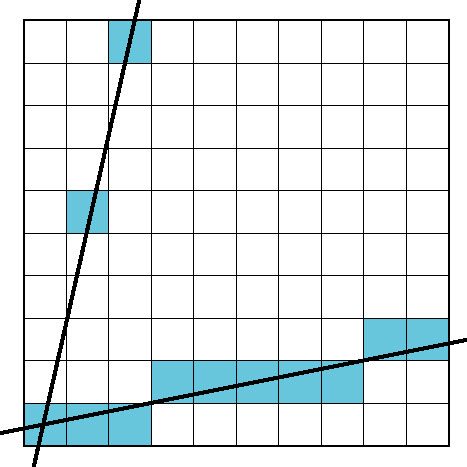
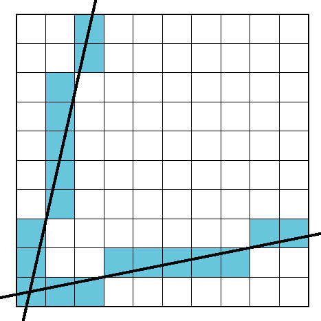
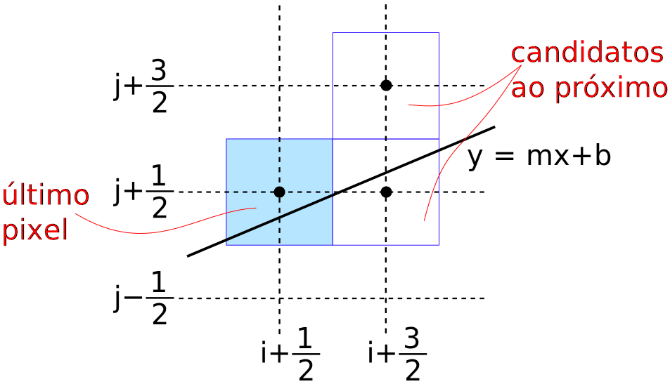
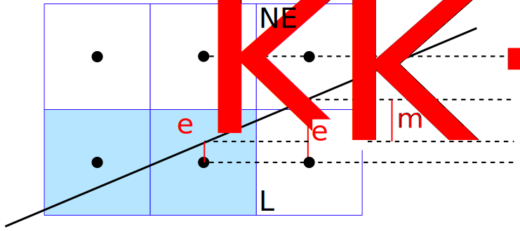
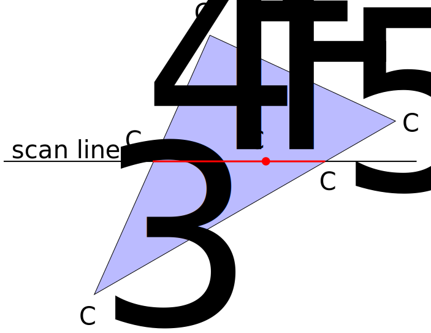
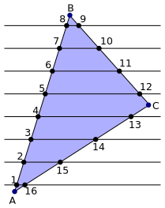

% Introdução à Computação Gráfica
% Marcel Jackowski, Anderson Tavares {mjack,acmt}@ime.usp.br
% Aula #14

# Objetivos

- Rasterização
    - Segmentos de reta
         - Algoritmo Básico
         - Algoritmo DDA
         - Algoritmo de Bresenham
    - Polígonos
         - Framebuffer
         - Interpolação
    - Antialiasing

# Mundo Vetorial X Mundo Raster (Pixels)

- O primeiro: resultado do _vertex shader_
- O segundo: resultado da montagem e rasterização
- O terceiro: resultado do _fragment shader_

<canvas id="mundovetorraster" width="960" height="400"></canvas>

# Rasterização

- Conversão de imagens vetoriais para pixels
- Produz um conjunto de fragmentos (pixels candidatos)
- Fragmentos possem atributos (posição, normal, coord. de textura...)
- Enviados para o _Fragment Shader_
- _Fragment Shader_ efetivamente colore os pixels e escolhe o pixel final.

# Desenho de Retas

- Converter os pontos extremos em pixels

# Algoritmo Básico

- Dado pontos extremos da linha da tela $Pt_{1}$ e $Pt_{2}$
- Calcula os coeficientes da equação

    $y = \color{blue}{m}x + \color{red}{b}$, onde $\color{blue}{m} = \frac{y_2 - y_1}{x_2-x_1}$ e $\color{red}{b} = y_1 - \color{blue}{m}x_1$

~~~~ {#mycode .ruby .numberLines startFrom="1"}
for x in x1..x2
    y = m * x + b
    desenhaPonto(x,y)
~~~~~~~~~~~~~~~~~~~~~~~~~~~~~~~~~~~~~~~~~~~~~~~~~

# Exemplo

~~~~ {#mycode .javascript .numberLines startFrom="1"}
function DesenharLinha(p1, p2, cor){
  var m = (p2.y - p1.y)/(p2.x - p1.x);
  var b = p1.y - m * p1.x;
  var y, x;
  
  for(x = p1.x, y = p1.y; x <= p2.x; x++){
    desenharPixel(x, ROUND(y), cor);
    y = m*x+b;
  }
}
~~~~~~~~~~~~~~~~~~~~~~~~~~~~~~~~~~~~~~~~~~~~~~~~~

<svg id="exemplo1" height="300px" width="960px" viewBox="0 0 960 300"></svg>

&#9194;

&#9193;

Arraste os extremos da linha e/ou clique nos botões para ver as iterações

# Desvantagens

- Multiplicação, soma e arredondamento.
- Como melhorar?

# Usando Equação Paramétrica

- Da equação paramétrica da reta 
    - $P = Pt_1 + t (Pt_2 - Pt_1)$ 
    - t variando de 0 a 1
- $x = x_1 + t(x_2-x_1)$
- $y = y_1 + t(y_2-y_1)$

~~~~ {#mycode .matlab .numberLines startFrom="1"}
y = y1;
x = x1;
for t = 0 to 1
    desenhaPonto(x,y)
    y = y1 + t * (y2 - y1)
    x = x1 + t * (x2 - x1)
~~~~~~~~~~~~~~~~~~~~~~~~~~~~~~~~~~~~~~~~~~~~~~~~~

- 2 somas e 2 multiplicações
- Como melhorar?

# Usando Algoritmo DDA

- _Digital Differential Analyzer_
- DDA foi uma máquina para resolver equações diferenciais de forma numérica

    $$ \frac{dy}{dx} = m = \frac{\Delta y}{\Delta x} = \frac{y_2-y_1}{x_2-x_1}$$

- Podemos desenhá-la para cada passo $\Delta x$:

~~~~ {#mycode .javascript .numberLines startFrom="1"}
y = y1
m = (y2-y1)/(x2-x1)
for(x = x1; x <= x2; x++, y+=m)
  desenharPixel(x, ROUND(y), cor);
~~~~~~~~~~~~~~~~~~~~~~~~~~~~~~~~~~~~~~~~~~~~~~~~~

- $x_{i+1} = x_i+1 \Rightarrow y_{i+1} = y_{i}+\frac{\Delta y}{\Delta x}$
- Ainda são necessários uma adição de floats e um arredondamento
- Como melhorar?

# Simetria - Problema

<table><tr><td>

- No DDA, para cada unidade em $x$, colore-se o pixel cuja coordenada $y$ seja a mais próxima.
    - Em linhas com alta inclinação, as coordenadas $y$ não serão contínuas.
    - Faça o teste no diagrama interativo anterior (ela mostra o problema da simetria e o problema de não se trabalhar no primeiro quadrante - trocando p1 e p2)
    
</td><td style="vertical-align:top">

</td></tr></table>

# Simetria - Solução

<table><tr><td>

- Para $m$ > 1, troque a função de $x$ e $y$
    - Para cada unidade em $y$, colore-se o pixel cuja coordenada $x$ seja a mais próxima.
    - Adicionar 1 unidade em $x$ implica em crescer $m$ unidades em $y$
    - Adicionar $\frac{1}{m}$ unidades em $x$ implica em crescer 1 unidade em $y$
    
~~~~ {#mycode .javascript .numberLines startFrom="1"}
minverso = 1/m;
for(y = y1; y <= y2; y++, x+=minverso)
  desenharPixel(ROUND(x), y, cor);
~~~~~~~~~~~~~~~~~~~~~~~~~~~~~~~~~~~~~~~~~~~~~~~~~
</td><td style="vertical-align:top">

</td></tr></table>

# Desenho de Retas

- Resumo dos problemas
    - Inclinação das linhas
    - Desempenho
        - Número de operações
        - Operações em reais X inteiros
        - Multiplicações X Adições
        
- Soluções
    - Eliminar ou reduzir operações em números reais
    - Aproveitar coerência espacial
        - Similaridade de valores referentes a pixels vizinhos

# Distância entre reta e ponto

- $0 < m \le 1$
- A linha poderia ter passado em qualquer parte do último pixel desenhado

# Bresenham

- Que critério usar para escolher entre os dois candidatos?
- Podemos usar a distância vertical entre a linha e o centro do pixel
    - Denominaremos essa distância de _erro_ associado ao pixel

# Algoritmo de Bresenham

- $e_k$ é o erro do último pixel desenhado ($x_k$, $y_k$)

- Algoritmo
    - Estima-se o novo erro $\color{red}{e_{k+1}}$ caso a escolha seja o pixel L ($y_{k+1} = y_k$)
    
        - $\color{red}{e_{k+1}=\color{red}{e_k}+\color{red}{m}}$
        
    - Se ($\color{red}{e_{k+1}} > 0.5$), então naquele ponto a reta passa pelo pixel NE ($y_{k+1} = y_k + 1$)
    
# Algoritmo de Bresenham

- O erro agora será baseado em no pixel de coordenada $y+1$ (removendo 1 do erro)

    - $\color{red}{e_{k+1}} = \color{red}{e_k} + \color{red}{m} - 1$ (um valor negativo)
  
- Para facilitar o algoritmo, considere o primeiro pixel com $erro = -0.5$ e a decisão passa a ser ($\color{red}{e_{k+1}} > 0$)

# Algoritmo de Bresenham
    
~~~~ {#mycode .javascript .numberLines startFrom="1"}
function LinhaBresenham(p1, p2, cor)
{
  var m = (y2-y1)/(x2-x1);
  var e = -0.5;
  var x, y;
  for(x = p1[0]; x <= p2[0]; x++)
  {
    if(e >= 0)
    {
      y++;
      e--;
    }
    desenharPixel(x, y, cor);
    e+=m;
  }
}
~~~~~~~~~~~~~~~~~~~~~~~~~~~~~~~~~~~~~~~~~~~~~~~~~

# Algoritmo de Bresenham
    
- Algoritmo com Inteiros (trabalhando com o dobro dos valores)

~~~~ {#mycode .javascript .numberLines startFrom="1"}
function LinhaBresenhamInteiro(p1, p2, cor)
{
  var DDx = (x2-x1)<<1;
  var DDy = (y2-y1)<<1;
  var ei = -Dx;
  var x, y;
  for(x = p1[0]; x <= p2[0]; x++)
  {
    if(e >= 0)
    {
      y++;
      e-=DDx;
    }
    desenharPixel(x, y, cor);
    e+=DDy;
  }
}
~~~~~~~~~~~~~~~~~~~~~~~~~~~~~~~~~~~~~~~~~~~~~~~~~

# Algoritmo de Bresenham

- Levar em conta a simetria (octantes)

# Algoritmo de Bresenham

- Levar em conta a simetria (octantes)

# Extensão para círculos

# Extensão para círculos

<table>
  <tr><td>$x^2_n + y^2_n$</td><td>=</td><td>$r^2$ (Mantém-se para cada ponto)</td></tr>
  <tr><td>$x^2_n$</td><td>=</td><td>$r^2 - y^2_n$ (Rearrumando)</td></tr>
  <tr><td>$x^2_{n+1}$</td><td>=</td><td>$r^2 - y^2_{n+1}$ (E para o próximo ponto)</td></tr>
  <tr><td>$y^2_{n+1}$</td><td>=</td><td>$(y_n + 1)^2$ (No primeiro octante)</td></tr>
  <tr><td></td><td>=</td><td>$y^2_n + 2y_n + 1$ </td></tr>
  <tr><td>$x^2_{n+1}$</td><td>=</td><td>$r^2 - y_n^2 - 2y_n - 1$ (Juntando as equações)</td></tr>
  <tr><td>$x^2_{n+1}$</td><td>=</td><td>$x^2_n - 2y_n - 1$ (recursiva em $x$)</td></tr>
</table>

# Extensão para círculos

- Erro Radial é a diferença entre a exata representação do círculo e o centro (ou outro ponto matemático interno) de cada pixel $(x_i, y_i)$

    - $ER(x_i, y_i) = |x_i^2 + y_i^2 - r^2|$
    
- Começando no pixel (r,0) (considerando r inteiro - pode-se pensar em r como um conjunto de pixels)
   
    - $ER(x_i, y_i) = |r^2 + 0^2 - r^2| = 0$
    
- Limitando-se ao 1º octante, em que $y_{i+1} = y_{i} + 1$:

    - $ER(x_i - 1, y_i+1) < ER(x_i, y_i+1)$
    
# Extensão para círculos
    
- Expandindo essa inequação

<table>
  <tr><td>$ER(x_i-1, y_i+1)$</td>                         <td>&lt;</td><td>$ER(x_i-1, y_i+1)$</td> </tr>
  <tr><td>$|(x_i-1)^2 + (y_i+1)^2 - r^2|$</td>            <td>&lt;</td><td>$|x_i^2+(y_i+1)^2-r^2|$</td></tr>
  <tr><td>$|(x_i^2 - 2x_i+1)+(y_i^2 + 2y_i + 1)-r^2|$</td><td>&lt;</td><td>$|x_i^2+(y_i^2+2y_i+1) - r^2|$</td></tr>
</table>

- A inequação se mantém se substituirmos módulos por potências ao quadrado

<table>
  <tr><td>$[(x_i^2 - 2x_i+1)+(y_i^2 + 2y_i + 1)-r^2]^2$</td><td>&lt;</td><td>$[x_i^2+(y_i^2+2y_i+1) - r^2]^2$</td></tr>
  <tr><td>$[(x_i^2 + y_i^2 - r^2 +2y_i + 1)+(1 - 2x_i)]^2$</td><td>&lt;</td><td>$[x_i^2+ y_i^2 - r^2 +2y_i+1]^2$</td></tr>
  <tr><td>$[A+B]^2$</td><td>&lt;</td><td>$A^2$</td></tr>
  <tr><td>$2AB+B^2$</td><td>&lt;</td><td>$0$</td></tr>
  <tr><td>$2(1-2x_i)(x_i^2 + y_i^2 - r^2 + 2y_i + 1) + (1-2x_i)^2$</td><td>&lt;</td><td>$0$</td></tr>
</table>

# Extensão para círculos

- $x > 0 \Rightarrow (1-2x_i) < 0$. Dividindo a inequação por $(1-2x_i)$:

<table>
  <tr><td>$2[(x_i^2 +y_i^2 - r^2) + (2y_i + 1)] + (1-2x_i)$</td><td>&gt;</td><td>$0$</td></tr>
  <tr><td>$2[ER(x_i, y_i) + YIncremento] + XIncremento$</td><td>&gt;</td><td>$0$</td></tr>
</table>

<!--$$
\begin{array}\\
x^2_n + y^2_n & = r^2 \text{(Mantém-se para cada ponto)}\\
x^2_n & = r^2 - y^2_n \text{(Rearrumando)}\\
x^2_{n+1} & = r^2 - y^2_{n+1} \text{(E para o próximo ponto)}\\
y^2_{n+1} & = (y_n + 1)^2 \text{(Para o 1º Octante)}\\
& = y^2_n + 2y_n + 1\\
x^2_{n+1} &= r^2 - y_n^2 - 2y_n - 1\\
x^2_{n+1} &= x^2_n - 2y_n - 1
\end{array}
$$-->

# Algoritmo

~~~~ {#mycode .javascript .numberLines startFrom="1"}
function DesenharCirculo(x0, y0, raio, cor)
{
  var x = raio, y = 0;
  var erroRaio = 1-x;
  while(x >= y)
  {
    desenharPixel( x + x0,  y + y0, cor);
    desenharPixel( y + x0,  x + y0, cor);
    desenharPixel(-x + x0,  y + y0, cor);
    desenharPixel(-y + x0,  x + y0, cor);
    desenharPixel(-x + x0, -y + y0, cor);
    desenharPixel(-y + x0, -x + y0, cor);
    desenharPixel( x + x0, -y + y0, cor);
    desenharPixel( y + x0, -x + y0, cor);
    y++;
    if(erroRaio >= 0)
    {
      x--;
      erroRaio += (1 - 2 * x);
    }
    erroRaio += (2 * y + 1);
  }
}
~~~~~~~~~~~~~~~~~~~~~~~~~~~~~~~~~~~~~~~~~~~~~~~~~

# Aliasing

- Os algoritmos apresentados (escolher apenas o pixel mais próximo) produz linhas serrilhadas
- Podemos colorir pixels vizinhos além dos escolhidos para reduzir o efeito serrilhado.
- _Antialiasing_
 

 Sem antialiasing

 Com antialiasing

 Antialiasing com função sinc

# Rasterização de Polígonos

<table><tr><td>

- Rasterização = Preenchimento
- Como determinar _interior_ e _exterior_
    - Caso convexo é fácil
    - Polígonos complexos são mais complicados
- Teste par-ímpar (número de interseções entre uma scanline e arestas do polígono)
    - par: externo
    - ímpar: interno

</td><td style="vertical-align:top">

</td></tr></table>

# Preenchimento do Framebuffer

- No final do _pipeline_ (antes do _fragment shader_), preenchemos somente polígonos convexos
- Assume-se que polígonos côncavos foram subdivididos (_tesselated_)
- Cores foram calculadas para os vértices (no caso do _Gourard Shading_)
    - Além de outros _varyings_ do _vertex shader_

# Interpolação

- Cores do $C_1$, $C_2$ e $C_3$ especificadas no _Buffer de Cores_
- A linha de _scan_ passa pelo polígono
- Intersecta em $C_4$ e $C_5$
- Interpolação final entre $C_4$ e $C_5$

# Preenchimento _Flood Fill_

- Bastante usado em visão computacional (labeling)
- Consiste em achar um ponto no interior do polígono e colorir os vizinhos, dispersando o processo por todo o polígono recursivamente

~~~~ {#mycode .javascript .numberLines startFrom="1"}
function FloodFill(x,y){
  if(getPixel(x,y) == WHITE){
    desenharPixel(x,y,BLACK);
    FloodFill(x-1,y);
    FloodFill(x+1,y);
    FloodFill(x,y+1);
    FloodFill(x,y-1);
  }
}
~~~~~~~~~~~~~~~~~~~~~~~~~~~~~~~~~~~~~~~~~~~~~~~~~

# Preenchimento _Scan Line_

- Também podemos manter uma estrutura de dados das interseções dos polígonos com scan lines
    - Ordenação por scan lines
    - Preenchimento de cada segmento

 ordem gerada por lista de vértices

 ordem desejada

    
# Aliasing de polígonos

<table><tr><td>

- Problemas de serrilhamento podem ser sérios
    - Arestas serrilhadas
    - Desaparecimento de pequenos polígonos
    - Utiliza-se de composição, assim a cor de um único polígono não determina a cor do pixel
    - <a href="http://acko.net/files/fullfrontal/fullfrontal/webglmath/online.html" target="_blank">Apresentação interessante sobre webgl e aliasing</a>
</td><td style="vertical-align:top">

</td></tr></table>
