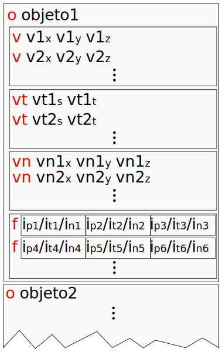

% Introdução à Computação Gráfica
% Anderson Tavares acmt@ime.usp.br
% Leitor de OBJ

# Objetivos 

- Criar um _parser_ no JavaScript
    - Ler Posições
    - Ler Coordenadas de Textura
    - Ler Normais
    - Indexação dos atributos
- Exibir o OBJ no WebGL

# Formato OBJ

<table><tr><td>

</td><td style="vertical-align:top; font-size:22pt; line-height:1.2em">
- Uma estratégia:
- Capturar cada linha (C++: _getLine()_, Javascript: _split_)
- Se a linha começar com:
    - o: finaliza o objeto atual (se houver) e trabalha com um novo objeto
    - v: adicionar os 3 números à lista de posições
    - vt: adicionar os 2 números à lista de coordenadas de textura
    - vn: adicionar os 3 números à lista de normais
    - f: captura os 3 atributos dos 3 vértices e os indexa (indexar? O que é isso?)
</td></tr></table>

# Indexação

- O OBJ tem índice para cada atributo: $I_P$/$I_T$/$I_N$
- O OpenGL/WebGL tem apenas um índice
- Então precisamos tratar o trio de atributos $I_P$/$I_T$/$I_N$ como um vértice de índice $I_V$
- Se existir um trio exatamente igual, então repete-se o $I_V$ (significa que outra face está utilizando o mesmo vértice)
- $I_P$/$I_T$/$I_N \neq \color{red}{I_{P'}}$/$I_T$/$I_N \neq I_P$/$\color{red}{I_{T'}}$/$I_N \neq I_P$/$I_T$/$\color{red}{I_{N'}}$ (significa que faces estão utilizando vértices diferentes, mesmo que contenham a mesma posição)

# Ilustração

<svg id="animacaoobj" width="960px" height="600px"></svg>

# Passo 0: Criar variáveis

~~~~ {#mycode .javascript .numberLines startFrom="1"}
// <DEFINIÇÃO OBJETO3D> ≡
function Objeto3D()
{
  // Listas capturadas do OBJ 
  this.listaPosicoes = [];
  this.listaCoordTex = [];
  this.listaNormais = [];
  // Listas após a indexação
  this.listaIndexadaPosicoes = [];
  this.listaIndexadaCoordTex = [];
  this.listaIndexadaNormais = [];
  this.listaIndices = [];
  // Referências a buffers
  this.bufferPosicoes = null;
  this.bufferCoordTex = null;
  this.bufferNormais = null;
  this.bufferIndices = null;
  this.bufferTextura = null;
}
var objetos = [];
var objetoAtual = null;

// <PASSO 1 - LER O ARQUIVO>
~~~~~~~~~~~~~~~~~~~~~~~~~~~~~~~~~~~~~~~~~~~~~~~~~

# Passo 1: Ler o arquivo

- Utilizando o XMLHttpRequest (Nativo)

~~~~ {#mycode .javascript .numberLines startFrom="1"}
// <PASSO 1 - LER O ARQUIVO> ≡
// Novo pedido AJAX
var xhr = new XMLHttpRequest();
// Usando GET e assíncrono = true
xhr.open("GET", "pinball.obj", true);
xhr.onload = function(e){
  if(xhr.readyState === 4){ // A conexão foi completada?
    if(xhr.status === 200){ // O status dessa conexão é "recebido"?
      // Aqui onde trataremos o dado usando xhr.responseText
      // <PASSO 2 - CAPTURAR CADA LINHA>
    }else{
      // Houve algum problema
      console.error(xhr.statusText);
    }
  }
};
xhr.onerror=function(e){
  console.error(xhr.statusText);
};
xhr.send(null);
~~~~~~~~~~~~~~~~~~~~~~~~~~~~~~~~~~~~~~~~~~~~~~~~~

# Passo 1: Ler o arquivo

- Utilizando o JQuery (Biblioteca _Canivete Suíço_)

~~~~ {#mycode .javascript .numberLines startFrom="1"}
$.get("pinball.obj", function(dadosStr))
{
   // Aqui onde trataremos o dado usando dadosStr
   // <PASSO 2 - CAPTURAR CADA LINHA>
}).fail(function(){
  console.log("erro");
});
~~~~~~~~~~~~~~~~~~~~~~~~~~~~~~~~~~~~~~~~~~~~~~~~~

# Passo 2: Capturar cada linha

- Em XMLHttpRequest

~~~~ {#mycode .javascript .numberLines startFrom="1"}
    // <PASSO 2 - CAPTURAR CADA LINHA> ≡
    var dados = xhr.responseText;
    var linhas = dados.split("\n");
    for(var i = 0; < linhas.length; i++)
    {
      var linha = linhas[i];
      // <PASSO 3 - TRATAR A LINHA>
    }
~~~~~~~~~~~~~~~~~~~~~~~~~~~~~~~~~~~~~~~~~~~~~~~~~

- Em JQuery, é o mesmo a partir do `var linhas...`

# Passo 3: Tratar a linha

- Vamos agora dividir a linha e interpretar suas partes

~~~~ {#mycode .javascript .numberLines startFrom="1"}
    // <PASSO 3 - TRATAR A LINHA> ≡
    // <PASSO 3.1 - OBTER AS PARTES DA LINHA>
    // <PASSO 3.2 - INTERPRETAR A LINHA PELAS PARTES>
~~~~~~~~~~~~~~~~~~~~~~~~~~~~~~~~~~~~~~~~~~~~~~~~~

- A divisão é um simples _split_

~~~~ {#mycode .javascript .numberLines startFrom="1"}
    // <PASSO 3.1 - OBTER AS PARTES DA LINHA> ≡
    var partes = linha.split(" ");
~~~~~~~~~~~~~~~~~~~~~~~~~~~~~~~~~~~~~~~~~~~~~~~~~

- A interpretação significa analisar a primeira parte da linha

~~~~ {#mycode .javascript .numberLines startFrom="1"}    
    // <PASSO 3.2 - INTERPRETAR A LINHA PELAS PARTES> ≡
    switch(partes[0])
    {
      // <PASSO 4 - TRATAR O OBJETO>
      // <PASSO 5 - TRATAR AS POSIÇÕES>
      // <PASSO 6 - TRATAR AS COORD. DE TEXTURA>
      // <PASSO 7 - TRATAR AS NORMAIS>
      // <PASSO 8 - TRABALHAR OS ÍNDICES>
    }
~~~~~~~~~~~~~~~~~~~~~~~~~~~~~~~~~~~~~~~~~~~~~~~~~

# Passo 4: Tratar o objeto

- Iremos criando objetos conforme acharmos uma linha com seu nome

~~~~ {#mycode .javascript .numberLines startFrom="1"}
      // <PASSO 4 - TRATAR O OBJETO> ≡
      case "o":
        if(objetoAtual) criarBuffers(objetoAtual);
        objetoAtual = new Objeto3D();
        objetos.push(objetoAtual);
        objetoAtual.nome = partes[1];
      break;
~~~~~~~~~~~~~~~~~~~~~~~~~~~~~~~~~~~~~~~~~~~~~~~~~

# Passo 5: Coletar as posições

- $\color{red}{v}$ $v_x$ $v_y$ $v_z$

~~~~ {#mycode .javascript .numberLines startFrom="1"}
      // <PASSO 5 - TRATAR AS POSIÇÕES> ≡
      case "v":
        var v1 = parseFloat(partes[1])
        var v2 = parseFloat(partes[2])
        var v3 = parseFloat(partes[3])
        objetoAtual.listaPosicoes.push(v1,v2,v3);
      break;
~~~~~~~~~~~~~~~~~~~~~~~~~~~~~~~~~~~~~~~~~~~~~~~~~

# Passo 6: Coletar as coordenadas de textura

- $\color{red}{vt}$ $vt_s$ $vt_t$

~~~~ {#mycode .javascript .numberLines startFrom="1"}
      // <PASSO 6 - TRATAR AS COORD. DE TEXTURA> ≡
      case "vt":
        var v1 = parseFloat(partes[1])
        var v2 = parseFloat(partes[2])
        objetoAtual.listaCoordTex.push(v1,v2);
      break;
~~~~~~~~~~~~~~~~~~~~~~~~~~~~~~~~~~~~~~~~~~~~~~~~~

# Passo 7: Coletar as normais

- $\color{red}{vn}$ $vn_x$ $vn_y$ $vn_z$

~~~~ {#mycode .javascript .numberLines startFrom="1"}
      // <PASSO 7 - TRATAR AS NORMAIS> ≡
      case "vn":
        var v1 = parseFloat(partes[1])
        var v2 = parseFloat(partes[2])
        var v3 = parseFloat(partes[3])
        objetoAtual.listaNormais.push(v1,v2,v3);
      break;
~~~~~~~~~~~~~~~~~~~~~~~~~~~~~~~~~~~~~~~~~~~~~~~~~

# Passo 8: Trabalhar os índices

- Cada _f_ tem um triângulo (3 vértices)
- Cada vértice do triângulo tem 3 atributos (posição/textura/normal)

~~~~ {#mycode .javascript .numberLines startFrom="1"}
      // <PASSO 8 - TRABALHAR OS ÍNDICES> ≡
      case "f":
        // Para cada vértice do triângulo...
        for(var i = 1; i < partes.length; i++)
        {
          // Capturamos os índices de cada atributo
          var indicesAttr = partes[i].split("/");
          var iposicao  = parseInt(indicesAttr[0])-1;
          var icoordtex = parseInt(indicesAttr[1])-1;
          var inormal   = parseInt(indicesAttr[2])-1;
          
          // <PASSO 9 - INDEXAR>
        }
      break;
~~~~~~~~~~~~~~~~~~~~~~~~~~~~~~~~~~~~~~~~~~~~~~~~~

# Passo 9: Indexar os vértices

- Adicione este vetor de flags no passo 3 (por enquanto trabalhando com até $2^8 = 256$ vértices)

~~~~ {#mycode .javascript .numberLines startFrom="1"}
      // <PASSO 3.1 - OBTER AS PARTES DA LINHA> +≡
      var bitsNormais = 8;
      var bitsPosicoes = 8;
      var bitsTexturas = 8;
      var flags = Array(((1 << bitsPosicoes) << bitsTexturas) << bitsNormais);
~~~~~~~~~~~~~~~~~~~~~~~~~~~~~~~~~~~~~~~~~~~~~~~~~

- 

- Agora continuando o Passo 9

~~~~ {#mycode .javascript .numberLines startFrom="1"}
      // <PASSO 9 - INDEXAR> ≡
      if(<PASSO 9 - INDEXAR>)
	/* Repetir seu índice na lista de índices*/
      else
      {
	/* Indexar o vértice */
	/* Criar um novo índice*/
      }
      
      var bitsNormais = 13;
      var bitsPosicoes = 13;
      var flags = Array((1 << bitsNormais) << bitsPosicoes);
~~~~~~~~~~~~~~~~~~~~~~~~~~~~~~~~~~~~~~~~~~~~~~~~~