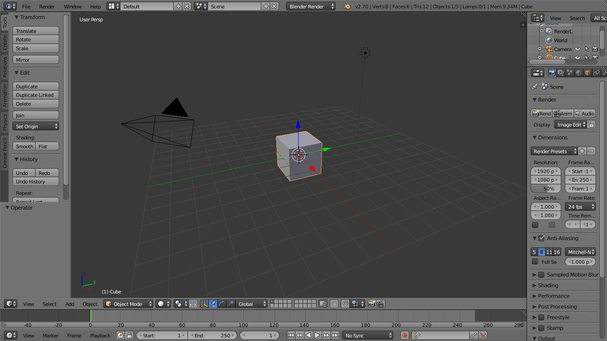

% Introdução à Computação Gráfica
% Anderson Tavares acmt@ime.usp.br
% Blender e Leitor de OBJ

# Objetivos 

- Navegar pelo Blender
- Aplicar materiais no Blender
    - Aplicar texturas
- Exportar no formato OBJ
- Criar um _parser_ no JavaScript
- Exibir o OBJ no WebGL

# Blender

- Um dos <a href="http://it.wikipedia.org/wiki/Computer_grafica_3D#Programmi_per_la_grafica_3D" target="_blank">Programas de Modelagem 3D</a>
- Concorrente gratuito aos comerciais: Maya, 3D Studio Max...
- Seu tamanho na época inicial: 1.44MB (Cabia no disquete)
- Regra de ouro: uma mão no mouse e outra no teclado.
- Tudo tem atalho.

# Navegar pelo Blender

# Navegar pelo Blender

- Alguns atalhos

<svg id="mouse" width="175" height="500" viewport="0 0 175 500"></svg>

# Parser OBJ

- O formato Wavefront OBJ te dá:
    - O arquivo onde estão os materiais
    - Uma lista de objetos
    - Para cada objeto:
        - Uma lista de posições
        - Uma lista de coordenadas de textura
        - Uma lista de normais
        - Uma lista de faces. Cada face contém:
            - Vértices no formato $I_P$/$I_T$/$I_N$
            - $I_P$: Índice da posição na lista
            - $I_T$: Índice da coordenada de textura
            - $I_N$: Índice da normal
        
# Formato OBJ

<table><tr><td>

</td><td style="vertical-align:top; font-size:22pt; line-height:1.2em">
- Uma estratégia:
- Capturar cada linha (C++: _getLine()_, Javascript: _split_)
- Se a linha começar com:
    - o: finaliza o objeto atual (se houver) e trabalha com um novo objeto
    - v: adicionar os 3 números à lista de posições
    - vt: adicionar os 2 números à lista de coordenadas de textura
    - vn: adicionar os 3 números à lista de normais
    - f: captura os 3 atributos dos 3 vértices e os indexa (indexar? O que é isso?)
</td></tr></table>

# Indexação

- O OBJ tem índice para cada atributo: $I_P$/$I_T$/$I_N$
- O OpenGL/WebGL tem apenas um índice
- Então precisamos tratar o trio de atributos $I_P$/$I_T$/$I_N$ como um vértice de índice $I_V$
- Se existir um trio exatamente igual, então repete-se o $I_V$ (significa que outra face está utilizando o mesmo vértice)
- $I_P$/$I_T$/$I_N \neq \color{red}{I_{P'}}$/$I_T$/$I_N \neq I_P$/$\color{red}{I_{T'}}$/$I_N \neq I_P$/$I_T$/$\color{red}{I_{N'}}$ (significa que faces estão utilizando vértices diferentes, mesmo que contenham a mesma posição)

# Ilustração

<svg id="animacaoobj"></svg>

# Passo 0: Criar variáveis

~~~~ {#mycode .javascript .numberLines startFrom="1"}

function Objeto3D()
{
  // Listas capturadas do OBJ 
  this.listaPosicoes = [];
  this.listaCoordTex = [];
  this.listaNormais = [];
  // Listas após a indexação
  this.listaIndexadaPosicoes = [];
  this.listaIndexadaCoordTex = [];
  this.listaIndexadaNormais = [];
  this.listaIndices = [];
  // Referências a buffers
  this.bufferPosicoes = null;
  this.bufferCoordTex = null;
  this.bufferNormais = null;
  this.bufferIndices = null;
  this.bufferTextura = null;
}
var objetos = [];
var objetoAtual = null;
~~~~~~~~~~~~~~~~~~~~~~~~~~~~~~~~~~~~~~~~~~~~~~~~~

# Passo 1: Ler o arquivo

- Utilizando o XMLHttpRequest (Nativo)

~~~~ {#mycode .javascript .numberLines startFrom="1"}
// Novo pedido AJAX
var xhr = new XMLHttpRequest();
// Usando GET e assíncrono = true
xhr.open("GET", "pinball.obj", true);
xhr.onload = function(e){
  if(xhr.readyState === 4){ // A conexão foi completada?
    if(xhr.status === 200){ // O status dessa conexão é "recebido"?
      // Aqui onde trataremos o dado usando xhr.responseText
      // Passo 2
    }else{
      // Houve algum problema
      console.error(xhr.statusText);
    }
  }
};
xhr.onerror=function(e){
  console.error(xhr.statusText);
};
xhr.send(null);
~~~~~~~~~~~~~~~~~~~~~~~~~~~~~~~~~~~~~~~~~~~~~~~~~

# Passo 1: Ler o arquivo

- Utilizando o JQuery (Biblioteca _Canivete Suíço_)

~~~~ {#mycode .javascript .numberLines startFrom="1"}
$.get("pinball.obj", function(dadosStr))
{
   // Aqui onde trataremos o dado usando dadosStr
   // Passo 2
}).fail(function(){
  console.log("erro");
});
~~~~~~~~~~~~~~~~~~~~~~~~~~~~~~~~~~~~~~~~~~~~~~~~~

# Passo 2: Capturar cada linha

- Em XMLHttpRequest

~~~~ {#mycode .javascript .numberLines startFrom="1"}
...
if(xhr.status === 200){
  var dados = xhr.responseText;
  var linhas = dados.split("\n");
  for(var i = 0; < linhas.length; i++)
  {
    var linha = linhas[i];
    // Depois iremos tratar estas linhas - Passo 3
  }
}
...
~~~~~~~~~~~~~~~~~~~~~~~~~~~~~~~~~~~~~~~~~~~~~~~~~

- Em JQuery, é o mesmo a partir do `var linhas...`

# Passo 3: Tratar a linha

~~~~ {#mycode .javascript .numberLines startFrom="1"}
...
    var partes = linha.split(" ");
    switch(partes[0])
    {
      case "o":break; // Passo 4
      case "v":break; // Passo 5
      case "vt":break;// Passo 6
      case "vn":break;// Passo 7
      case "f":break; // Passo 8
    }
...
~~~~~~~~~~~~~~~~~~~~~~~~~~~~~~~~~~~~~~~~~~~~~~~~~

# Passo 4: Tratar o objeto

- o Objeto

~~~~ {#mycode .javascript .numberLines startFrom="1"}
...
      case "o":
        if(objetoAtual) criarBuffers(objetoAtual);
        objetoAtual = new Objeto3D();
        objetos.push(objetoAtual);
      break;
...
~~~~~~~~~~~~~~~~~~~~~~~~~~~~~~~~~~~~~~~~~~~~~~~~~

# Passo 5: Coletar as posições

- $\color{red}{v}$ $v_x$ $v_y$ $v_z$

~~~~ {#mycode .javascript .numberLines startFrom="1"}
...
      case "v":
        var v1 = parseFloat(partes[1])
        var v2 = parseFloat(partes[2])
        var v3 = parseFloat(partes[3])
        objetoAtual.listaPosicoes.push(v1,v2,v3);
      break;
...
~~~~~~~~~~~~~~~~~~~~~~~~~~~~~~~~~~~~~~~~~~~~~~~~~

# Passo 6: Coletar as coordenadas de textura

- $\color{red}{vt}$ $vt_s$ $vt_t$

~~~~ {#mycode .javascript .numberLines startFrom="1"}
...
      case "vt":
        var v1 = parseFloat(partes[1])
        var v2 = parseFloat(partes[2])
        objetoAtual.listaCoordTex.push(v1,v2);
      break;
...
~~~~~~~~~~~~~~~~~~~~~~~~~~~~~~~~~~~~~~~~~~~~~~~~~

# Passo 7: Coletar as normais

- $\color{red}{vn}$ $vn_x$ $vn_y$ $vn_z$

~~~~ {#mycode .javascript .numberLines startFrom="1"}
...
      case "vn":
        var v1 = parseFloat(partes[1])
        var v2 = parseFloat(partes[2])
        var v3 = parseFloat(partes[3])
        objetoAtual.listaNormais.push(v1,v2,v3);
      break;
...
~~~~~~~~~~~~~~~~~~~~~~~~~~~~~~~~~~~~~~~~~~~~~~~~~

# Passo 8: Trabalhar os índices

~~~~ {#mycode .javascript .numberLines startFrom="1"}
...
      case "f":
	// Para cada vértice do triângulo...
        for(var i = 0; i < partes.length; i++)
        {
          // Capturamos os índices de cada atributo
          var indicesAttr = partes[i].split("/");
          var iposicao  = parseInt(indicesAttr[0])-1;
          var icoordtex = parseInt(indicesAttr[1])-1;
          var inormal   = parseInt(indicesAttr[2])-1;
          
          // Passo 9
          if(/*Este vértice já foi adicionado na lista indexada*/)
            /* Repetir seu índice na lista de índices*/
          else
          {
            /* Indexar o vértice */
            /* Criar um novo índice*/
          }
        }
      break;
...
~~~~~~~~~~~~~~~~~~~~~~~~~~~~~~~~~~~~~~~~~~~~~~~~~

# Passo 9: Indexar os vértices

- Adicione este vetor de flags no passo 3

~~~~ {#mycode .javascript .numberLines startFrom="1"}
var bitsNormais = 13;
var bitsPosicoes = 13;
var flags = Array((1 << bitsNormais) << bitsPosicoes);
~~~~~~~~~~~~~~~~~~~~~~~~~~~~~~~~~~~~~~~~~~~~~~~~~

- Agora continuando o Passo 9

~~~~ {#mycode .javascript .numberLines startFrom="1"}
var bitsNormais = 13;
var bitsPosicoes = 13;
var flags = Array((1 << bitsNormais) << bitsPosicoes);
~~~~~~~~~~~~~~~~~~~~~~~~~~~~~~~~~~~~~~~~~~~~~~~~~