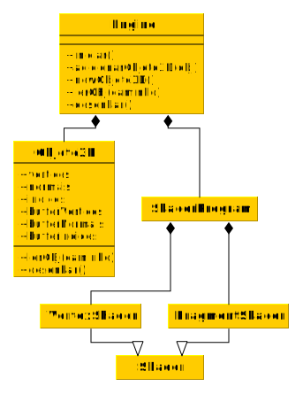

% Introdução à Computação Gráfica
% Anderson Tavares acmt@ime.usp.br
% Engine WebGL

# Objetivos

- Estruturar uma Engine em WebGL
- Construir funcionalidades básicas
- Carregar objetos
- Carregar shaders
- Exibir objetos

# Bibliotecas que vamos usar

- Canivete suíço: [JQuery 2.1.1](http://www.jquery.com)
- Manipulação de Matrizes: [glMatrix 2.2](http://glmatrix.net/)

# Design do Sistema

- Vamos dividir o sistema
- Vamos encapsular o shader em uma classe
- Vamos encapsular o programa de shader em uma classe

# Limites

- Todos os OBJs são 

