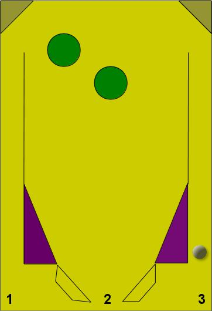
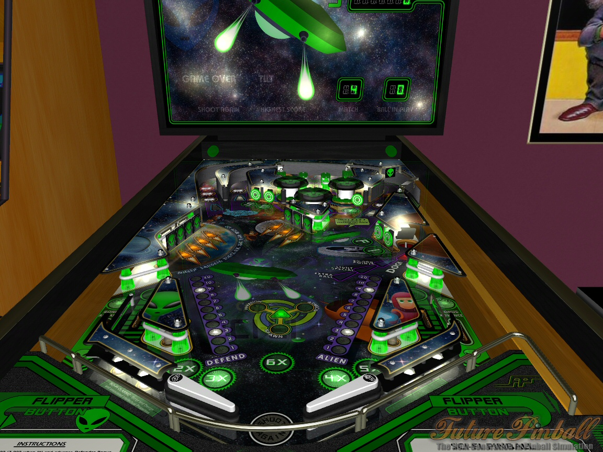
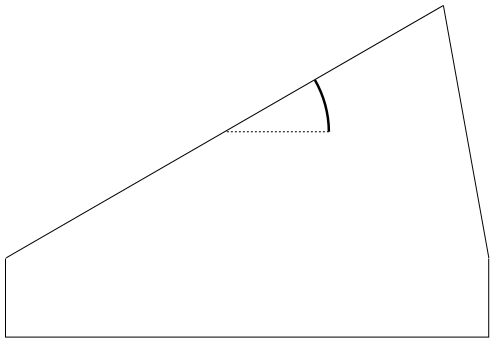

% Introdução à Computação Gráfica
% Marcel Jackowski mjack@ime.usp.br
% EP #2: It's pinball time!

# Objetivos

- Sistema de Partículas
    - Física Clássica (Newtoniana)
    - Colisões Inelásticas
- Animação (quadro a quadro)
- Transformações Geométricas
    - Movimentação da Bola
    - Movimentação das Paletas (flippers)
- Uso de composição e texturas
- Iluminação

# Elementos

- Mesa
    - Ângulo de Inclinação
    - Obstáculos
    - Lançador de bolinhas
    - Paletas (Flippers)
        - Teclado (um para cada)
        - Espaço suficiente para cair uma bolinha no meio
- Bolinha
    - Rolando perpendicularmente ao sentido do movimento
    - Textura para mostrar o rolamento
    - Bater em um obstáculo => Aparecer + 3 bolinhas
        - Desativar enquanto tiver mais de uma bolinha
    
# Exemplo de Mesa

 

# Física

- Força da gravidade
- Força inicial do lançamento da bola
- Força resultante da colisão com obstáculos
    - Paredes: Somente restituição (ex: perde 20%)
    - Obstáculos: X% de perda em cada tipo.
    - Paletas
        - Velocidade Angular => Vetor Força

# Interface Gráfica

<table><tr><td style="width:50%">
- Canvas do Jogo
    - Redimensionável
    - Atualize a Perspectiva
    - Mesa centralizada
- Número de Chances
    - 3 chances
    - Perder uma bolinha: -1 chance
    - Perder todas: Jogo acaba

</td> <td style="width:50%; vertical-align:top">

- Pausar/Continuar o jogo
- Reiniciar o jogo
- Pontuação Atual
- Iluminação
    - Uma fonte de luz
    - Posição/Direção livre
    - Mudar a cor difusa, especular e ambiente
    - Mudar a potência da especular
</td></tr></table>

# Inclinação da mesa

<table><tr><td style="vertical-align:top;">

   
  

</td><td>

- Aumentar/Reduzir pelo teclado
- Limites (0 e 45 graus)
- Eixo de rotação X (ex: aresta inferior, centro...)
- Distorção de faces (opcional)

</td></tr></table>

# Especificações

- Câmera em posição e orientação adequadas
- Skybox (céu ou sala ou ...)
- Entregar compactado via Paca (com seus nomes)
    - Avaliação usando a versão do Paca
- Entrega: 08 de Junho de 2014
- Demonstração: 11 de Junho de 2014
- Colocar nas vossas páginas pessoais
- Descrição de como usar mostrada na página
- Não usar bibliotecas gráficas (Three.js, GLGE, )
- Não usar bibliotecas de física
- Usar (se desejável) apenas bibliotecas de tratamento e carregamento de texto, matrizes e quaternions.

# Bônus - Sombras

- Aplique sombras
- Sobre a mesa
- Sobre outros objetos (opcional)
- Hard/Soft Shadow

# Bônus - Áudio

- Sons em eventos
    - Colisões com obstáculos
    - Lançadores
    - Perder a bolinha
    - Outros (Pontos alcançados, música de fundo...)
    
# FuturePinball

- Inspiração 
- [Link](http://www.futurepinball.com/)

# Avaliação

-- --------------------------------------------------------------------------------- ---------
#  Descrição                                                                         Pontuação
01 Mesa e obstáculos exibidos corretamente                                                  05
02 Paletas, bolinhas, e lançador exibidos corretamente                                      05
03 Paletas se movimentam corretamente                                                       03
04 Paletas impulsionam a esfera corretamente                                                03
-- --------------------------------------------------------------------------------- ---------

# Avaliação

-- --------------------------------------------------------------------------------- ---------
#  Descrição                                                                         Pontuação
05 Obstáculos funcionando corretamente                                                      08
06 Ao perder a esfera, uma chance é gasta e o jogo é recomeçado                             03
07 Ao perder 3 chances, o jogo termina.                                                     03
08 Pontuação funcionando corretamente                                                       05
09 Interface correta                                                                        08
10 Iluminação correta (alterando tons de textura e cores)                                   05
11 Iluminação atualizada pelos controles da interface                                       04
-- --------------------------------------------------------------------------------- ---------

# Avaliação

-- --------------------------------------------------------------------------------- ---------
#  Descrição                                                                         Pontuação
12 Skybox feito corretamente                                                                05
13 Lançador funcionando corretamente                                                        05
14 Esfera se movimenta na velocidade e aceleração corretas                                  05
15 Esfera se rola corretamente                                                              04
-- --------------------------------------------------------------------------------- ---------

# Avaliação

-- --------------------------------------------------------------------------------- ---------
#  Descrição                                                                         Pontuação
16 Dinâmica do jogo funcionando efetivamente                                                05
17 Várias bolinhas funcionam corretamente (sist. de partículas > 8fps)                      05
18 Inclinação correta (teclado e física)                                                    05
19 Botões pausar/continuar e reiniciar funcionando corretamente                             04
20 Projeto compactado, entregue e demonstração feita satisfatoriamente                      10
-- --------------------------------------------------------------------------------- ---------

# Avaliação

-- --------------------------------------------------------------------------------- ---------
#  Descrição                                                                         Pontuação
21 Bônus – sombras feitas corretamente                                                      50
22 Bônus – áudio funcionando corretamente                                                   50
-- --------------------------------------------------------------------------------- ---------
