% Revisão de Álgebra Linear para CG
% Anderson Tavares
% Universidade de São Paulo

# Sistemas de Coordenadas Cartesiano

## Uma dimensão

> - Números contáveis
> - 
Contar ovelha 

> - [Introdução à História da Matemática](http://www.livrariasaraiva.com.br/produto/392616)
- Pensamento Logaritmo 

## Uma dimensão

> - 
Zero (nenhuma ovelha) 

> - 
Devendo uma ovelha 

> - E os pobres sem poder comprar a ovelha inteira?
> - Números racionais $\frac{31415}{10000}$
> - Número decimal $3,1415$.

## Uma dimensão

> - Números irracionais
> - Não são contáveis
> - Matemática discreta e matemática contínua
> - Como representar esse mundo contínuo?

## Uma dimensão

### Primeira Lei da Computação Gráfica
 Se parecer Ok, então está Ok.

## Duas dimensões

- Cartésia

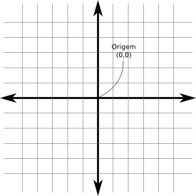

## Duas dimensões

- Disléxia

- Várias orientações; 

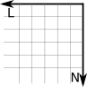

> - Uma como _orientação normal_.
- Rotações nas outras &#8614; _orientação normal_

## Três dimensões

- Mais um eixo

## Três dimensões

- Mão esquerda X Mão direita

## Três dimensões

- Orientação (Ex: Mão esquerda)

# Vetores

## Conceito

Tupla $[x_1,x_2, ...,x_n]$, com $x_i \in R^n, 1 \le i \le n$. 

- Magnitude
- Direção
- Sentido
- Dimensão: $n$
- Vetor Linha: $$\begin{bmatrix}1&2&3\end{bmatrix}$$
- Vetor Coluna: $$\begin{bmatrix}1\\2\\3\end{bmatrix}$$

## Conceito

- $\vec{v}_{linha}^T = \vec{v}_{coluna}$
- Notação coluna: $[1,2,3]^T$
- $\vec{a}$ como $[a_1,a_2,a_3,a_4]$ ou $[a_x,a_y,a_z,a_w]$.

## Ponto

- Tupla $(x_1,x_2, ...,x_n)$, com $x_i \in R^n, 1 \le i \le n$. 
- Notação: $()$ para ponto e $[]$ para vetor

+------------------------------------+----------------------------------------+
|ponto                               |vetor                                   |
+====================================+========================================+
|representa uma posição              |representa um deslocamento              |
|não tem direção                     |tem direção                             |
|não tem sentido                     |tem sentido                             |
|não tem magnitude                   |tem magnitude                           |
|tem posição                         |não tem uma posição específica          |
+------------------------------------+----------------------------------------+

## Ponto

> - Ex: $A=(-23,46)$ e $B=(50,20)$
  - De $A$ a $B$, o deslocamento $\vec{d}=[50-(-23),20-46]=[73,66]$
  - $\vec{d}=[73,66]$ é diferente de um ponto $C=(73,66)$
  
## Ponto

Relacionando vetor e ponto:

- $A - B = \vec{v}$
- $A + \vec{v} = B$
- $\vec{v} + \vec{w} = \vec{z}$

## Vetor zero

- $[0,0,\dots,0]^T$
- Identidade da adição
- Não há direção (ou então há todos)
- Melhor pensar como _Sem deslocamento_

## Negar um vetor

$-\vec{a}= -[a_1,a_2,\dots,a_n]^T = [-a_1,-a_2,\dots,-a_n]^T$

Geometricamente invertes o sentido do vetor:

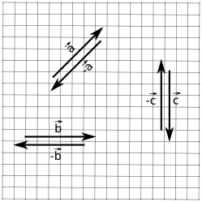

## Magnitude

- Norma, comprimento ou intensidade. 
- O vetor $[3,4]^T$ tem magnitude nem 3 nem 4, mas 5.

$\|\vec{v}\| = \sqrt{v_1^2 + v_2^2 + ... + v_{n-1}^2 + v_n^2}$

$\|\vec{v}\| = \sqrt{\sum^{n}_{i=1}{v_i^2}}$

Geometricamente, usando pitágoras:

## Magnitude

- $v_x$ e $v_y$ podem ser valores negativos, todavia $\|\vec{v}\|$ não é.
- Já que $|x|^2 = x^2$ então as equações seguintes são equivalentes:

$\|\vec{v}\|^2 = |v_1|^2 + |v_2|^2$

$\|\vec{v}\|^2 = v_1^2 + v_2^2$

## Multiplicação por um escalar

$$
k 
\begin{bmatrix} v_1 \\ v_2 \\ \vdots \\ v_n \end{bmatrix}
=
\begin{bmatrix} v_1 \\ v_2 \\ \vdots \\ v_n \end{bmatrix}
k
=
\begin{bmatrix} kv_1 \\ kv_2 \\ \vdots \\ kv_n \end{bmatrix}
$$

## Multiplicação por um escalar

- Divisão: multiplicar por $\frac{1}{k}$.
- Omite-se o símbolo de multiplicação;
- Antes da adição: $3\vec{a} + \vec{b} = (3\vec{a})+\vec{b} \neq 3(\vec{a}+\vec{b})$;
- $\nexists k/\vec{v}$ e $\nexists \vec{v}/\vec{w}$;
- $-\vec{v} = -1\vec{v}$.

## Multiplicação por um escalar

- Mantém o sentido, muda a magnitude (proporcional a $k$).

## Normalização

- Para onde o vento está orientado nesse ponto?
- Para onde esse fóton está indo?
- Essa cidade fica ao norte ou ao leste daqui?
- Na sinuca, em que direção o taco deve se orientar para acertar a bola?

## Normalização

- Normal, versor ou vetor unitário;
- $\|\vec{v}\| = 1$;
- \vec{0} não tem versor;
- Basta dividir pela magnitude

$\vec{v}_{norm} = \frac{\vec{v}}{\|v\|}$

## Normalização

## Adição e Subtração de vetores

Na adição, $\vec{a} + \vec{b} = \vec{b} + \vec{a}$:

$$
\begin{bmatrix} a_1 \\ a_2 \\ \vdots \\ a_n \end{bmatrix}
+
\begin{bmatrix} b_1 \\ b_2 \\ \vdots \\ b_n \end{bmatrix}
=
\begin{bmatrix} a_1 + b_1 \\ a_2 + b_2 \\ \vdots \\ a_n + b_n \end{bmatrix}
$$

## Adição e Subtração de vetores

Na subtração, $\vec{a} - \vec{b} = - (\vec{b} - \vec{a})$:

$$
\begin{bmatrix} a_1 \\ a_2 \\ \vdots \\ a_n \end{bmatrix}
-
\begin{bmatrix} b_1 \\ b_2 \\ \vdots \\ b_n \end{bmatrix}
=
\begin{bmatrix} a_1 - b_1 \\ a_2 - b_2 \\ \vdots \\ a_n - b_n \end{bmatrix}
$$

## Adição e Subtração de vetores

- Adição: se eu caminhar por uma sequência de lugares, qual o deslocamento do primeiro lugar para o último?
- Subtração: se eu sair daqui para um dos dois outros lugares, qual é o deslocamento entre estes destinos? É longe um do outro?

## Adição e Subtração de vetores

Representando um vetor como uma soma (sequência) ponderada

$$
\begin{bmatrix} a_1 \\ a_2 \\ \vdots \\ a_n \end{bmatrix}
=
a_1\begin{bmatrix} 1 \\ 0 \\ \vdots \\ 0 \end{bmatrix}
+
a_2\begin{bmatrix} 0 \\ 1 \\ \vdots \\ 0 \end{bmatrix}
+
\dots
+
a_n\begin{bmatrix} 0 \\ 0 \\ \vdots \\ 1 \end{bmatrix}
$$

## Distância entre pontos

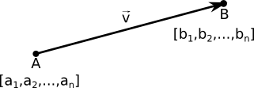

- Pontos A e B 
- $v = A-B = [a_1 - b_1,a_2-b_2,\dots,a_n-b_n]^T$. 
- A distância entre A e B é a magnitude $\|v\| = \sqrt{(a_1-b_1)^2+(a_2-b_2)^2+\dots+(a_n-b_n)^2}$

## Produto Escalar

> - Resultado: uma escalar
> - $\vec{a}\cdot\vec{b} = a_1b_1 + a_2b_2 + \dots + a_nb_n$.
> - Soma de multiplicações elemento-a-elemento.
> - O quão similares são os vetores 
    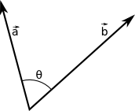
> - $\vec{a}\cdot\vec{b} = \|\vec{a}\|\|\vec{b}\|cos(\theta)$
> - Versores: $\vec{a}\cdot\vec{b} = cos(\theta)$

## Projetando um vetor no outro

> - $\|\vec{v}_\parallel\| = \|\vec{v}\|cos(\theta)$.
> - $\vec{v}\cdot\vec{w} = \|\vec{v}\|\|\vec{w}\|cos(\theta)$
> - $\frac{\vec{v}\cdot\vec{w}}{\|\vec{w}\|} = \|\vec{v}\|cos(\theta)$
> - $\|\vec{v}_\parallel\| = \frac{\vec{v}\cdot\vec{w}}{\|\vec{w}\|}$
> - $\vec{v}_\parallel = \frac{\vec{w}}{\|\vec{w}\|}\|\vec{v}_\parallel\| = \vec{w}\frac{\vec{v}\cdot\vec{w}}{\|\vec{w}\|^2}$

## Projetando um vetor no outro

- Para vetores unitários: $\vec{v}_\parallel = \vec{w}(\vec{v}\cdot\vec{w})$
- $\vec{v}\cdot\vec{w} = \vec{v}^T\vec{w}$

## Produto Vetorial

- Resultado: um vetor perpendicular aos dois

$$
\begin{bmatrix} x_1 \\ y_1 \\ z_1 \end{bmatrix}
\times
\begin{bmatrix} x_2 \\ y_2 \\ z_2 \end{bmatrix}
=
\begin{bmatrix} y_1z_2 - y_2z_1 \\ x_1z_2 - z_1x_2 \\ x_1y_2-y_1x_2 \end{bmatrix}
$$

> - Para capturar o primeiro elemento
>      - Remova a primeira linha ($x_1$ e $x_2$)
>      - Determinante da matriz com os elem. restantes
> - Determinante usando expansão em cofatores

## Produto Vetorial

- $[x,y,z]^T$ como $x\vec{i}+y\vec{j}+z\vec{k}$
- $\vec{i} = [1,0,0]^T$, $\vec{j} = [0,1,0]^T$ e $\vec{k} = [0,0,1]^T$

$$
\vec{v}\times\vec{w} = 
\begin{bmatrix}
  \vec{i} & \vec{j} & \vec{k} \\
  v_1     & v_2     & v_3     \\
  w_1     & w_2     & w_3    
\end{bmatrix}
$$

## Produto Vetorial

- Que eu saiba, com dois vetores distintos, há outros dois vetores que são perpendiculares a eles. Qual deles é o resultado do produto vetorial?

## Produto Vetorial

<table><tr>
  <td></td>
  <td style="vertical-align:top">
> - Regra da mão direita
>      - polegar no primeiro vetor
>      - outros dedos no segundo vetor
>      - produto vetorial saindo da palma da mão
> - Veja se o `?` é o $\vec{w}\times\vec{v}$
> - Então $\vec{v}\times\vec{w} = -$\vec{w}\times\vec{v}$
</td>
</tr></table>

## Produto Vetorial

- $\|\vec{v}\times\vec{w}\| = \|\vec{w}\times\vec{v}\| = Area_{paralelogramo}$

$$
\begin{split}
Area_{paralelogramo} & = bh \\
                     & = \|\vec{v}\|h \\
                     & = \|\vec{v}\|\|\vec{w}\|sen(\theta)
\end{split}
$$

# Matrizes

## Introdução

- Multidimensional;
- Retangular;
- Uma matriz $l\times c$ tem $l$ linhas e $c$ colunas.
- $M = [m_{ij}]$, onde $1 \le i \le l$ e $1 \le j \le c$

$$M=\begin{bmatrix}
m_{11}  &  m_{12}  &  \dots  & m_{1c} \\
m_{21}  &  m_{22}  &  \dots  & m_{2c} \\
\vdots  & \vdots   &  \ddots & \vdots \\
m_{l1}  &  m_{l2}  &  \dots  & m_{lc}
\end{bmatrix}
$$

## Introdução

- Vetor linha $\vec{v}_{1\times c}$ e coluna $\vec{v}_{l\times 1}$
- Se $M_{l\times c}=[m_{ij}]$, então $M^T_{c\times l}=[m_{ji}]$,  $1 \le i \le l$ e $1 \le j \le c$
- $(M^{T})^T = M$

## Multiplicação de uma matriz por uma escalar

$$kM = 
k\begin{bmatrix} m_{11} & m_{12} & m_{13} \\ m_{21} & m_{22} & m_{23} \\ m_{31} & m_{32} & m_{33}\end{bmatrix} = \begin{bmatrix}km_{11} & km_{12} & km_{13} \\ km_{21} & km_{22} & km_{23} \\ km_{31} & km_{32} & km_{33}\end{bmatrix}$$

## Multiplicação entre Matrizes

- Elemento a elemento

$$AB = [a_{ij}][b_{ij}] = [a_{ij}b_{ij}]$$

> - 
Outra forma, mais usada. Ex: Equações Lineares $$\begin{array}\\\color{red}{a_{11}}x_1 + \color{red}{a_{12}}x_2 + \color{red}{a_{13}}x_3 + \color{red}{a_{14}}x_4 = b_1 \\\color{red}{a_{21}}x_1 + \color{red}{a_{22}}x_2 + \color{red}{a_{23}}x_3 + \color{red}{a_{24}}x_4 = b_2 \\\color{red}{a_{31}}x_1 + \color{red}{a_{32}}x_2 + \color{red}{a_{33}}x_3 + \color{red}{a_{34}}x_4 = b_3 \\\color{red}{a_{41}}x_1 + \color{red}{a_{42}}x_2 + \color{red}{a_{43}}x_3 + \color{red}{a_{44}}x_4 = b_4\end{array}$$

> - 1ª Equação: produto interno entre o vetor $[\color{red}{a_{11}, a_{12}, a_{13}, a_{14}}]^T$ e o vetor $[x_1,x_2,x_3,x_4]^T$.

## Multiplicação entre Matrizes

$$
\begin{array}\\[\color{red}{a_{11}, a_{12}, a_{13}, a_{14}}][x_1,x_2,x_3,x_4]^T = b_1 \\
[\color{red}{a_{21}, a_{22}, a_{23}, a_{24}}][x_1,x_2,x_3,x_4]^T = b_2 \\
[\color{red}{a_{31}, a_{32}, a_{33}, a_{34}}][x_1,x_2,x_3,x_4]^T = b_3 \\
[\color{red}{a_{41}, a_{42}, a_{43}, a_{44}}][x_1,x_2,x_3,x_4]^T = b_4
\end{array}
$$

## Multiplicação entre Matrizes

- Reunindo as equações 

$$
\begin{bmatrix}  \color{red}{a_{11}} & \color{red}{a_{12}} & \color{red}{a_{13}} & \color{red}{a_{14}} \\
  \color{red}{a_{21}} & \color{red}{a_{22}} & \color{red}{a_{23}} & \color{red}{a_{24}} \\
  \color{red}{a_{31}} & \color{red}{a_{32}} & \color{red}{a_{33}} & \color{red}{a_{34}} \\
  \color{red}{a_{41}} & \color{red}{a_{42}} & \color{red}{a_{43}} & \color{red}{a_{44}}
\end{bmatrix}
\begin{bmatrix}x_1 \\  x_2 \\  x_3 \\  x_4 \end{bmatrix} 
=
\begin{bmatrix}b_1 \\  b_2 \\  b_3 \\  b_4 \end{bmatrix}
$$

> - Abreviando 
$$\color{red}{A}\vec{x} = \vec{b}$$

## Multiplicação entre Matrizes

- Relação entre linhas da 1ª Matriz e colunas da 2ª Matriz.

$$A_{l \times n}B_{n \times c} = C_{l \times c}$$

- Cada elemento

$$c_{ij} = \sum^{n}_{k=1}{a_{ik}b_{kj}}$$

## Multiplicação entre Matrizes

> - Multiplicar uma matriz $M$ por uma matriz quadrada $Q$ (em qualquer um dos lados) mantém o tamanho de $M$ (a multiplicação precisa ser válida);
> - Se $I$ é a matriz identidade 
    $MI = IM = M$;
  
> - Multiplicação de matrizes não é comutativa: 
    $AB \neq BA$;
  
> - Multiplicação de matrizes é associativa: 
    $(AB)C = A(BC)$;
  
## Multiplicação entre Matrizes
  
> - $(kA)B = k(AB) = A(kB)$ e $(\vec{v}A)B = \vec{v}(AB)$
> - $(AB)^T = B^TA^T$. 
    $(A_{l \times n}B_{n \times c})^T = B^T_{c \times n}A^T_{n \times l}$
> - $(M_1M_2 \cdots M_n)^T = M_n^T\cdots M_2^TM_1^T$

## Multiplicar um vetor e uma matriz

$$
\begin{align}
\begin{bmatrix}x & y & z\end{bmatrix}\begin{bmatrix}m_{11} & m_{12} & m_{13}\\m_{21} & m_{22} & m_{23}\\m_{31} & m_{32} & m_{33}\end{bmatrix} &= \begin{bmatrix}xm_{11} + ym_{21} + zm_{31} & xm_{12} + ym_{22} + zm_{32} & xm_{13} + ym_{23} + zm_{33}\end{bmatrix}\\
\begin{bmatrix}m_{11} & m_{12} & m_{13}\\m_{21} & m_{22} & m_{23}\\m_{31} & m_{32} & m_{33}\end{bmatrix}\begin{bmatrix}x \\ y \\ z\end{bmatrix} &= \begin{bmatrix}xm_{11} + ym_{12} + zm_{13} \\ xm_{21} + ym_{22} + zm_{23} \\ xm_{31} + ym_{32} + zm_{33}\end{bmatrix}\\
\begin{bmatrix}m_{11} & m_{12} & m_{13}\\m_{21} & m_{22} & m_{23}\\m_{31} & m_{32} & m_{33}\end{bmatrix}\begin{bmatrix}x & y & z\end{bmatrix} &= indefinido\\
\begin{bmatrix}x \\ y \\ z\end{bmatrix}\begin{bmatrix}m_{11} & m_{12} & m_{13}\\m_{21} & m_{22} & m_{23}\\m_{31} & m_{32} & m_{33}\end{bmatrix} &= indefinido
\end{align}
$$

## Multiplicar um vetor e uma matriz

- Para vetor linha

$$\begin{bmatrix}xm_{11} + ym_{21} + zm_{31} & xm_{12} + ym_{22} + zm_{32} & xm_{13} + ym_{23} + zm_{33}\end{bmatrix}$$

- Para vetor coluna

$$\begin{bmatrix}xm_{11} + ym_{12} + zm_{13} \\ xm_{21} + ym_{22} + zm_{23} \\ xm_{31} + ym_{32} + zm_{33}\end{bmatrix}$$

- Os valores não são iguais!
- OpenGL usa vetor coluna
- DirectX usa vetor linha

## Interpretação Geométrica

$$
\begin{split}
\begin{bmatrix} v_1 \\ v_2 \\ v_3 \end{bmatrix} & = 
1\begin{bmatrix} v_1 \\ 0   \\ 0   \end{bmatrix} +
1\begin{bmatrix} 0   \\ v_2 \\ 0   \end{bmatrix} +
1\begin{bmatrix} 0   \\ 0   \\ v_3 \end{bmatrix} \\
& = 
v_1\begin{bmatrix} 1 \\ 0  \\ 0   \end{bmatrix} +
v_2\begin{bmatrix} 0 \\ 1  \\ 0   \end{bmatrix} +
v_3\begin{bmatrix} 0 \\ 0  \\ 1   \end{bmatrix} \\
& = 
v_1\vec{i} + v_2\vec{j} + v_3\vec{k} \\
& = \begin{bmatrix}\vec{i}&\vec{j}&\vec{k}\end{bmatrix}\begin{bmatrix}v_1\\v_2\\v_3\end{bmatrix} \\
& =
\begin{bmatrix}1&0&0\\0&1&0\\0&0&1\\\end{bmatrix}\begin{bmatrix}v_1\\v_2\\v_3\end{bmatrix}
\end{split}
$$

## Interpretação Geométrica

- Representando $\vec{v}$, $\vec{i}$ e $\vec{j}$ (2D) 

## Interpretação Geométrica

- E se trocarmos a identidade por outra matriz. Ex:

$$
\begin{bmatrix}
2 & 0 & 0 \\
0 & 3 & 0 \\
0 & 0 & 5 
\end{bmatrix}
\begin{bmatrix}
v_1 \\
v_2 \\
v_3 
\end{bmatrix}
=
\begin{bmatrix}
2v_1 \\
3v_2 \\
5v_3 \\
\end{bmatrix}
$$

- A matriz transformou um vetor em outro;
- Combinação linear de elementos (da matriz e do vetor);

## Interpretação Geométrica

> - **Mas como eu sei que transformação uma dada matriz provoca?**
> - _Resposta: Veja como os VETORES BASE se transformam!!!_

## Interpretação Geométrica

- Como o vetor $\vec{i}$ se transforma?

$$
\begin{bmatrix}
\color{red}{m_{11}} & m_{12} & m_{13} \\
\color{red}{m_{21}} & m_{22} & m_{23} \\
\color{red}{m_{31}} & m_{32} & m_{33} 
\end{bmatrix}
\begin{bmatrix}
1 \\ 0 \\ 0
\end{bmatrix}
=
\begin{bmatrix}
\color{red}{m_{11}} \\ \color{red}{m_{21}} \\ \color{red}{m_{31}}
\end{bmatrix}
$$

- Como o vetor $\vec{j}$ se transforma?

$$
\begin{bmatrix}
m_{11} & \color{green}{m_{12}} & m_{13} \\
m_{21} & \color{green}{m_{22}} & m_{23} \\
m_{31} & \color{green}{m_{32}} & m_{33} 
\end{bmatrix}
\begin{bmatrix}
0 \\ 1 \\ 0
\end{bmatrix}
=
\begin{bmatrix}
\color{green}{m_{12}} \\ \color{green}{m_{22}} \\ \color{green}{m_{32}}
\end{bmatrix}
$$

- Como o vetor $\vec{k}$ se transforma?

$$
\begin{bmatrix}
m_{11} & m_{12} & \color{blue}{m_{13}} \\
m_{21} & m_{22} & \color{blue}{m_{23}} \\
m_{31} & m_{32} & \color{blue}{m_{33}} 
\end{bmatrix}
\begin{bmatrix}
0 \\ 0 \\ 1
\end{bmatrix}
=
\begin{bmatrix}
\color{blue}{m_{13}} \\ \color{blue}{m_{23}} \\ \color{blue}{m_{33}}
\end{bmatrix}
$$

## Interpretação Geométrica

> - Então as próprias colunas das matrizes são o resultado da transformação dos vetores $\vec{i}$, $\vec{j}$ e $\vec{k}$ (Na regra da mão esquerda, são as linhas).
> - Ex: 
$$
M = \begin{bmatrix}
 2 & -1\\
 1 &  2\\
\end{bmatrix}
$$

> - $\vec{i}$ se transforma em $[2,1]^T$
> - $\vec{j}$ se transforma em $[-1,2]^T$

## Interpretação Geométrica

<table><tr><td>
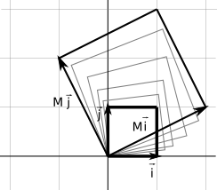
</td><td style="vertical-align:top">
- Uma espécie de escala e rotação.
- Transformações lineares
    - Rotação
    - Escala
    - Projeção Ortográfica
    - Reflexão
    - Cisalhamento
</td></tr></table>

# Transformações

## Rotação em 2D

$$R(\theta)=\begin{bmatrix}
  \vec{p'} & \vec{q'}
\end{bmatrix}
 =
\begin{bmatrix}
cos\theta & -sen\theta \\
sen\theta & cos\theta
\end{bmatrix}$$

## Rotação em 3D

## Rotação em 3D

- Sobre o eixo X

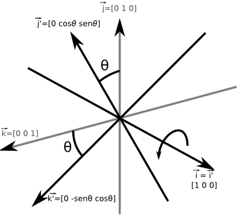

$$R_x(\theta)=
\begin{bmatrix}
  \vec{i'} &
  \vec{j'} &
  \vec{k'}
\end{bmatrix}=
\begin{bmatrix}
  1 & 0 	  & 0 \\
  0 & cos(\theta) & -sen(\theta) \\
  0 & sen(\theta) &  cos(\theta)
\end{bmatrix}$$

## Rotação em 3D

- Sobre o eixo Y

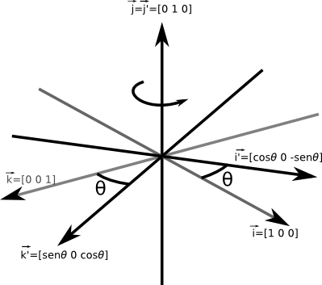

$$R_y(\theta)=
\begin{bmatrix}
  \vec{i'} &
  \vec{j'} &
  \vec{k'}
\end{bmatrix}=\begin{bmatrix}
  cos(\theta) & 0 & sen(\theta) \\
  0           & 1 & 0            \\
 -sen(\theta) & 0 & cos(\theta)
\end{bmatrix}$$

## Rotação em 3D

- Sobre o eixo Z

$$R_z(\theta)=
\begin{bmatrix}
  \vec{i'} &
  \vec{j'} &
  \vec{k'}
\end{bmatrix}=\begin{bmatrix}
  cos(\theta) & -sen(\theta) & 0 \\
  sen(\theta) &  cos(\theta) & 0 \\
  0           & 0 	     & 1
\end{bmatrix}$$

## Rotação sobre um eixo arbitrário

<table><tr><td>

</td><td style="vertical-align:top">
$$\begin{align}
\vec{v}_\parallel & = (\vec{v}\cdot \vec{n})\vec{n} \\
\vec{v}_\perp     & = v - \vec{v}_\parallel \\
                  & = v - (\vec{v}\cdot \vec{n})\vec{n} \\
\vec{w}           & = \vec{n} \times \vec{v}_\perp \\
                  & = \vec{n} \times (\vec{v} - \vec{v}_\parallel) \\
                  & = \vec{n} \times \vec{v} - \vec{n} \times \vec{v}_\parallel\\
                  & = \vec{n} \times \vec{v} - \vec{0}\\
                  & = \vec{n} \times \vec{v}\\
\vec{v}_\perp'    & = cos(\theta)\vec{v}_\perp + sen(\theta)\vec{w} \\
                  & = cos(\theta)(\vec{v} - (\vec{v}\cdot \vec{n})\vec{n}) + sen(\theta)(\vec{n}\times\vec{v})\\
\vec{v}'          & = \vec{v}_\perp' + \vec{v}_\parallel \\
                  & = cos(\theta)(\vec{v} - (\vec{v} \cdot \vec{n})\vec{n}) + sen(\theta)(\vec{n}\times\vec{v}) + (\vec{v}\cdot\vec{n})\vec{n}
\end{align}
$$

</td></tr></table>

## Rotação sobre um eixo arbitrário

$$\begin{align}
\vec{i}  & = \begin{bmatrix}1&0&0\end{bmatrix}^T \\
\vec{i}' & = cos(\theta)(\vec{i} - (\vec{i} \cdot \vec{n})\vec{n}) + sen(\theta)(\vec{n}\times\vec{i}) + (\vec{i}\cdot\vec{i})\vec{n} \\
         & = cos(\theta)\left(
	      \begin{bmatrix}1\\0\\0\end{bmatrix}-\left(
		\begin{bmatrix}1\\0\\0\end{bmatrix} \cdot
		\begin{bmatrix}n_x\\n_y\\n_z\end{bmatrix}
	      \right)
	      \begin{bmatrix}n_x\\n_y\\n_z\end{bmatrix}
	     \right)
	     +sen(\theta)\left(
	      \begin{bmatrix}n_x\\n_y\\n_z\end{bmatrix}\times
	      \begin{bmatrix}1\\0\\0\end{bmatrix}
	     \right)
	     +\left(
	      \begin{bmatrix}1\\0\\0\end{bmatrix}\cdot
	      \begin{bmatrix}n_x\\n_y\\n_z\end{bmatrix}
	     \right)
	     \begin{bmatrix}n_x\\n_y\\n_z\end{bmatrix} \\
	 & = cos(\theta)\left(
	       \begin{bmatrix}1\\0\\0\end{bmatrix}-
	       n_x\begin{bmatrix}n_x\\n_y\\n_z\end{bmatrix}
	     \right) +
	     sen(\theta)\begin{bmatrix}0\\n_z\\-n_y\end{bmatrix}+
	     n_x\begin{bmatrix}n_x\\n_y\\n_z\end{bmatrix} \\
	 & = cos(\theta)\begin{bmatrix}1-n_x^2\\-n_xn_y\\-n_xn_z\end{bmatrix}+
	     sin(\theta)\begin{bmatrix}0\\n_z\\-n_y\end{bmatrix} + 
	     \begin{bmatrix}n_x^2\\n_xn_y\\n_xn_z\end{bmatrix} \\
	 & = \begin{bmatrix}cos(\theta)-n_x^2cos(\theta)\\-n_xn_ycos(\theta)\\-n_xn_zcos(\theta)\end{bmatrix} + 
	     \begin{bmatrix}0\\n_zsen(\theta)\\-n_ysen(\theta)\end{bmatrix} + 
	     \begin{bmatrix}n_x^2\\n_xn_y\\n_xn_z\end{bmatrix}
\end{align}
$$

## Rotação sobre um eixo arbitrário

$$\begin{align}
\vec{i}' & = \begin{bmatrix}
	     cos(\theta) - \cos(\theta)n_x^2 + n_x^2\\
	     -n_xn_ycos(\theta) + n_zsen(\theta) + n_xn_y\\
	     -n_xn_zcos(\theta) - n_ysen(\theta) + n_xn_z
	     \end{bmatrix} \\
	 & = \begin{bmatrix}
	     n_x^2(1-cos(\theta)) + cos(\theta)\\
	     n_xn_y(1-cos(\theta)) + n_zsen(\theta)\\
	     n_xn_z(1-cos(\theta)) - n_ysen(\theta)
	     \end{bmatrix}
\end{align}
$$

## Rotação sobre um eixo arbitrário

- Ufa, falta os outros dois (quê?!)

$$\begin{align}
\vec{j}  & = \begin{bmatrix}0 & 1 & 0\end{bmatrix}^T \\
\vec{j}' & = \begin{bmatrix}
n_xn_y(1-cos\theta) - n_zsen\theta)\\
n_y^2(1 - cos\theta) + cos\theta \\
n_yn_z(1 - cos\theta) + n_xsen\theta
\end{bmatrix}\\
\vec{k}  & = \begin{bmatrix}0 & 0 & 1\end{bmatrix}^T \\
\vec{k}' & = \begin{bmatrix}
n_xn_z(1-cos\theta) + n_ysen\theta)\\
n_yn_z(1 - cos\theta) - n_xsen\theta \\
n_z^2(1 - cos\theta) + cos\theta
\end{bmatrix}
\end{align}$$

## Rotação sobre um eixo arbitrário

- Finalmente a matriz de rotação

$$R(\vec{n},\theta) = 
\begin{bmatrix}
n_x^2(1-cos\theta) + cos\theta     & n_xn_y(1-cos\theta) - n_zsen\theta) & n_xn_z(1-cos\theta) + n_ysen\theta) \\
n_xn_y(1-cos\theta) + n_zsen\theta & n_y^2(1 - cos\theta) + cos\theta & n_yn_z(1 - cos\theta) - n_xsen\theta \\
n_xn_z(1-cos\theta) - n_ysen\theta & n_yn_z(1 - cos\theta) + n_xsen\theta & n_z^2(1 - cos\theta) + cos\theta \\
\end{bmatrix}
$$

## Escala

<table><tr><td>

</td><td style="vertical-align:middle">
$$S(k_1, k_2, \dots,k_n) = \begin{bmatrix}
  k_1    & 0      & \cdots & 0      \\ 
  0      & k_2    & \cdots & 0      \\ 
  \vdots & \vdots & \ddots & \vdots \\
  0      & 0      & \cdots & k_n        
\end{bmatrix}$$

</td></tr></table>

## Escala em uma direção arbitrária

<table><tr><td>
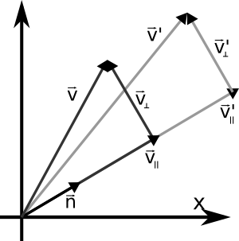
</td><td style="vertical-align:middle">
- Em 2D:

$$
\begin{align}
  \vec{v} &= \vec{v}_\parallel + \vec{v}_\perp\\
  \vec{v}_\parallel &= (\vec{v}\cdot\vec{n})\vec{n}\\
  \vec{v}_\perp' &= \vec{v}_\perp\\
          &= \vec{v} - \vec{v}_\parallel\\
          &= \vec{v} - (\vec{v}\cdot\vec{n})\vec{n}\\
  \vec{v}_\parallel' &= k\vec{v}_\parallel\\
          &= k(\vec{v}\cdot\vec{n})\vec{n}\\
  \vec{v}'&= \vec{v}_\perp' + \vec{v}_\parallel'\\
          &= \vec{v}-(\vec{v}\cdot\vec{n})\vec{n} + k(\vec{v}\cdot\vec{n})\vec{n}\\
          &= \vec{v}+(k-1)(\vec{v}\cdot\vec{n})\vec{n}\\
\end{align}
$$
</td></tr></table>

## Escala em uma direção arbitrária

- Transformação de $\vec{i}$ e $\vec{j}$:

<table><tr><td>
$$
\begin{align}
  \vec{i} & = \begin{bmatrix}1&0\end{bmatrix}^T\\
  \vec{i}'& = \vec{i}+(k-1)(\vec{i}\cdot\vec{n})\vec{n}\\
          & = \begin{bmatrix}1\\0\end{bmatrix}+(k-1)(\begin{bmatrix}1\\0\end{bmatrix}\cdot\begin{bmatrix}n_x\\n_y\end{bmatrix})\begin{bmatrix}n_x\\n_y\end{bmatrix}\\
          & = \begin{bmatrix}1\\0\end{bmatrix}+(k-1)n_x\begin{bmatrix}n_x\\n_y\end{bmatrix}\\
          & = \begin{bmatrix}1\\0\end{bmatrix}+\begin{bmatrix}(k-1)n_x^2\\(k-1)n_xn_y\end{bmatrix}\\
          & = \begin{bmatrix}1+(k-1)n_x^2\\(k-1)n_xn_y\end{bmatrix}
\end{align}
$$
</td><td style="vertical-align:top">
$$
\begin{align}
  \vec{j} & = \begin{bmatrix}0&1\end{bmatrix}^T\\
  \vec{j}'& = \begin{bmatrix}(k-1)n_xn_y\\1+(k-1)n_y^2\end{bmatrix}\\
\end{align}
$$
</td></tr></table>

## Escala em uma direção arbitrária

- Então a matriz de escala por um eixo arbitrário é:

$$
S(\vec{n},k)=\begin{bmatrix}\vec{i}'&\vec{j}'\end{bmatrix} = 
\begin{bmatrix}1+(k-1)n_x^2 & (k-1)n_xn_y\\(k-1)n_xn_y & 1+(k-1)n_y^2\end{bmatrix}
$$

## Escala em uma direção arbitrária

- E agora em 3D:

<table><tr><td>
$$
\begin{align}
  \vec{i} & = \begin{bmatrix}1&0\end{bmatrix}^T\\
  \vec{i}'& = \vec{i}+(k-1)(\vec{i}\cdot\vec{n})\vec{n}\\
          & = \begin{bmatrix}1\\0\end{bmatrix}+(k-1)(\begin{bmatrix}1\\0\end{bmatrix}\cdot\begin{bmatrix}n_x\\n_y\end{bmatrix})\begin{bmatrix}n_x\\n_y\end{bmatrix}\\
          & = \begin{bmatrix}1\\0\end{bmatrix}+(k-1)n_x\begin{bmatrix}n_x\\n_y\end{bmatrix}\\
          & = \begin{bmatrix}1\\0\end{bmatrix}+\begin{bmatrix}(k-1)n_x^2\\(k-1)n_xn_y\end{bmatrix}\\
          & = \begin{bmatrix}1+(k-1)n_x^2\\(k-1)n_xn_y\end{bmatrix}
\end{align}
$$
</td><td style="vertical-align:top">
$$
\begin{align}
  \vec{j} & = \begin{bmatrix}0&1\end{bmatrix}^T\\
  \vec{j}'& = \begin{bmatrix}(k-1)n_xn_y\\1+(k-1)n_y^2\end{bmatrix}\\
  \vec{k} & = \begin{bmatrix}0&1\end{bmatrix}^T\\
  \vec{k}'& = \begin{bmatrix}(k-1)n_xn_y\\1+(k-1)n_y^2\end{bmatrix}\\
\end{align}
$$
</td></tr></table>

## Escala em uma direção arbitrária

- A matriz de escala por um eixo arbitrário em 3D é:

$$
S(\vec{n},k)=\begin{bmatrix}\vec{i}'&\vec{j}'\end{bmatrix} = 
\begin{bmatrix}1+(k-1)n_x^2 & (k-1)n_xn_y\\(k-1)n_xn_y & 1+(k-1)n_y^2\end{bmatrix}
$$

## Projeção Ortográfica
<table><tr><td>

</td><td style="vertical-align:top">
$$P_x = S(\begin{bmatrix}0&1\end{bmatrix},0) = \begin{bmatrix}1&0\\0&0\end{bmatrix}$$

$$P_y = S(\begin{bmatrix}1&0\end{bmatrix},0) = \begin{bmatrix}0&0\\0&1\end{bmatrix}$$

$$P_{xy} = S(\begin{bmatrix}0&0&1\end{bmatrix},0) = \begin{bmatrix}1&0&0\\0&1&0\\0&0&0\end{bmatrix}$$

$$P_{xz} = S(\begin{bmatrix}0&1&0\end{bmatrix},0) = \begin{bmatrix}1&0&0\\0&0&0\\0&0&1\end{bmatrix}$$

$$P_{yz} = S(\begin{bmatrix}1&0&0\end{bmatrix},0) = \begin{bmatrix}0&0&0\\0&1&0\\0&0&1\end{bmatrix}$$
</td></tr></table>

## Projeção Ortográfica

- Sobre uma direção arbitrária (Em 2D)

$$\begin{align}
P(\vec{n}) &= S(\vec{n},0) \\
           &= \begin{bmatrix}1+(0-1)n_x^2 & (0-1)n_xn_y\\(0-1)n_xn_y&1+(0-1)n_y^2\end{bmatrix} \\
           &= \begin{bmatrix}1-n_x^2&-n_xn_y\\-n_xn_y&1-n_y^2\end{bmatrix}
\end{align}
$$

- Sobre uma direção arbitrária (Em 3D)
     
$$\begin{align}
P(\vec{n}) &= S(\vec{n},0) \\
           &= \begin{bmatrix}1+(0-1)n_x^2 & (0-1)n_xn_y&(0-1)n_xn_z\\(0-1)n_xn_y&1+(0-1)n_y^2&(0-1)n_yn_z\\(0-1)n_xn_z&(0-1)n_yn_z&1+(0-1)n_z^2\end{bmatrix} \\
           &= \begin{bmatrix}1-n_x^2&-n_xn_y&-n_xn_z\\-n_xn_y&1-n_y^2&-n_yn_z\\-n_xn_z&-n_yn_z&1-n_z^2\end{bmatrix}
\end{align}
$$

## Reflexão

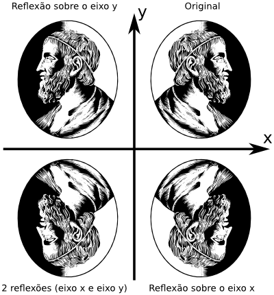

$$
\begin{align}
R(\vec{n}) & = S(\vec{n}, -1) = \begin{bmatrix}1+(-1-1)n_x^2&(-1-1)n_xn_y\\(-1-1)n_xn_y&1+(-1-1)n_y^2\end{bmatrix} = \begin{bmatrix}1-2n_x^2&-2n_xn_y\\-2n_xn_y&1-2n_y^2\end{bmatrix}
\end{align}
$$

## Reflexão

- Em 3D:

$$
\begin{align}
R(\vec{n}) & = S(\vec{n}, -1) \\
           & = \begin{bmatrix}1+(-1-1)n_x^2&(-1-1)n_xn_y&(-1-1)n_xn_z\\(-1-1)n_xn_y&1+(-1-1)n_y^2&(-1-1)n_yn_z\\(-1-1)n_xn_z&(-1-1)n_yn_z&1+(-1-1)n_z^2\end{bmatrix}\\
           & = \begin{bmatrix}1-2n_x^2&-2n_xn_y&-2n_xn_z\\-2n_xn_y& 1-2n_y^2&-2n_yn_z\\-2n_xn_z&-2n_yn_z&1-2n_z^2\end{bmatrix}
\end{align}
$$

## Cisalhamento

<table><tr><td>

</td><td style="vertical-align:top">

</td></tr><tr><td>
$$H_x(c)=\begin{bmatrix}1&c\\0&1\end{bmatrix}$$</td><td>
$$H_y(c)=\begin{bmatrix}1&0\\c&1\end{bmatrix}$$
</td></tr></table>

## Cisalhamento

- Em 3D: Um vetor distorce outros dois
- $H_{xy}$: o eixo Z contribui para os eixos X e Y

$$
\begin{align}
H_{xy}(c,d) &= \begin{bmatrix}1&0&c\\0&1&d\\0&0&1\end{bmatrix}\\
H_{xz}(c,d) &= \begin{bmatrix}1&c&0\\0&1&0\\0&d&1\end{bmatrix}\\
H_{yz}(c,d) &= \begin{bmatrix}1&0&0\\c&1&0\\d&0&1\end{bmatrix}
\end{align}
$$

## Composição de Transformações

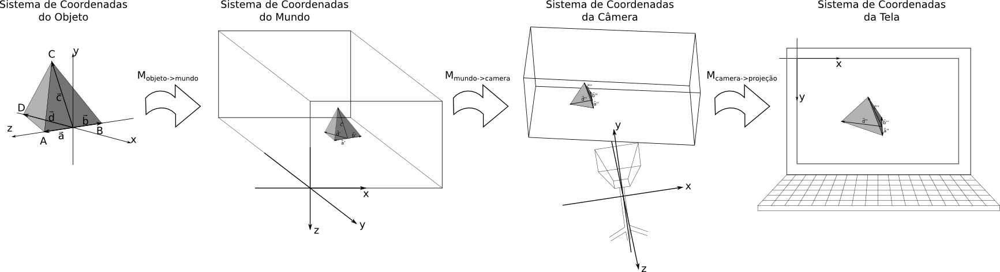

$$\begin{align}
\vec{v}'  & = \color{red}{M_{objeto\rightarrow mundo}}\vec{v} \\
\vec{v}'' & = \color{green}{M_{mundo->camera}}\vec{v}' \\
          & = \color{green}{M_{mundo->camera}}(\color{red}{M_{objeto\rightarrow mundo}}\vec{v}) \\
\vec{v}'''& = \color{blue}{M_{camera->tela}}\vec{v}'' \\
          & = \color{blue}{M_{camera->tela}}(\color{green}{M_{mundo->camera}}(\color{red}{M_{objeto\rightarrow mundo}}\vec{v}))
\end{align}$$

## Composição de Transformações

- Como multiplicação de matrizes é associativa, vamos agrupar as matrizes:

$$\begin{align}
\vec{v}'''& = (\color{blue}{M_{camera->tela}}\color{green}{M_{mundo->camera}}\color{red}{M_{objeto\rightarrow mundo}})\vec{v} 
\end{align}$$

- $\color{blue}{M_{camera->tela}}$ é a matriz de projeção $\color{blue}{P}$
- $\color{green}{M_{mundo->camera}}$ é a matriz de visualização $\color{green}{V}$
- $\color{red}{M_{objeto\rightarrow mundo}}$ é a matriz de modelo $\color{red}{M}$
- _Model-View-Projection_($\color{red}{M}\color{green}{V}\color{blue}{P}$): Da coordenada do objeto à coordenada da tela

# Classes de Transformações

## Introdução

- O conjunto de transformações + conjunto de pontos = _*geometria*_

## Geometria Euclidiana

- Propriedades preservadas (invariantes):
    - _ângulos_;
    - _paralelismo_;
    - _áreas_ (2D, 3D e outros $N$D, com $N\ge 2$);
    - _volumes_ (no caso de 3D e outros $N$D, com $N\ge 2$);
    - _razões de distâncias entre pontos_ (ex: AB/AC se mantém após a transformação);
    - _colinearidade_: se vários pontos estão contidos numa linha, os pontos resultantes ainda formarão parte de uma linha;
    - _distância_;
    - _incidência_: se uma linha incidir sobre um ponto, a linha transformada incidirá sobre o ponto transformado.

## Geometria Euclidiana

- (Cont) Propriedades preservadas (invariantes):
    - _razão cruzada_: se calculares as distâncias entre um ponto e outros dois pontos (ex: AC e AD), fazer a razão ($\frac{AC}{AD}$), e fizer o mesmo com um outro ponto ($\frac{BC}{BD}$), e fizer a razão entre estas razões ($\frac{\frac{AC}{AD}}{\frac{BC}{BD}}$), esse valor se manterá após a transformação.
    - _forma_.
- Transformações
    - translação;
    - rotação.
    
## Geometria de Similaridade

- Invariantes:
    - ângulos;
    - paralelismo;
    - razões de distâncias entre pontos;
    - colinearidade;
    - incidência;
    - razão cruzada;
    - forma;
- Transformações
    - translação;
    - rotação;
    - reflexão;
    - escala uniforme.

## Geometria Afim

- Invariantes:
    - paralelismo;
    - razões de distâncias entre pontos;
    - razão cruzada;
    - colinearidade;
- Transformações
    - translação;
    - rotação;
    - reflexão;
    - escala Uniforme;
    - escala Não-Uniforme;
    - cisalhamento.

## Geometria Projetiva

<table><tr><td style="text-align:top">
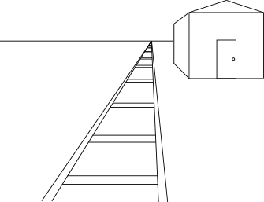
</td><td style="text-align:top">
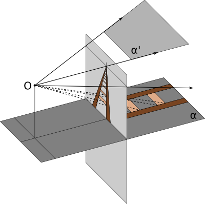
</td></tr></table>

> - Euclidiana: 2 linhas se encontram em um ponto exceto em paralelo.
> - Projetiva: 2 linhas se encontram em um ponto ~~exceto em paralelo~~.

## Geometria Projetiva

<table><tr><td style="text-align:top">

</td><td style="text-align:top">

</td></tr></table>

- Horizonte

## Geometria Projetiva

- Invariantes:
    - Razão Cruzada;
    - Colinearidade;    
- Transformações:
    - Todas as transformações da geometria afim;
    - Projeção perspectiva;
    - Composição de projeções.
- Livros:
    - [Multiple View Geometry](http://www.amazon.com/Multiple-View-Geometry-Computer-Vision/dp/0521540518/ref=sr_1_1?ie=UTF8&qid=1394402186&sr=8-1&keywords=multi+view+geometry);
    - [Projective Geometry](http://www.amazon.com/Projective-Geometry-H-S-M-Coxeter/dp/0387406239/ref=sr_1_1?ie=UTF8&qid=1394402213&sr=8-1&keywords=projective+geometry);
    - [Geometry](http://books.google.com.br/books?id=UlrmKjIjrzQC)

## Geometria Projetiva

<table><tr><td style="text-align:top">
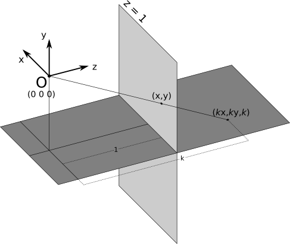
</td><td style="vertical-align:top;text-align:top">

> - $\mathbb{R}^2 \rightarrow \mathbb{P}^2 \cong \mathbb{R}^3$
> - Qualquer ponto $k(x,y,1)$ é projetado para $(x,y)$.
> - Em $\mathbb{P}^2$, $k_1(x,y,1) = k_2(x,y,1)$, para $k_1 \neq k_2$.
> - O conjunto de pontos $k(x,y,1)$ é uma linha em $\mathbb{R}^3$
> - Uma linha em $\mathbb{R}^3$ é um Ponto em $\mathbb{P}^2$.
> - O conjunto de Pontos é todo o espaço $\mathbb{P}^2$.
> - $(x,y,1)$ é a coordenada homogênea de $(x,y)$.

</td></tr></table>

## Geometria Projetiva

> - Mas e em $\mathbb{R}^3$?
> - $\mathbb{R}^3 \rightarrow \mathbb{P}^3 \cong \mathbb{R}^4$;
> - $(x,y,z,1)$ é a coordenada homogênea de $(x,y,z)$;
> - Em $\mathbb{P}^3$, $(kx,ky,kz,k) = k(x,y,z,1) = (x,y,z,1)$.
> - E as matrizes de transformações?
> - Vamos ver a escala não uniforme: $[\color{red}{x},\color{red}{y},\color{red}{z},1] \rightarrow [\color{blue}{s_1}\color{red}{x},\color{blue}{s_2}\color{red}{y},\color{blue}{s_3}\color{red}{z},1]$: 
$$\begin{array}\\
\color{blue}{s_1}\color{red}{x} &+                0\color{red}{y} &+                0\color{red}{z} &+ a\times1 &= s_1\color{red}{x}\\
                0\color{red}{x} &+ \color{blue}{s_2}\color{red}{y} &+                0\color{red}{z} &+ b\times1 &= s_2\color{red}{y}\\
                0\color{red}{x} &+                0\color{red}{y} &+ \color{blue}{s_3}\color{red}{z} &+ c\times1 &= s_3\color{red}{z}\\
                0\color{red}{x} &+                0\color{red}{y} &+                0\color{red}{z} &+ d\times1 &= 1
\end{array}
$$
> - Vemos que $a=b=c=0$ e $d=1$. Arrumando em Matrizes: 
$$
\begin{bmatrix}
s_1&0&0&0\\ 
0&s_2&0&0\\
0&0&s_3&0\\
0&0&0&1
\end{bmatrix}
\begin{bmatrix}
x\\y\\z\\1
\end{bmatrix}=
\begin{bmatrix}
s_1x\\s_2y\\s_3z\\1
\end{bmatrix}
$$

## Geometria Projetiva

> - Para a rotação, acontece o mesmo: $a=b=c=0$ e $d=1$
> - Ex: no eixo X 
$$
\begin{bmatrix}
  1&         0&         0&0\\ 
  0& cos\theta& sen\theta&0\\
  0&-sen\theta& cos\theta&0\\ 
  0&         0&         0&1
\end{bmatrix}
\begin{bmatrix}
x\\y\\z\\1
\end{bmatrix}=
\begin{bmatrix}
x\\cos\theta y+sen\theta z\\-sen\theta y+cos\theta z\\1
\end{bmatrix}
$$
> - Resumindo: para as tranformações até agora mostradas, basta adicionar $[0,0,0,1]$ na 4ª linha e 4ª coluna
> - Imagine que a 4ª coluna $[0,0,0,1]^T$ é a origem do sistema.
> - E para a bendita translação?
> - A ideia é transladar a origem do sistema de $[0,0,0,1]^T$ para $[t_x, t_y, t_z, 1]$.

## Geometria Projetiva

> - Queremos transformar $[x,y,z,1]$ em $[x+\color{blue}{t_x},y+\color{blue}{t_y},z+\color{blue}{t_z},1]$.
> - Focando no primeiro elemento 
    $\color{green}{a_{11}}x + \color{green}{a_{12}}y + \color{green}{a_{13}}z + \color{green}{a_{14}}1 = x + \color{blue}{t_x}$
> - Vemos que $\color{green}{a_{11}} = 1$, $\color{green}{a_{12}} = \color{green}{a_{13}} = 0$ e $\color{green}{a_{14}} = \color{blue}{t_x}$.
> - Para os outros elementos, é o mesmo processo: 
$$\begin{array}\\
1x &+& 0y &+& 0z &+& \color{blue}{t_x}\times1 &=& x + \color{blue}{t_x}\\
0x &+& 1y &+& 0z &+& \color{blue}{t_y}\times1 &=& y + \color{blue}{t_y}\\
0x &+& 0y &+& 1z &+& \color{blue}{t_z}\times1 &=& z + \color{blue}{t_z}\\
0x &+& 0y &+& 0z &+&   1\times1 &=& 1
\end{array}
$$
> - Arrumando em matrizes: 
$$
\begin{bmatrix}
  1 & 0 & 0 & \color{blue}{t_x}\\
  0 & 1 & 0 & \color{blue}{t_y}\\
  0 & 0 & 1 & \color{blue}{t_z}\\
  0 & 0 & 0 & 1
\end{bmatrix}
\begin{bmatrix}
x\\y\\z\\1
\end{bmatrix}=
\begin{bmatrix}
x + \color{blue}{t_x}\\y + \color{blue}{t_y}\\z + \color{blue}{t_z}\\1
\end{bmatrix}
$$

## Geometria Euclidiana (Voltando)

- Translação e Rotação
- Formato da transformação: 
$$
\begin{bmatrix}
  R       & \vec{t}\\
  \vec{0} & 1
\end{bmatrix}
$$

## Geometria de Similaridade (Voltando)

- Translação, Rotação, Reflexão e Escala Uniforme
- Formato da transformação: 
$$
\begin{bmatrix}
  sR       & \vec{t}\\
  \vec{0}  & 1
\end{bmatrix}
$$

## Geometria Afim (Voltando)

- Translação, Rotação, Reflexão, Escala Uniforme e Escala Não-Uniforme
- Formato da transformação: 
$$
\begin{bmatrix}
  A       & \vec{t}\\
  \vec{0}  & 1
\end{bmatrix}
$$
- $A$ pode ser qualquer matriz

## Geometria Projetiva (Voltando)

- Toda as transformações da Geom. Afim, mais a projeção perspectiva;
- Formato da transformação: 
$$
\begin{bmatrix}
  h_{11} & h_{12} & \cdots & h_{1n}\\
  h_{21} & h_{22} & \cdots & h_{2n}\\
  \vdots & \vdots & \ddots & \vdots \\
  h_{n1} & h_{n2} & \cdots & h_{nn}
\end{bmatrix}
$$

## Geometrias (Ilustração)

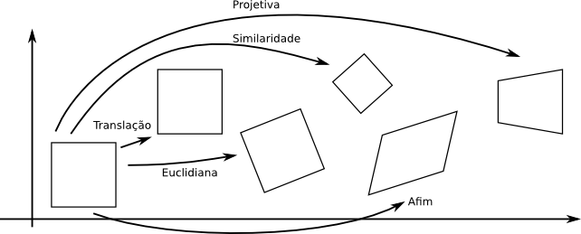

## Geometrias Não-Euclidianas

<table style="margin-left:auto;margin-right:auto"><tr style="text-align:top center;"><td style="text-align:top center;">
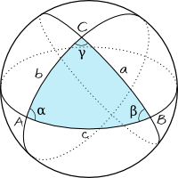
</td><td style="text-align:top center;">
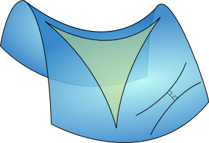
</td></tr>
<tr style="text-align:top center;"><td style="text-align:top center;">

</td><td style="text-align:top center;">

</td></tr>
</table>

## Transformação Linear

- Aditiva:  $F(a+b) = F(a) + F(b)$;
- Homogênea: $F(ka) = kF(a)$.
- Ex: Multiplicação de Matriz 

$$\begin{align}
F(\vec{a}+\vec{b}) &= M(\vec{a}+\vec{b}) \\
       &= M\vec{a}+M\vec{b}  \\
       &= F(\vec{a}) + F(\vec{b})\\
F(k\vec{a}) &= M(k\vec{a}) \\
       &= kM\vec{a}  \\
       &= kF(\vec{a})
\end{align}
$$

## Transformação Afim

- $F(\vec{a}) = M\vec{a} + \vec{t}$
- $\vec{t}=\vec{0} \Rightarrow F(\vec{a}) = M\vec{a}$
- $\vec{t}\neq\vec{0}$ 
    $$\begin{align}
    F(\vec{a} + \vec{b}) &= M(\vec{a} + \vec{b}) + \vec{t} \\
			&= (M\vec{a} + \vec{t}) + (M\vec{b} + \vec{t}) - \vec{t} \\
			&= F(\vec{a}) + F(\vec{b}) - \vec{t} \\
			&\neq F(\vec{a}) + F(\vec{b})
    \end{align}
    $$

## Transformação Inversível

- $F(a)=b \Rightarrow F^{-1}(b)=a$
- Rotação: basta rotacionar $-\theta$
- Escala: basta escalar
- Projeção: não tem inversa (perdeu uma dimensão) 
    _Desafio para reconstrução 3D_
- Translação: basta transladar -[t_x, t_y, t_z]
- Cisalhamento: basta cisalhar -c no mesmo eixo

## Transformação Ortogonal

- $M^{-1} = M^T$
- As colunas da matriz são vetores bases ortonormais (perpendiculares e unitários)
- $det(M)= 1$ (rotação) ou $det(M)= -1$ (reflexão)

# Matrizes

## Determinante

$$|M| = 
\begin{vmatrix}
  m_{11} & m_{12} \\ 
  m_{21} & m_{22}
\end{vmatrix}
= m_{11}m_{22}-m_{12}m_{21}
$$

$$\begin{align}\begin{vmatrix}
  m_{11} & m_{12} & m_{13}\\ 
  m_{21} & m_{22} & m_{23}\\ 
  m_{31} & m_{32} & m_{33}\\ 
\end{vmatrix}
& = m_{11}m_{22}m_{33}+m_{12}m_{23}m_{31}+m_{13}m_{21}m_{32}
 -m_{13}m_{22}m_{31}-m_{12}m_{21}m_{33}-m_{11}m_{23}m_{32}\\
& = m_{11}(m_{22}m_{33}-m_{23}m_{32}) -m_{12}(m_{21}m_{33}-m_{23}m_{31}) + m_{13}(m_{21}m_{32}-m_{22}m_{31})
 \end{align}
$$

- Regra de Sarrus
- Teorema de Laplace (Expansão em Cofatores)
    - Dada uma linha $i$: 
    $$|M_{l\times c}| = \sum^{c}_{j=1}{m_{ij}(-1)^{i+j}|M_{ij}|}$$
    $M_{ij}$ é a matriz removendo a i-ésima linha e j-ésima coluna.

## Determinante

- $|AB| = |A||B|$;
- $|M_1M_2\dots M_n|=|M_1||M_2|\dots|M_n|$;
- $|M^T|=|M|$;
- Se alguma linha ou coluna for $\vec{0}$, $|M|=0$;
- Trocar um par de linhas (ou colunas) nega o determinante;
- Adicionar um multiplo de uma linha (ou coluna) em outra linha (ou coluna) não muda o determinante;
- Multiplicar uma linha (ou coluna) por um fator $k$, o determinante é multiplicado por $k$.

## Determinante

> - Determinante tem interpretação geométrica?
> - Área dos vetores base da matriz 
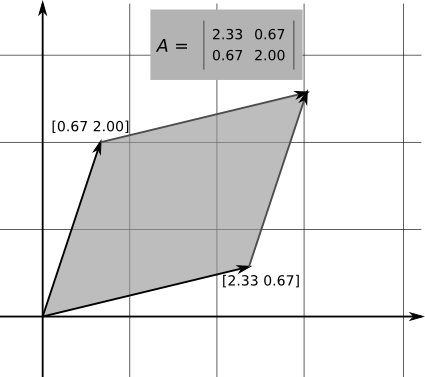

## Inversa

- $MM^{-1} = M^{-1}M = I$
- $(M^{-1})^{-1}=M$
- $I^{-1} = I$
- $(M^T)^{-1} = (M^-1)^T$
- $(AB)^-1 = B^{-1}A^{-1}$
- $(M_1M_2\dots M_n)^{-1}=M_n^{-1}\dots M_2^{-1}M_1^{-1}$
- Geometricamente, $M^{-1}$ é a transformação oposta de $M$ 
    $M^{-1}(M\vec{v}) = (M^{-1}M)\vec{v} = I\vec{v} = \vec{v}$

## Matrizes Ortogonais

- $M^{-1} = M^T \Rightarrow M^TM = MM^T = I$
- Aparecem muitas vezes em CG (Rotação e Reflexão)
- Geometricamente, a matriz é ortogonal se seus vetores bases são ortonormais
- Escolhendo duas colunas $\vec{c}_i$ e $\vec{c}_j$ de $M$ 
    $\vec{c}_i\cdot\vec{c}_j = 0$, se $i\neq j$ (perpendiculares) 
    $\vec{c}_i\cdot\vec{c}_j = 1$, se $i=j$ (paralelo)

## Matrizes Homogêneas

- Coordenadas Homogêneas: $[x,y,z] \Rightarrow [x,y,z,w]$
- Ponto: $w = 1$
- Vetor: $w = 0$
- Matrix $4\times4$
- Transformações lineares: adiciona a origem $[0,0,0,1]^T$ e $0$ na coordenada $w$ dos vetores base.
- Projeção perspectiva?

## Matrizes Homogêneas

<table><tr><td>
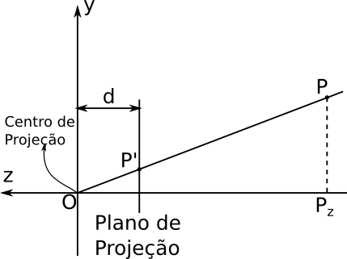
</td><td style="vertical-align:center;">
> - Veja por semelhança de triângulos que:
    $$\frac{x}{x'} = \frac{z}{d} \Rightarrow x' = \frac{dx}{z}$$
    $$\frac{y}{y'} = \frac{z}{d} \Rightarrow y' = \frac{dy}{z}$$
    $$z = d$$
    $$w = 1$$
> - Então
    $$\vec{p}' = 
    \begin{bmatrix}dx/z\\dy/z\\d\\1\end{bmatrix}
    = \begin{bmatrix}dx/z\\dy/z\\dz/z\\1\end{bmatrix}
    = \frac{d}{z}\begin{bmatrix}x\\y\\z\\z/d\end{bmatrix}
    = \begin{bmatrix}x\\y\\z\\z/d\end{bmatrix}
    $$
</td></tr></table>

## Matrizes Homogêneas

> - Construindo nossa matriz de projeção perspectiva
> - $[1, 0, 0, 0]^T \Rightarrow [1, 0, 0, 0]^T$
> - $[0, 1, 0, 0]^T \Rightarrow [0, 1, 0, 0]^T$
> - $[0, 0, 1, 0]^T \Rightarrow [0, 0, d, 1/d]^T$
> - $[0, 0, 0, 1]^T \Rightarrow [0, 0, 0, 0]^T$
> - A matriz então: 
$$P(d) = \begin{bmatrix}
1 & 0 &   0 & 0 \\
0 & 1 &   0 & 0 \\
0 & 0 &   d & 0 \\
0 & 0 & 1/d & 0
\end{bmatrix}
$$

## Matrizes Homogêneas

- A matriz de projeção perspectiva converte [x, y, z, 1] em [x, y, z, z/d].
- Para converter para 3D:
    - $$\begin{bmatrix}x\\y\\z\\z/d\end{bmatrix} = \begin{bmatrix}dx/z\\dy/z\\dz/z\\z/d\end{bmatrix} = \begin{bmatrix}dx/z\\ dy/z\\ d\\ 1\end{bmatrix}$$
- Em 3D, o ponto resultante é [dx/z, dy/z, d]
- A matriz descarta a coordenada $z$. Mas OpenGL precisa da coordenada $z$ para Z-buffering.
- O plano de projeção é perpendicular a $z$. E se não for?

# Orientação e Deslocamento Angular

# Primitivas Geométricas

# Testes Geométricos

