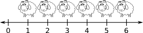

% Revisão de Álgebra Linear para CG
% Anderson Tavares
% Universidade de São Paulo

# Sistemas de Coordenadas Cartesiano

## Uma dimensão

> - Números contáveis
> - 
Contar ovelha 

> - [Introdução à História da Matemática](http://www.livrariasaraiva.com.br/produto/392616)
- 
Pensamento Logaritmo 

## Uma dimensão

> - 
Zero (nenhuma ovelha) 

> - 
Devendo uma ovelha 

> - E os pobres sem poder comprar a ovelha inteira?
> - Números racionais $\frac{31415}{10000}$
> - Número decimal $3,1415$.

## Uma dimensão

> - Números irracionais
> - Não são contáveis
> - Matemática discreta e matemática contínua
> - Como representar esse mundo contínuo?

## Uma dimensão

### Primeira Lei da Computação Gráfica
 Se parecer Ok, então está Ok.

## Duas dimensões

## Três dimensões

http://vision.ime.usp.br/~acmt/hakyll/assets/images/right-hand.png

test3

# Vetores

## Vetor zero

## Negar um vetor

## Magnitude

## Multiplicação por um escalar

## Normalização

## Adição e Subtração de vetores

## Distância entre pontos

## Produto Escalar

## Projetando um vetor no outro

## Produto Vetorial

# Matrizes

## Introdução

## Multiplicação de uma matriz por uma escalar

## Multiplicação entre Matrizes

## Multiplicar um vetor e uma matriz

## Interpretação Geométrica

# Transformações

## Rotação em 2D

## Rotação em 3D

## Rotação sobre um eixo arbitrário

## Escala

## Escala em uma direção arbitrária

## Projeção Ortográfica

## Reflexão

## Cisalhamento

## Composição de Transformações

# Classes de Transformações

## Geometria Euclidiana

## Geometria de Similaridade

## Geometria Afim

## Geometria Projetiva

## Transformação Linear

## Transformação Afim

## Transformação Inversível

# Matrizes

## Determinante

## Inversa

## Matrizes Ortogonais

## Matrizes Homogêneas

# Orientação e Deslocamento Angular

# Primitivas Geométricas

# Testes Geométricos

