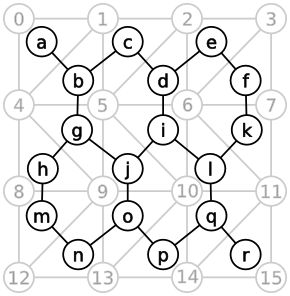
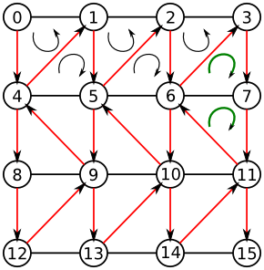
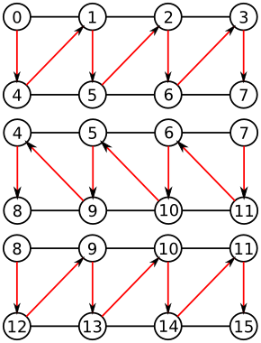

% Triangle Strip para Grades - CG
% Anderson Tavares
% Universidade de São Paulo

# Introdução

## Grade com Triângulos

- Se você usar gl.TRIANGLE
    - Uma grade de 10x10 tem 100 quadrados
    - 100 quadrados contém 200 triângulos
    - 200 triângulos contém 600 vértices
- 600 vértices para uma bandeira
- Imagina para modelar um terreno
- Numa grade de $N\times N$: $6N^2$ vértices.
- A Página Web pode travar (JavaScript não gosta de vetores grandes).
- Podemos economizar vértices.

## Grade com Strip

- _Triangle strip_ (faixa de triângulos). 
    
- 3 vértices para o primeiro triângulo
- 1 vértice adicional para cada triângulo adicional
- Ordem antihorária (triângulos ímpares)
- Ordem horária (triângulos pares)
- Uma fita com 100 triângulos: 102 vértices.
- E para uma grade?

## Grande com Strip

- Uma formação 
    
- Há um problema nessa formação

## Grande com Strip

- Converta em um grafo (Cada triângulo é um nó) 
    
- Problema do ciclo Hamiltoniano (NP Completo)

## Grande com Strip

- Veja a primeira fileira (ela acaba no $f$) 
    
- Mas o $f$ é ligado com $k$ (o penúltimo da segunda fileira)

## Grande com Strip

- Poderíamos interligá-lo com o último ($l$).
- Mas a ligação passa por três triângulos.
- É preciso mudar a estrutura da grade.
- Podemos mudar a segunda fileira

## Grande com Strip

- E se for essa grade? 

## Grande com Strip

- Veja como fica a ligação entre os triângulos

## Ordem dos vértices

- Veja como fica a ligação entre os triângulos

<table><tr><td>
</td><td style="vertical-align:top">

- Ex:Crie uma lista de vértices de 0 a 15
- Crie uma lista de índices
- Insira os índices [0,4,1,5,2,6,3,7,11,6]
- A convenção do TRIANGLE_STRIP são orientações alternadas
- Mas [7,11,6] tem a mesma ordem de [6,3,7] (se torna um buraco)
- Pode-se criar um triângulo degenerado, repetindo-se o 7.

</td></tr></table>

## Triângulo degenerado

- Veja como fica a ligação entre os triângulos

## Solução

- Veja como fica a ligação entre os triângulos

## Solução

- Veja como fica a ligação entre os triângulos
<table><tr><td>
  
</td><td style="vertical-align:top;">
- Nas linhas ímpares (índice j)
    - De 0 até N (índice $i$), posso inserir dois vértices: $jN + i$ e $(j+1)N + i$
- Nas linhas pares
    - De 0 até N (índice $i$), posso inserir dois vértices: $jN + N-(i+1)$ e $(j+1)N + N-(i+1)$
</td></tr></table>

## Algoritmo

- Uma grade de tamanho $numZ \times numX$
- Adicionam-se $numZ \times numX$ vértices
- O triangle strip será feito pelos índices

~~~~ {#mycode .javascript .numberLines startFrom="5"}
for(var i = 0; i < numZ; i++)
{
  for(var j = 0; j < numX; j++)
  {
      vertices.push(i/numX,0.0,-j/numZ);
      if(i%2) indices.push((i+1)*numX-(j+1),(i+2)*numX-(j+1));
      else    indices.push(i*numX+j,(i+1)*numX+j);
  }
}
~~~~~~~~~~~~~~~~~~~~~~~~~~~~~~~~~~~~~~~~~~~~~~~~~

- Aqui tem $i+1$ e $i+2$ pois os índices começam com 1

## Economia?

- Para uma grade de NxN
    - A primeira e última fileiras não se repetem: $2N$
    - As outras fileiras se repetem: $2(N-2)N$
    - Então temos: $2N(N-2+1) = 2N(N-1)$
    - Numa grade de 10x10: $2 \times 10(10-1) = 180$
    - Muito melhor que os 600 vértices!!!
