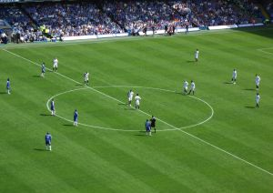
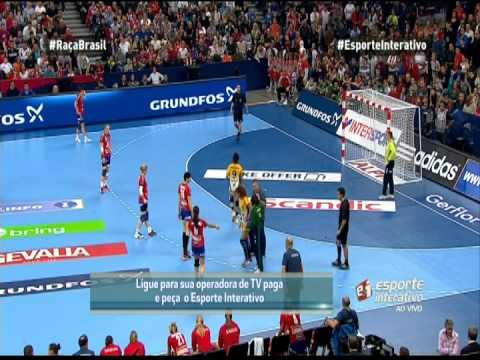
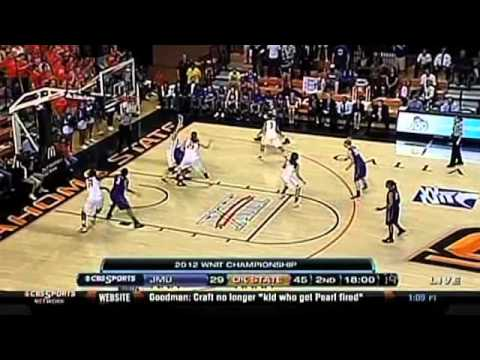
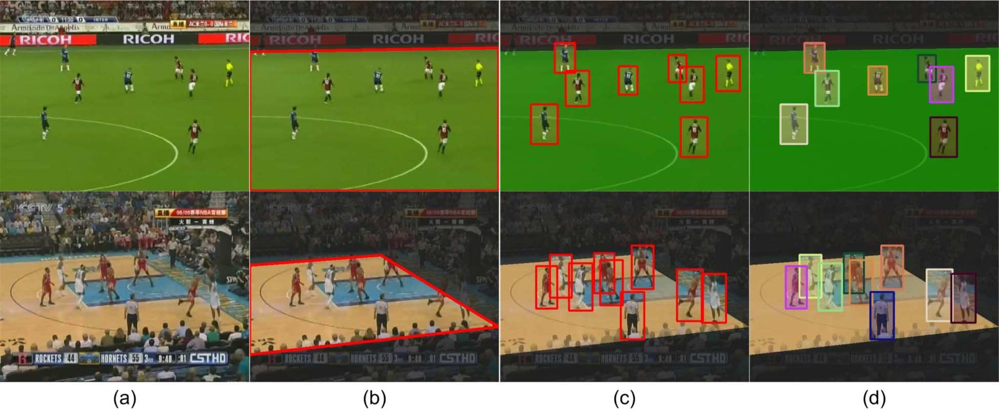
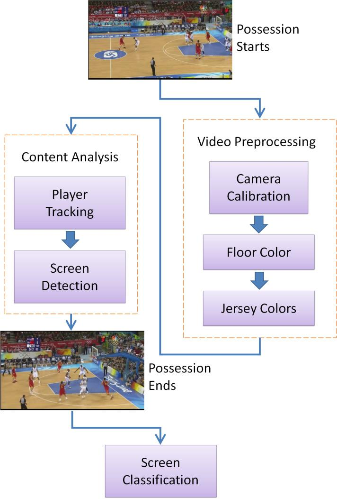
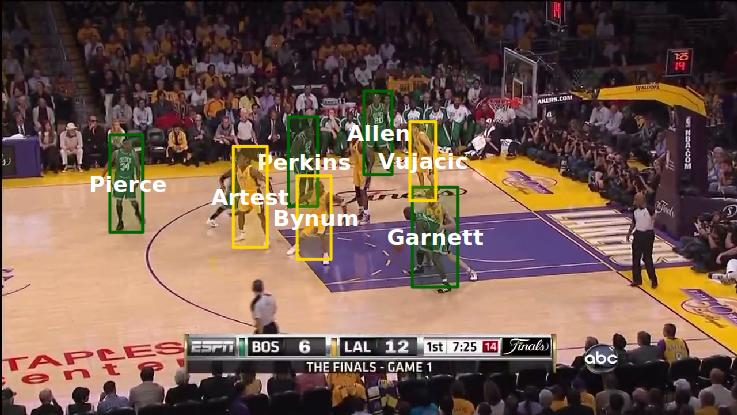
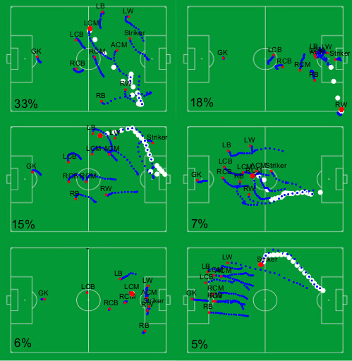
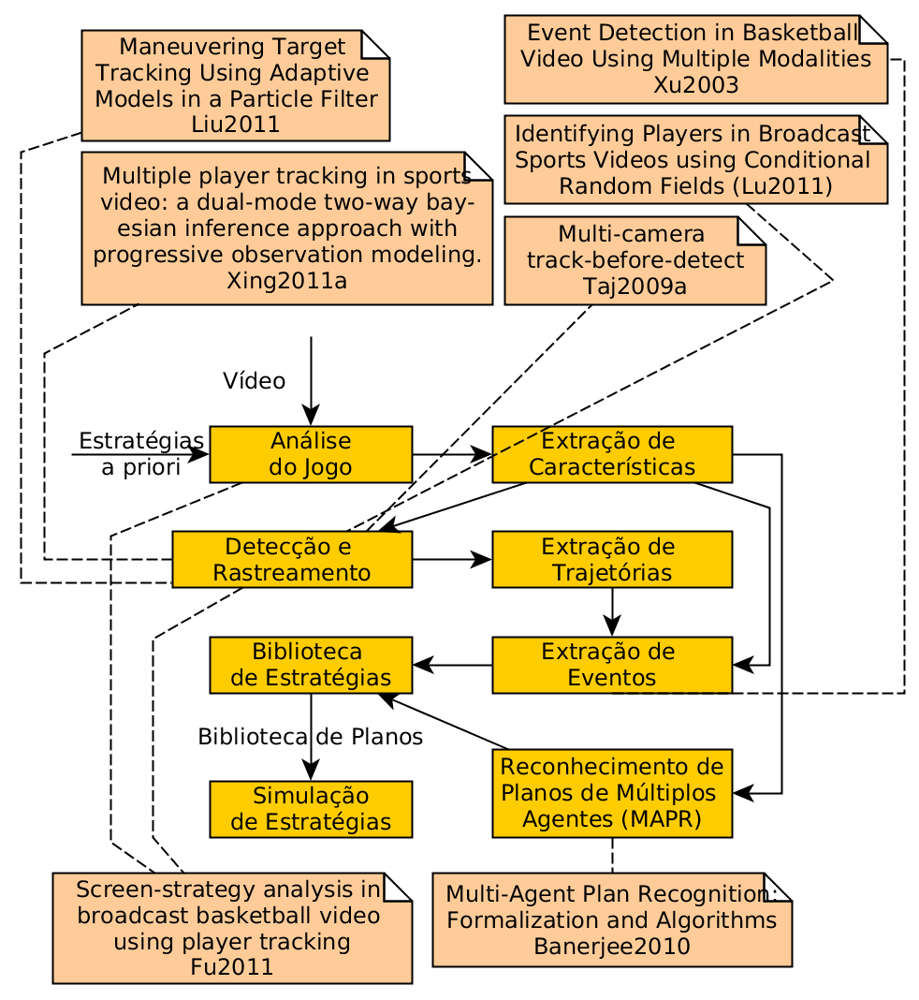
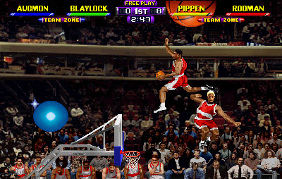
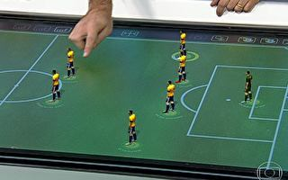

% Detecção de Trajetórias em Esportes de Invasão para Planejamento Estratégico
% Anderson Tavares
% Universidade de São Paulo

# Introdução

- Esportes de Invasão
    - Futebol
    - Handebol
    - Basquete

    
    
    

# Caracterização do Problema

- Anotação Manual
- Câmera com parâmetros intrísecos e extrínsecos desconhecidos
- Detecção de Jogadores
- Rastreamento de Jogadores
- Trajetórias
- Eventos
- Estratégias (Detecção e Simulação)
- Interação entre Jogadores
    - Oclusão
- Diferentes esportes

# Basquete: Movementos

<iframe src="http://en.wikipedia.org/wiki/Basketball_moves" width="100%" height="500px"></iframe>

# Trabalhos Relacionados

- Banerjee [@Banerjee2010] : _Multi-Agent Plan Recognition_ (MPAR), onde modela o planejamento das sequências de atividades de uma equipe.
- Xing et al. [@Xing2011a] : _Multiple Object Tracking_ (MOT) 
    - Dentro e Fora do Campo: _Gaussian Mixture Model_ (GMM)
    - Campo e Jogadores
    - Distinguir Jogadores (oclusão)
    

    
# Trabalhos Relacionados

<table><tr><td>
- Fu [@Fu2011]: Detecção e Análise do Screen
    - Calibração da Câmera: _Hough Transform_
    - Detecção de Jogador: GMM
    - Classificação do Time: _K-Means_
    - Rastreamento: Kalman Filter
    - Detecção do Screen
    
</td><td style="vertical-align:top">

</td></tr></table>

# Trabalhos Relacionados

- Lu[@Lu2011]: Conditional Random Fields (CRF)
    - Detecção do Jogador: _Deformable Part Model_ (DPM)
        - 5000 imagens de jogadores
        - 300 negativos
    - Classificação do Time: 
        - Histograma de Cores e Regressão Logística
    - Rastreamento
        - _Tracking-by-detection_
        - Modelo de Observação Gaussiano

# Trabalhos Relacionados

- Wei [@Wei2013]: Análise de Formações no Futebol
    - Papéis ao invés de Jogadores
    - Detecção de Eventos (escanteio, chutes, laterais...)
    - Representação compacta espaço-temporal das características: Bilinear Basis Model
    

# Metodologia

# Metodologia

- Podem-se usar informações a priori
    - Quadra (cor, geometria...)
    - Jogadores (cor da camisa...)
    - Limitações Físicas (velocidade máxima, salto...)
    
        

# Resultados Esperados

- Extrator de características
- Extrator de trajetórias
- Detector de eventos
- Extrator de gramática
- Extrator de estratégias
- Simulador de estratégias

# Bibliografia