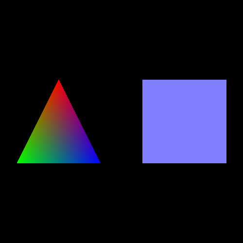
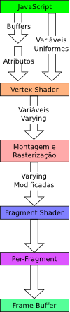

------------------------------
author: Anderson Tavares
title: Tutorial WebGL 2: Adicionando Cores
description: Adicionando cores aos polígonos.
tags: WebGL, OpenGL
thumbnail: assets/images/webgl-colorindo-triangulo-thumb.png
biblio: library.bib
csl: ieee-with-url.csl
math: true
------------------------------

[<< T01: Criando Formas](2014-02-26-webgl-criando-triangulo.html)
[T03: Movimentando Formas >>](2014-03-01-webgl-movimentando-triangulo.html)

Bem vindo ao meu segundo tutorial de WebGL! Esta lição é baseado na [lição 2](http://learningwebgl.com/blog/?p=134) do site LearningWebGL. Vamos agora adicionar cores na cena. 
Veja o resultado:

<a href="http://vision.ime.usp.br/~acmt/hakyll/webgl/demo-adicionando-cores" target="_blank">Veja o resultado</a>. 
<a href="http://github.com/anderflash/webgl_tutorial" target="_blank">Baixe todos os demos</a>.

Este tutorial foi feito baseando-se no conteúdo das aulas de Introdução à Computação Gráfica do Instituto de Matemática e Estatística da USP. Mesmo assim, se você não estiver nessa condição, não haverá problema em compreender o conteúdo e visualizar seu resultado.

Se houver erros no tutorial, não hesite em avisar-me.

No [tutorial 1](2014-02-26-webgl-criando-triangulo.html), falei que o boa parte do código entre os tutoriais são similares. Em resumo é:

- Criar a estrutura HTML com o canvas e associações a arquivos externos (código javascript, por exemplo);
- Definir os _shaders_ de vértices e de fragmento, dentro da tag `<script>` com os tipos "x-shader/x-vertex" e "x-shader/x-fragment";
- Inicializar um contexto WebGL;
- Carregar os shaders em um programa WebGL usando as funções que criamos `getShader` e `iniciarShaders`;
- Definir as matrizes Model-View-Projection (MVP) e enviá-los para a GPU usando a função `setMatrixUniforms`;
- Carregar os _buffers_ com os dados dos vértices (posição, cor, textura...), usando nossa função criada `iniciarBuffers` ;
- Por fim, definir a função iniciaWebGL que chamará as outras funções em sequência;

O que vamos mudar para esse tutorial são os shaders (onde a cor será referenciada), a função iniciarBuffers (onde ela será guardada) e desenharCena (para ativar o atributo `cor` do vértice).

O diagrama ao lado mostra como os dados em JavaScript são transformados em pixels para serem desenhados no canvas WebGL. No mais alto nível, o processo trabalha assim: a cada chamada de uma função de desenho como `drawArrays`, WebGL processa os dados que você enviou para os buffers como atributos (como as posições do [tutorial 1](2014-02-26-webgl-criando-triangulo.html)) e _uniforms_ (como as matrizes MVP) e passa para o _shader_ de vértices.

O _shader_ de vértice é executado para cada vértice paralelamente, enquanto tiver núcleo disponível na GPU. Cada vértice tem seus atributos diferentes entre eles, mas eles têm os mesmos _uniforms_. O _shader_ aplica a transformação do modelo primeiramente, depois a transformação da câmera e por último a transformação da projeção. Na verdade, você que deve ditar como estas transformações serão realizadas no shader; e não estás limitado a essa sequência: você pode não usar a matriz de câmera, ou então mudar a ordem (mas os efeitos são diferentes).

O resultado do _shader_ de vértice são as variáveis denominadas "varying". Elas não são passadas para a CPU, e sim para o shader de fragmento. Antes disso, os vértices precisam se transformar em fragmentos (pixels candidatos), inclusive seus intermediários, através de uma interpolação. Quem conecta os vértices é o processo de montagem, e quem usa essa conexão para criar pixels interpolados é o rasterizador. 

Depois os fragmentos são passados para o shader de fragmento, onde serão coloridos, praticamente é onde você realiza os efeitos de iluminação para dar a cor final. Essa cor é jogada na variável varying chamada gl_FragColor.

Depois de finalizado o shader de fragmento, os pixels da tela são guardados no _Frame Buffer_, que será usado para desenhar na tela (podemos utilizar essa imagem não para ser desenhada na tela, mas para texturizar um outro objeto, isso em outro tutorial). Então o objetivo dos shaders, no final das contas, é definir a cor do pixel do fragmento.

Podemos enviar não apenas a posição do vértice, mas também outros atributos. Para cada atributo, criamos um buffer (na verdade podemos criar apenas um buffer com todos os atributos, mas por enquanto vamos dividir os problemas). Podemos enviar a cor no shader de vértice para o shader de fragmento. E ganhamos de presente a possibilidade de figuras com gradiente de cores.

**Por quê?** Devido à interpolação de vértices, eles interpolam não apenas a posição, mas qualquer _varying_ que for enviada do shader de vértice para o shader de fragmento. O resultado: o gradiente de cores do triângulo do resultado deste tutorial, por exemplo.

Vamos então ao código. Trabalharemos com modificações a partir do código da lição 1.

**Tarefa**: Copie a pasta da lição 1 e renomeie para lição 2. Modifique o shader de vértice para ficar desta forma:

~~~~ {#mycode .c .numberLines startFrom="5"}
// Para cada vértice
attribute vec3 aVertexPosition;
/*--Adicione esta linha--*/
attribute vec4 aVertexColor;

// O mesmo para os vértices
uniform mat4 uMMatrix;
uniform mat4 uVMatrix;
uniform mat4 uPMatrix;

// A saída do vertex shader
/*--Adicione esta linha--*/
varying vec4 vColor;

void main(void)
{
  gl_Position = uPMatrix * uVMatrix * vec4(aVertexPosition, 1.0);
  /*--Adicione esta linha--*/
  vColor = aVertexColor;
}
~~~~~~~~~~~~~~~~~~~~~~~~~~~~~~~~~~~~~~~~~~~~~~~~~

**Por que um vetor de 4 valores para a posição**: As projeções trabalham com coordenadas homogêneas, cujo sistema de coordenadas $\mathbb{P}^n$ é isomórfico ào sistema de coordenadas $\mathbb{R}^{n+1}$. Precisamos da quarta coordenada para realizar o efeito de perspectiva e para diferenciar um ponto de um vetor (o vetor tem valor 0.0 na 4ª coordenada e não é afetada pela translação, pois ele não tem posição). Outra característica é que a translação não é uma operação linear. Todavia, com uma matrix homogênea, a translação passa a ser linear.

Agora nós temos 2 atributos (posição e cor). A cor é um vetor 4x1 pois estamos representando o espaço de cores RGBA (red-green-blue-alpha). Por enquanto não estamos usando transparência. Deixaremos para outro tutorial.

Na função principal do shader, só adicionamos a atribuição do varying cor (que será passada para o fragment shader) pelo atributo (que foi passado pela CPU). Após esse ponto, a interpolação será realizada e as cores serão também interpolados entre os vértices do mesmo polígono. O shader de fragmento fica assim:

~~~~ {#mycode .c .numberLines startFrom="21"}
precision mediump float;
/*--Adicione esta linha--*/
varying vec4 vColor;

void main(void)
{
  /*--Modifique esta linha--*/
  gl_FragColor = vColor;
}
~~~~~~~~~~~~~~~~~~~~~~~~~~~~~~~~~~~~~~~~~~~~~~~~~

Depois de definir a precisão do ponto flutuante (existem _highp_ que demanda mais computação e _lowp_, mas não use _highp_ pois não é bem suportado), estamos declarando o varying que o shader está recebendo do _vertex shader_. A saída gl_FragColor é a cor final do pixel. Estamos apenas passando diretamente para a saída (poderíamos trabalhar os valores antes de passar para a saída, e vamos fazer isso posteriormente).

Existem duas outras modificações (iniciarShaders e desenharCena). As mudanças estão comentadas:

~~~~ {#mycode .javascript .numberLines hl_lines="3" startFrom="82"}
function iniciarShaders()
{
  var vertexShader = getShader(gl, "#shader-vs");
  var fragmentShader = getShader(gl, "#shader-fs");
  
  shaderProgram = gl.createProgram();
  gl.attachShader(shaderProgram, vertexShader);
  gl.attachShader(shaderProgram, fragmentShader);
  gl.linkProgram(shaderProgram);
  
  if(!gl.getProgramParameter(shaderProgram, gl.LINK_STATUS))
  {
    alert("Não pode inicializar shaders");
  }
  
  gl.useProgram(shaderProgram);
  
  shaderProgram.vertexPositionAttribute = gl.vertexPositionAttribute = gl.getAttribLocation(shaderProgram, "aVertexPosition");
  gl.enableVertexAttribArray(shaderProgram.vertexPositionAttribute);
  
  /*--Adicione estas duas linhas--*/
  shaderProgram.vertexColorAttribute = gl.getAttribLocation(shaderProgram, "aVertexColor");
  gl.enableVertexAttribArray(shaderProgram.vertexColorAttribute);
  
  shaderProgram.pMatrixUniform = gl.getUniformLocation(shaderProgram, 
		"uPMatrix");
  shaderProgram.vMatrixUniform = gl.getUniformLocation(shaderProgram, 
		"uVMatrix");
  shaderProgram.mMatrixUniform = gl.getUniformLocation(shaderProgram, 
		"uMMatrix");
  
  
}
~~~~~~~~~~~~~~~~~~~~~~~~~~~~~~~~~~~~~~~~~~~~~~~~~

Estamos querendo saber a referência para o atributo 'cor' no shader. Vamos usar ele posteriormente. É preciso habilitá-lo também.

A próxima mudança se dá na função desenharCena, mas antes precisamos declarar as variáveis dos buffers de cores no JavaScript. Onde tiver os buffers, adicione as linhas comentadas:

~~~~ {#mycode .javascript .numberLines hl_lines="3" startFrom="38"}
var triangleVertexPositionBuffer;
var triangleVertexColorBuffer;
var squareVertexPositionBuffer;
var squareVertexColorBuffer;
~~~~~~~~~~~~~~~~~~~~~~~~~~~~~~~~~~~~~~~~~~~~~~~~~

Vamos agora inicializar os buffers de cores. Modifique a função `iniciarShaders`:

~~~~ {#mycode .javascript .numberLines hl_lines="3" startFrom="155"}
function iniciarBuffers()
{
  triangleVertexPositionBuffer = gl.createBuffer();
  gl.bindBuffer(gl.ARRAY_BUFFER, triangleVertexPositionBuffer);
  var vertices = [
	0.0, 1.0, 0.0,
      -1.0,-1.0, 0.0,
	1.0,-1.0, 0.0
      ];
  gl.bufferData(gl.ARRAY_BUFFER, new Float32Array(vertices), gl.STATIC_DRAW);
  triangleVertexPositionBuffer.itemSize = 3;
  triangleVertexPositionBuffer.numItems = 3;
  /*--Adicione estas linhas abaixo--*/
  triangleVertexColorBuffer = gl.createBuffer();
  gl.bindBuffer(gl.ARRAY_BUFFER, triangleVertexColorBuffer);
  var cores = [
      1.0, 0.0, 0.0, 1.0,
      0.0, 1.0, 0.0, 1.0,
      0.0, 0.0, 1.0, 1.0
  ];
  gl.bufferData(gl.ARRAY_BUFFER, new Float32Array(cores), gl.STATIC_DRAW);
  triangleVertexColorBuffer.itemSize = 4;
  triangleVertexColorBuffer.numItems = 3;
  
~~~~~~~~~~~~~~~~~~~~~~~~~~~~~~~~~~~~~~~~~~~~~~~~~

O que fizemos para o buffer de posição fizemos para o buffer de cores. Criamos um buffer, dizemos ao WebGL para utilizar esse buffer nas próximas operações. Criamos um vetor de dados e passamos os dados para o buffer e salvamos o tamanhos de cada atributo e o número deles (3 cores RGBA).

Para o quadrado, é o mesmo, porém vamos usar apenas uma cor. Então criamos um laço para repetir a cor para os 4 vértices.

~~~~ {#mycode .javascript .numberLines hl_lines="3" startFrom="179"}

  squareVertexPositionBuffer = gl.createBuffer();
  gl.bindBuffer(gl.ARRAY_BUFFER, squareVertexPositionBuffer);
  vertices = [
    1.0, 1.0, 0.0,
    -1.0, 1.0, 0.0,
    1.0,-1.0, 0.0,
    -1.0,-1.0, 0.0
  ];
  gl.bufferData(gl.ARRAY_BUFFER, new Float32Array(vertices), gl.STATIC_DRAW);
  squareVertexPositionBuffer.itemSize = 3;
  squareVertexPositionBuffer.numItems = 4;
  /*--Adicione estas linhas abaixo--*/
  squareVertexColorBuffer = gl.createBuffer();
  gl.bindBuffer(gl.ARRAY_BUFFER, squareVertexColorBuffer);
  cores = []
  for (var i=0; i < 4; i++) {
    cores = cores.concat([0.5, 0.5, 1.0, 1.0]);
  }
  gl.bufferData(gl.ARRAY_BUFFER, new Float32Array(cores), gl.STATIC_DRAW);
  squareVertexColorBuffer.itemSize = 4;
  squareVertexColorBuffer.numItems = 4;
}
~~~~~~~~~~~~~~~~~~~~~~~~~~~~~~~~~~~~~~~~~~~~~~~~~

Agora vamos mudar a função `desenharCena`. 

~~~~ {#mycode .javascript .numberLines hl_lines="3" startFrom="209"}

function desenharCena()
{
  gl.clear(gl.COLOR_BUFFER_BIT | gl.DEPTH_BUFFER_BIT);
  mat4.perspective(45, gl.viewportWidth / gl.viewportHeight, 0.1, 100.0, pMatrix);
  mat4.identity(mMatrix);
  mat4.identity(vMatrix);
  
  // Desenhando Triângulo
  mat4.translate(mMatrix, [-1.5, 0.0, -7.0]);
  gl.bindBuffer(gl.ARRAY_BUFFER, triangleVertexPositionBuffer);
  gl.vertexAttribPointer(shaderProgram.vertexPositionAttribute, triangleVertexPositionBuffer.itemSize, gl.FLOAT, false, 0, 0);
  /*--Adicione estas duas linhas--*/
  gl.bindBuffer(gl.ARRAY_BUFFER, triangleVertexColorBuffer);
  gl.vertexAttribPointer(shaderProgram.vertexColorAttribute, triangleVertexColorBuffer.itemSize, gl.FLOAT, false, 0, 0);
  setMatrixUniforms();
  gl.drawArrays(gl.TRIANGLES, 0, triangleVertexPositionBuffer.numItems);
  
  // Desenhando o Quadrado
  mat4.translate(mMatrix, [3.0, 0.0, 0.0]);
  gl.bindBuffer(gl.ARRAY_BUFFER, squareVertexPositionBuffer);
  gl.vertexAttribPointer(shaderProgram.vertexPositionAttribute, squareVertexPositionBuffer.itemSize, gl.FLOAT, false, 0, 0);
  /*--Adicione estas duas linhas--*/
  gl.bindBuffer(gl.ARRAY_BUFFER, squareVertexColorBuffer);
  gl.vertexAttribPointer(shaderProgram.vertexColorAttribute, squareVertexColorBuffer.itemSize, gl.FLOAT, false, 0, 0);
  setMatrixUniforms();
  gl.drawArrays(gl.TRIANGLE_STRIP, 0, squareVertexPositionBuffer.numItems);
}

function setMatrixUniforms()
{
  gl.uniformMatrix4fv(shaderProgram.pMatrixUniform, 
		      false, pMatrix);
  gl.uniformMatrix4fv(shaderProgram.vMatrixUniform, 
		      false, vMatrix);
  gl.uniformMatrix4fv(shaderProgram.mMatrixUniform, 
		      false, mMatrix);
}

~~~~~~~~~~~~~~~~~~~~~~~~~~~~~~~~~~~~~~~~~~~~~~~~~

Lembre-se de adicionar antes da função `drawArrays`. A próxima modificação é: não há mais modificação. É só isso.

[<< T01: Criando Formas](2014-02-26-webgl-criando-triangulo.html)
[T03: Movimentando Formas >>](2014-03-01-webgl-movimentando-triangulo.html)

