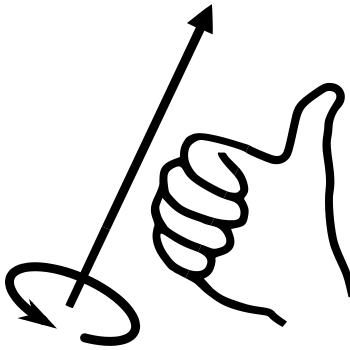

------------------------------
author: Anderson Tavares
title: Tutorial WebGL: Agora é em 3D
description: Criando objetos tridimensionais
tags: WebGL, OpenGL
thumbnail: assets/images/webgl-real-3d-thumb.png
biblio: library.bib
csl: ieee-with-url.csl
math: True
------------------------------

[<< T03: Movimentando Formas](2014-03-01-webgl-movimentando-triangulo.html)
[T05: Agora é em 3D >>](2014-03-02-webgl-real-3d.html)

Bem vindo ao tutorial número 4 nessa série de tutoriais WebGL. Ao invés de um triângulo e um quadrado, vamos agora criar uma pirâmide e um cubo. O tutorial é baseado na [lição 4](http://learningwebgl.com/blog/?p=370) do LearningWebGL.

Veja o resultado obtido:

<iframe width="640" height="360" src="//www.youtube.com/embed/Oa71cNJdkts?feature=player_embedded" frameborder="0" allowfullscreen></iframe>

<a href="../webgl/demo-agora-em-3d" target="_blank">Veja o resultado</a>. 
<a href="http://github.com/anderflash/webgl_tutorial" target="_blank">Baixe todos os demos</a>.

Um aviso (de novo): estas lições estão baseadas no conteúdo dado na disciplina de Introdução à Computação Gráfica do Instituto de Matemática e Estatística da USP. Mesmo assim, outras pessoas que não sejam alunos dessa disciplina podem aproveitar e compreender o conteúdo destes tutoriais. Se você não fez o [tutorial 1](2014-02-26-webgl-criando-triangulo.html), o [tutorial 2](2014-02-28-webgl-colorindo-triangulo.html) e o [tutorial 3](2014-03-01-webgl-movimentando-triangulo.html), recomendo fazê-lo antes de avançar para este tutorial. Se você se sente seguro em compreender o que se passa aqui, pode continuar. Se houver falhas ou achar que falta alguma coisa para melhorar o tutorial, não hesite em me avisar.

As diferenças entre o código desta lição e da anterior se concentram exclusivamente nas funções `animar`, `iniciarBuffers`, e `desenharCena`. Antes disso, uma pequena mudança: ao invés de rTri e rQuad, vamos renomeá-las para `rPiramide` e `rCubo` (na declaração e nos usos pelas funções).

**Tarefa:** Renomeie as variáveis (a localização está indicada nos comentários).

~~~~ {#mycode .javascript .numberLines startFrom="1"}
  /*---Edite isso na função animar---*/
  rPiramide  += ((90*diferenca)/1000.0) % 360.0;
  rCubo += ((75*diferenca)/1000.0) % 360.0;
  
  /*---Edite isso na declaração das variáveis---*/
  var rPiramide = 0;
  var rCubo = 0;
  
  /*---Edite isso na função desenharCena---*/
  mat4.rotate(mMatrix, degToRad(rPiramide), [0, 1, 0]);
~~~~~~~~~~~~~~~~~~~~~~~~~~~~~~~~~~~~~~~~~~~~~~~~~

~~~~ {#mycode .html .numberLines startFrom="1"}

~~~~~~~~~~~~~~~~~~~~~~~~~~~~~~~~~~~~~~~~~~~~~~~~~

Para o OpenGL, existem diversas bibliotecas gráficas (como [GLUT](http://www.opengl.org/resources/libraries/glut/), [GLFW](http://www.glfw.org/), [QT](http://qt-project.org/doc/qt-5.0/qtopengl/qtopengl-index.html), [SDL](http://www.libsdl.org/) e [WxWidgets](http://widgetscomcafe.blogspot.com.br/2012/05/opengl-com-wxwidgets.html)) que promovem um gerenciamento de janelas e modos de desenhar a imagem nessas janelas. No WebGL, precisamos utilizar o JavaScript. Para fazer animação, precisamos a cada instante atualizar nossa tela de desenho. Então precisamos chamar a função `desenharCena` constantemente.

**Com que frequência?** Você escolhe. Você pode esperar a cada segundo, para desenhar uma cena, pode desenhar 30 imagens dentro desse segundo, ou então desenhar logo que a imagem ficar pronta e disponível. O JavaScript contém funções como `requestAnimFrame(func)` que recebe uma função que será chamada tão logo quanto possível. E se dentro da função `func` estiver justamente o `requestAnimFrame(func)`? Então a função `func` será regularmente chamada, e podemos utilizar esse recurso para fazer nossa animação. Alguns navegadores preferem criar suas próprias funções. Por exemplo, a Mozilla (do Firefox) disponibiliza a função `mozRequestAnimationFrame`. Para evitar que nosso ambiente seja incompatível com algum navegador, existe um código feito para resolver a incompatibilidade. Ele está disponível no WebGLSamples, um repositório de exemplos no Google Code. O arquivo é o [webgl-utils.js](http://code.google.com/p/webglsamples/source/browse/book/webgl-utils.js?r=41401f8a69b1f8d32c6863ac8c1953c8e1e8eba0). O arquivo também está disponibilizado no [código](https://github.com/anderflash/webgl_tutorial) do tutorial. Lembre-se de adicionar o link para o arquivo:

~~~~ {#mycode .html .numberLines startFrom="1"}

<!--Adicione esta linha-->

~~~~~~~~~~~~~~~~~~~~~~~~~~~~~~~~~~~~~~~~~~~~~~~~~

**Tarefa:** Modifique a função `iniciaWebGL` da forma como abaixo.

~~~~ {#mycode .javascript .numberLines startFrom="1"}
function iniciaWebGL()
{
  var canvas = $('#licao01-canvas')[0];
  iniciarGL(canvas); // Definir como um canvas 3D
  iniciarShaders();  // Obter e processar os Shaders
  iniciarBuffers();  // Enviar o triângulo e quadrado na GPU
  iniciarAmbiente(); // Definir background e cor do objeto
  /*---Remova desenharCena e adicione esta linha---*/
  tick();            // Desenhar a cena repetidamente
}
~~~~~~~~~~~~~~~~~~~~~~~~~~~~~~~~~~~~~~~~~~~~~~~~~

Removemos a função desenharCena (ela vai ser chamada dentro do `tick()`) e inserimos a função `tick()`. A função `tick()` programará a sua próxima chamada atraveś do `requestAnimFrame`.

**E a função `setInterval` do Javascript?** A função `setInterval` programa a chamada de uma função depois de um determinado tempo, e isso repetidamente. Ele também pode ser usado para animações. Porém ele tem um problema: mesmo que você não esteja vendo a animação (está em outra aba por exemplo acessando outras coisas), a função é executada, piorando o desempenho de sua navegação, especialmente quando você tem mais de uma aba com animações WebGL (a execução de uma animação pioraria a execução da outra). A função `requestAnimFrame` só é chamada quando a aba estiver ativada.

**Tarefa:** Adicione a função `tick()` no script em JavaScript:

~~~~ {#mycode .javascript .numberLines startFrom="1"}
function tick()
{
  requestAnimFrame(tick);
  desenharCena();
  animar();
}
~~~~~~~~~~~~~~~~~~~~~~~~~~~~~~~~~~~~~~~~~~~~~~~~~

Ele programa sua próxima execução, desenha a cena e atualiza informações para animação (por exemplo, incrementando o ângulo de rotação). Você pode, se desejar, trocar a ordem das funções (atualizar os dados antes de desenhar). Ah, e já que vamos rotacionar, vamos então guardar o ângulo de rotação em uma variável.

**Tarefa:** Adicione estas variáveis globais (fora de qualquer função):

~~~~ {#mycode .javascript .numberLines startFrom="1"}
var rTri = 0;
var rQuad= 0;
~~~~~~~~~~~~~~~~~~~~~~~~~~~~~~~~~~~~~~~~~~~~~~~~~

Eles serão usados para rotacionar os objetos. A cada _tick_, iremos incrementar o ângulo. Variáveis globais não são uma boa prática quando for trabalhar com projetos mais complexos. Teremos tutoriais em que organizaremos melhor estas variáveis.

A próxima mudança se dá em `desenharCena`. Logo após a translação, faremos a rotação dos objetos. Vamos fazer rotações diferentes para cada objeto. Então precisamos guardar a matriz antes da rotação do triângulo para recuperar a matriz original e rotacioná-lo para o quadrado. Se não houver essa operação guardar/recuperar, as rotações serão combinadas. Então o quadrado sofrerá a rotação do triângulo e dele (nessa ordem). Não queremos isso.

**Tarefa:** Modifique a função `desenharCena` (a parte do triângulo):

~~~~ {#mycode .javascript .numberLines startFrom="1"}
function desenharCena()
{
  gl.clear(gl.COLOR_BUFFER_BIT | gl.DEPTH_BUFFER_BIT);
  mat4.perspective(45, gl.viewportWidth / gl.viewportHeight, 0.1, 100.0, pMatrix);
  mat4.identity(mMatrix);
  mat4.identity(vMatrix);
  
  // Desenhando Triângulo
  mat4.translate(mMatrix, [-1.5, 0.0, -7.0]);
  
  /*---Adicione estas duas linhas---*/
  mPushMatrix();
  mat4.rotate(mMatrix, degToRad(rTri), [0, 1, 0]);
  
  gl.bindBuffer(gl.ARRAY_BUFFER, triangleVertexPositionBuffer);
  gl.vertexAttribPointer(shaderProgram.vertexPositionAttribute, triangleVertexPositionBuffer.itemSize, gl.FLOAT, false, 0, 0);
  gl.bindBuffer(gl.ARRAY_BUFFER, triangleVertexColorBuffer);
  gl.vertexAttribPointer(shaderProgram.vertexColorAttribute, triangleVertexColorBuffer.itemSize, gl.FLOAT, false, 0, 0);
  setMatrixUniforms();
  gl.drawArrays(gl.TRIANGLES, 0, triangleVertexPositionBuffer.numItems);
  
  /*---Adicione esta linha---*/
  mPopMatrix();  
~~~~~~~~~~~~~~~~~~~~~~~~~~~~~~~~~~~~~~~~~~~~~~~~~

Digamos que nós temos a matriz $T_t$ que representa a translação do triângulo, e $R_t$ a sua rotação. A matriz $R_tT_t$ representa a translação e rotação do triângulo (a ordem é da direita para a esquerda, como uma composição de funções matemáticas). Para o quadrado, poderíamos aplicar a rotação inversa do triângulo para neutralizar sua rotação ($R_t^{-1}R_tT_t$) e depois a traslação do quadrado e sua rotação ($R_qT_qR_t^{-1}R_tT_t$). Mas veja que $R_t^{-1}R_t = I$. E por isso a transformação do quadrado é $R_qT_qT_t$. Ou seja, antes da translação do quadrado, só basta a translação do triângulo. Então guardamos a transformação $T_t$, e depois de rotacionar o triângulo, substituímos a transformação atual $R_tT_t$ pela matriz salva $T_t$, utilizando uma estrutura de pilha. Dessa forma, não precisamos aplicar a rotação inversa.

Permita-me explicar essa função de rotação: os ângulos precisam ser convertidos para radianos (mostrarei a função `degToRad` depois, ele é bem simples). Para o triângulo, utilizamos a nossa variável `rTri`. Vamos rotacionar a partir do eixo $y = [0,1,0]^T$. Para saber como ele será rotacionado, vou te dar uma dica: usando a mão direita (estamos utilizando a regra da mão direita como sistema de coordenadas), coloque o seu polegar oapontado para o eixo (nesse caso o y) e os outros dedos curvados darão o sentido da rotação. Olha a figura abaixo:

**Tarefa:** Modifique a função `desenharCena` (agora para o quadrado):

~~~~ {#mycode .javascript .numberLines startFrom="1"}
  // Desenhando o Quadrado
  mat4.translate(mMatrix, [3.0, 0.0, 0.0]);
  /*---Adicione estas duas linhas---*/
  mPushMatrix();
  mat4.rotate(mMatrix, degToRad(rQuad), [1, 0, 0]);
  
  gl.bindBuffer(gl.ARRAY_BUFFER, squareVertexPositionBuffer);
  gl.vertexAttribPointer(shaderProgram.vertexPositionAttribute, squareVertexPositionBuffer.itemSize, gl.FLOAT, false, 0, 0);
  gl.bindBuffer(gl.ARRAY_BUFFER, squareVertexColorBuffer);
  gl.vertexAttribPointer(shaderProgram.vertexColorAttribute, squareVertexColorBuffer.itemSize, gl.FLOAT, false, 0, 0);
  setMatrixUniforms();
  gl.drawArrays(gl.TRIANGLE_STRIP, 0, squareVertexPositionBuffer.numItems);
  /*---Adicione esta linha---*/
  mPopMatrix();
}
~~~~~~~~~~~~~~~~~~~~~~~~~~~~~~~~~~~~~~~~~~~~~~~~~

Isso é tudo para a função `desenharCena`. Vamos agora atualizar os ângulos para o próximo desenho.

**Tarefa:** Adicione a função `animar()`.

~~~~ {#mycode .javascript .numberLines startFrom="1"}
  var ultimo = 0;
  function animar()
  {
    var agora = new Date().getTime();
    if(ultimo != 0)
    {
      var diferenca = agora - ultimo;
      rTri  += ((90*diferenca)/1000.0) % 360.0;
      rQuad += ((75*diferenca)/1000.0) % 360.0;
    }
    ultimo = agora;
  }
~~~~~~~~~~~~~~~~~~~~~~~~~~~~~~~~~~~~~~~~~~~~~~~~~

Poderíamos atualizar o ângulo simplesmente com `rTri += valor_a_incrementar` e `rQuad += valor_a_incrementar`. Mas há um problema: máquinas mais rápidas rotacionarão o triângulo mais rápido do que máquinas mais lentas (pois elas incrementarão o ângulo mais rapidamente). E como sincronizá-los para ter a mesma animação independente da velocidade da máquina? Usamos a duração entre os frames para servir de peso para a rotação: se a máquina é lenta, então a duração entre os frames é maior, então rotacionaremos o proporcional a essa duração; se a máquina for rápida, a duração entre os frames é menor, então faremos pequenas rotações. No final, em um segundo, tanto a máquina rápida quanto a máquina lenta terão a mesma rotação.

Ah, adicionamos novas funções `mPushMatrix` e `mPopMatrix`. Eles simplesmente trabalham com uma pilha, retirando e colocando matrizes.

**Tarefa:** Adicione a pilha (variável global) e as funções `mPushMatrix` e `mPopMatrix`.

~~~~ {#mycode .javascript .numberLines startFrom="1"}
  var mMatrix = mat4.create();
  /*---Adicione esta linha---*/
  var mMatrixPilha = [];
  var vMatrix = mat4.create();
  var pMatrix = mat4.create();

  /*---Adicione esta função---*/
  function mPushMatrix() {
    var copy = mat4.create();
    mat4.set(mMatrix, copy);
    mMatrixPilha.push(copy);
  }

  /*---Adicione esta função---*/
  function mPopMatrix() {
    if (mMatrixPilha.length == 0) {
      throw "inválido popMatrix!";
    }
    mMatrix = mMatrixPilha.pop();
  }
~~~~~~~~~~~~~~~~~~~~~~~~~~~~~~~~~~~~~~~~~~~~~~~~~

A função `mPushMatrix` copia a matriz atual `mMatrix` e guarda na pilha. A função `mPopMatrix` devolve a matriz guardada no topo da pilha para a `mMatrix`.

Lembra da função degToRad? Ela é apenas uma linha de código, em que $rad = \frac{PI}{180}\times graus$.

**Tarefa:** Adicione a função `degToRad`:

~~~~ {#mycode .javascript .numberLines startFrom="1"}
function degToRad(graus) {
  return graus * Math.PI / 180;
}
~~~~~~~~~~~~~~~~~~~~~~~~~~~~~~~~~~~~~~~~~~~~~~~~~

Pronto. A função `tick` chamará o `desenharCena` que rotacionará os objetos, e o `animar` que atualizará os ângulos. Fim das modificações. Agora vamos dar um corpo tridimensional nesses polígonos no [tutorial 4](2014-03-02-webgl-real-3d.html)

[<< T03: Movimentando Formas](2014-03-01-webgl-movimentando-triangulo.html)
[T05: Agora é em 3D >>](2014-03-02-webgl-real-3d.html)

