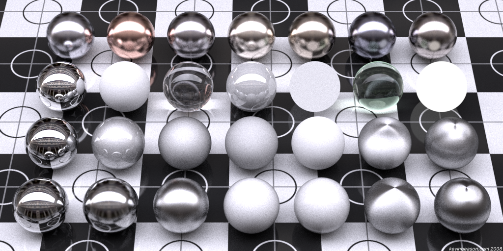
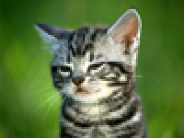
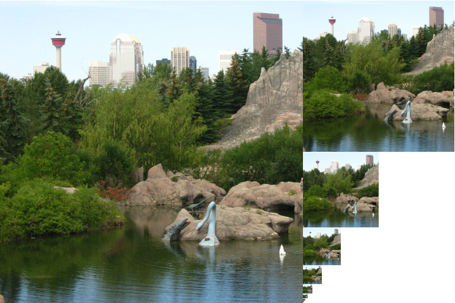
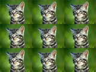
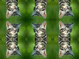
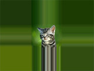
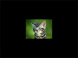

------------------------------
author: Anderson Tavares
title: Tutorial WebGL 7: Luz direcional e ambiente
description: Luz direcional e ambiente
tags: WebGL, OpenGL
thumbnail: assets/images/webgl-directional-ambient-light-thumb.png
biblio: library.bib
csl: ieee-with-url.csl
math: true
------------------------------

[<< T06: Teclado e Filtro de Textura](2014-03-04-webgl-texture.html)
[T07: Teclado e Filtro de Texturas >>](2014-03-06-webgl-keyboard-filter.html)

Bem vindo ao tutorial número 7 nessa série de tutoriais WebGL, baseado na [lição 7](http://learningwebgl.com/blog/?p=571) do LearningWebGL. Vamos trabalhar com um dos assuntos mais importantes da computação gráfica: iluminação. Na verdade falaremos e faremos o básico. Vou apresentar um conteúdo mais matemático. Espero que seja compreensível para quem ainda não tem estudado álgebra linear e outras disciplinas.

Veja o resultado:

<iframe class="sombreado" width="640" height="360" src="//www.youtube.com/embed/wq68Q6WJgyo?feature=player_embedded" frameborder="0" allowfullscreen></iframe>

<a href="http://vision.ime.usp.br/~acmt/hakyll/webgl/demo-luz-ambiente-direcional" target="_blank">Veja o resultado</a>. 
<a href="http://github.com/anderflash/webgl_tutorial" target="_blank">Baixe todos os demos</a>.

Um aviso (de novo): estas lições estão baseadas no conteúdo dado na disciplina de Introdução à Computação Gráfica do Instituto de Matemática e Estatística da USP. Mesmo assim, outras pessoas que não sejam alunos dessa disciplina podem aproveitar e compreender o conteúdo destes tutoriais. Faça os tutoriais anteriores para melhor compreensão do que está acontecendo. O código mostrado é apenas a diferença para o [tutorial 6](2014-03-05-webgl-keyboard-filter.html). Se houver falhas ou achar que falta alguma coisa para melhorar o tutorial, não hesite em me avisar.

Antes de trabalhar com iluminação, precisamos fortalecer um pouco nossa base matemática, pois as técnicas de iluminação que vamos utilizar necessitam delas. Eu não mostrei antes para que vocês pudessem experimentar a prática e verem o resultado o mais rápido possível, além de perceberem melhor a necessidade de se estudar álgebra linear (abordagem pedagógica _top-down_).

Como essa revisão de álgebra linear é grande, embora curta comparado aos livros-texto, criei outro [post](2014-03-07-linear-algebra.html) dedicado a ele. Se você quiser estudar, ou apenas dar uma revisada, sinta-se à vontade. Se você estiver seguro dos seus conhecimentos de álgebra linear, então pode seguir em frente.

# Luzes

Uma má notícia: não existe funções pré-definidas em WebGL para iluminação. Mas há uma boa notícia: uma vez explicado um ou mais modelos de iluminação, é fácil aplicá-lo em WebGL por meio de shaders.

As maiores modificações entre a última lição e essa, é o controle pelo teclado. É mais fácil entender esse controle explicando o que está sendo controlado:

- À medida que o usuário segura a tecla da direita, além do cubo girar para a direita, sua velocidade aumenta. Se ele pressionar a esquerda, o cubo vai desacelerando até começar a girar para a esquerda e acelerar.
- As teclas Cima/Baixo fazem o mesmo efeito girando sobre o eixo X (girando para cima e para baixo).
- Queremos também ir mais perto ou se distanciar do cubo.
- Também queremos mudar o filtro da textura entre linear, vizinhança ou mipmaps (explicaremos ao longo do tutorial).

Vamos começar a satisfazer esses pedidos mostrando as variáveis a serem controladas.

**Tarefa:** Remova o `zRot` e adicione `xVelo`, `yVelo`, `z` e `filtro`.

~~~~ {#mycode .javascript .numberLines startFrom="1"}
var xRot = 0;
var xVelo = 0;

var yRot = 0;
var yVelo = 0;

var z = -5.0;

var filtro = 0;
~~~~~~~~~~~~~~~~~~~~~~~~~~~~~~~~~~~~~

`z` será a coordenada `z` do cubo (a câmera continua imóvel). Vamos controlá-la usando PageDown/PageUp.

Ao invés de aplicar os filtros toda vez que for desenhar, vamos criar as imagens filtradas, enviá-las na GPU e simplesmente referenciá-las, economizando recursos. Serão 3 filtros sobre uma imagem, resultando em 3 texturas. Vamos guardá-las num vetor.

**Tarefa:** Mude a função `tratarTextura` e `iniciarTextura`

~~~~ {#mycode .javascript .numberLines startFrom="1"}
/*---Remova "var uspTextura;"---*/
/*---Insira esta linha---*/
var caixaTexturas = Array();

function iniciarTextura()
{
  var imagemCaixa = new Image();
  for(var i = 0; i < 3; i++)
  {
    var textura = gl.createTexture();
    textura.image = imagemCaixa;
    caixaTexturas.push(textura);
  }
  imagemCaixa.onload = function()
  {
    tratarTextura(caixaTexturas);
  }
  imagemCaixa.src = "caixa.gif";
  shaderProgram.samplerUniform = gl.getUniformLocation(shaderProgram, "uSampler");
}
function tratarTextura(texturas)
{
  gl.pixelStorei(gl.UNPACK_FLIP_Y_WEBGL, true);
  gl.bindTexture(gl.TEXTURE_2D, texturas[0]);
  gl.texImage2D(gl.TEXTURE_2D, 0, gl.RGBA, gl.RGBA, gl.UNSIGNED_BYTE, texturas[0].image);
  gl.texParameteri(gl.TEXTURE_2D, gl.TEXTURE_MAG_FILTER, gl.NEAREST);
  gl.texParameteri(gl.TEXTURE_2D, gl.TEXTURE_MIN_FILTER, gl.NEAREST);

  gl.bindTexture(gl.TEXTURE_2D, texturas[1]);
  gl.texImage2D(gl.TEXTURE_2D, 0, gl.RGBA, gl.RGBA, gl.UNSIGNED_BYTE, texturas[1].image);
  gl.texParameteri(gl.TEXTURE_2D, gl.TEXTURE_MAG_FILTER, gl.LINEAR);
  gl.texParameteri(gl.TEXTURE_2D, gl.TEXTURE_MIN_FILTER, gl.LINEAR);

  gl.bindTexture(gl.TEXTURE_2D, texturas[2]);
  gl.texImage2D(gl.TEXTURE_2D, 0, gl.RGBA, gl.RGBA, gl.UNSIGNED_BYTE, texturas[2].image);
  gl.texParameteri(gl.TEXTURE_2D, gl.TEXTURE_MAG_FILTER, gl.LINEAR);
  gl.texParameteri(gl.TEXTURE_2D, gl.TEXTURE_MIN_FILTER, gl.LINEAR_MIPMAP_NEAREST);
  gl.generateMipmap(gl.TEXTURE_2D);

  gl.bindTexture(gl.TEXTURE_2D, null);
}
~~~~~~~~~~~~~~~~~~~~~~~~~~~~~~~~~~~~~

Veja que carregamos apenas uma imagem, todavia criamos 3 texturas com essa imagem, e passamos o vetor para a função `tratarTextura`. Essa função inverte o eixo Y (linhas dos gifs são guardados do último para o primeiro), seleciona a textura com o `bindTexture`, manda para a GPU com o `texImage2D`, define o filtro de ampliação e minimização com o `texParameteri`. Até aqui nada de shaders ainda.

# Os filtros

É hora de falar mais um pouco sobre estes filtros. Como as coordenadas de textura são independentes da resolução da imagem, nem sempre o texel corresponde ao pixel. Isso ocorre especialmente em casos em que a imagem é esticada e reduzida. O processo de filtragem escolhe como os pixels serão coloridos baseados nos texels da imagem. No shader de fragmentos você pode criar seu filtro personalizado, todavia o WebGL provê alguns filtros básicos por padrão.

- `NEAREST` escolhe o texel mais próximo do pixel. Se um pixel estiver no meio entre dois vértices, sua cor corresponderá ao texel do meio entre dois texel correspondentes aos vértices. Ele não fará nenhum cálculo com os vizinhos;
- `LINEAR` calcula a média entre os 4 texels vizinhos;
- `LINEAR_MIPMAP_NEAREST` captura o mipmap mais próximo.

Abaixo está um exemplo de filtragem `NEAREST` e `LINEAR`.

<table>
<tbody>
<tr class="odd" style="border:none;">
<td align="center" style="width:320px"></td>
<td align="center" style="width:320px"></td>
</tr>
<tr class="even" style="border:none;">
<td align="center" width="110px">NEAREST</td>
<td align="center" width="110px">LINEAR</td>
</tr>
</tbody>
</table>

Mipmaps são cópias menores da imagem que servem para ajustar a textura de acordo com o tamanho do objeto na tela. Estas cópias são de tamanho $\frac{1}{2}$, $\frac{1}{4}$, $\frac{1}{8}$ até 1 pixel (por isso que o WebGL prefere trabalhar com imagens com tamanho potência de 2 (outro jargão: POT - _Power of Two_). Cada mipmap é referenciado pelo seu nível (a textura original tem o nível 0, o mipmap $\frac{1}{2}$ tem o nível 1, e assim sucessivamente...). Por isso que na função `texImage2D`, estamos usando o nível 0 (a textura original) como primeiro nível de textura.

**Mas sou eu que tenho de gerar esses mipmaps?** Nâo necessariamente, o WebGL já provê isso para nós, pela função `generateMipmap` (veja lá no código acima). Lembre-se que é o `bindTexture` que diz qual textura vai sofrer esse processo.

A opção `LINEAR_MIPMAP_NEAREST` escolhe o mipmap mais próximo do tamanho do objeto e usa a interpolação linear. As diferenças entre as opções são mais perceptíveis quando você movimenta o objeto, ou quando se desloca entre mais próximo e mais longe do objeto. Você pode achar que pela opção `LINEAR_MIPMAP_NEAREST` ser mais complexa, ela é mais interessante; nem sempre, pois a opção `NEAREST` é bastante usada para simular jogos de 8 bits, com aspecto pixelado.

Não estamos usando `LINEAR_MIPMAP_NEAREST` para `TEXTURE_MAG_FILTER` pois os mipmaps são para o caso de redução (`TEXTURE_MIN_FILTER`).

# O Entorno

Se a coordenada de textura estão dentro da faixa [0.0,1.0], o que acontece se você inserir a coordenada de textura (5.0, 3.0) para um vértice? A resposta é: você escolhe o resultado. Após a coordenada com valor 1.0, você pode decidir se quer repetir a imagem, truncar os valores fora da faixa para [0.0, 1.0], ou espelhar a imagem. Veja os efeitos:

<table>
<tbody>
<tr class="odd" style="border:none;">
<td align="center" style="width:170px"></td>
<td align="center" style="width:170px"></td>
<td align="center" style="width:170px"></td>
<td align="center" style="width:170px"></td>
</tr>
<tr class="even" style="border:none;">
<td align="center" width="110px">REPEAT</td>
<td align="center" width="110px">MIRRORED_REPEAT</td>
<td align="center" width="110px">CLAMP_TO_EDGE</td>
<td align="center" width="110px">CLAMP_TO_BORDER (Só no OpenGL)</td>
</tr>
</tbody>
</table>

O WebGL não contém o modo `CLAMP_TO_BORDER`. 

Então se você usar o `REPEAT` e os 4 vértices de um quadrado tiverem coordenadas (0.0, 0.0), (5.0, 0.0), (5.0, 3.0) e (0.0, 3.0), então você verá a textura repetida 5 vezes pelo eixo U e 3 vezes pelo eixo V. Você pode, por exemplo, especificar `REPEAT` apenas para um dos eixos e `CLAMP_TO_EDGE` para o outro eixo. 

Vamos continuar com nosso código. Já que estamos usando a variável `z` para deslocar o cubo para longe ou para perto, vamos usá-lo.

**Tarefa:** Mude a translação do cubo na função `desenharCena`

~~~~ {#mycode .javascript .numberLines startFrom="1"}
mat4.translate(mMatrix, [0.0, 0.0, z]);
~~~~~~~~~~~~~~~~~~~~~~~~~~~~~~~~~~~~~

Vamos também inserir as nossas rotações que serão controladas pelo teclado

**Tarefa:** Mude a rotação do cubo na função `desenharCena` (remova o `zRot`)

~~~~ {#mycode .javascript .numberLines startFrom="1"}
mat4.rotate(mMatrix, degToRad(xRot), [1, 0, 0]);
mat4.rotate(mMatrix, degToRad(yRot), [0, 1, 0]);
~~~~~~~~~~~~~~~~~~~~~~~~~~~~~~~~~~~~~

Vamos agora dizer qual textura o cubo vai "vestir"

**Tarefa:** Edite o comando `bindTexture` na função `desenharCena`

~~~~ {#mycode .javascript .numberLines startFrom="1"}
gl.bindTexture(gl.TEXTURE_2D, caixaTexturas[filtro]);
~~~~~~~~~~~~~~~~~~~~~~~~~~~~~~~~~~~~~

**Tarefa:** Adicione as velocidades na função `animar` (remova o `zRot`)

~~~~ {#mycode .javascript .numberLines startFrom="1"}
xRot  += ((xVelo*diferenca)/1000.0) % 360.0;
yRot  += ((yVelo*diferenca)/1000.0) % 360.0;
~~~~~~~~~~~~~~~~~~~~~~~~~~~~~~~~~~~~~

Falta agora o efetivo controle do teclado. Precisamos capturar os eventos de teclado na página. O objeto no JavaScript que representa a página é o `document`. Vamos capturar as teclas pressionadas (`onkeydown`) e soltas (`onkeyup`). Há um problema comum quando somos iniciantes ao aprender a manipular o teclado no WebGL (ou OpenGL, ou SDL, darkBasic, PyGame...). É que quando você pressiona a tecla `A`, o sistema operacional espera um tempo na primeira tecla para depois repetir a tecla: `AAAAAAA` de forma temporal fica `A - 1 segundo depois - AAAAAA`. Se você utilizar diretamente o evento de teclado para movimentar um objeto, o objeto vai movimentar 1 frame, esperar 1 segundo de frames (a duração depende da configuração do SO) e depois se movimenta como esperado. Essa parada provavelmente não é o que você quer.

O que precisamos fazer é inserir uma matriz no meio entre os eventos e o movimento dos objetos. Os eventos do teclado atualizam a matriz e toda vez que for desenhar, as funções de movimento utilizam a matriz. Então esse efeito indesejado desaparece. Essa matriz só terá duas colunas: o código da tecla e se ela está pressionada. Em Python, você pode utilizar o dicionário para essa associação. Em JavaScript, você pode usar a matriz associativa, que é equivalente a um objeto mutável. Usuários do JSON (JavaScript Object Notation) trabalham constantemente com esse tipo de objeto.

**Tarefa:** Adicione as funções que tratam eventos de teclado na função `iniciaWebGL`

~~~~ {#mycode .javascript .numberLines startFrom="1"}
function iniciaWebGL()
{
  var canvas = $('#licao01-canvas')[0];
  iniciarGL(canvas); // Definir como um canvas 3D
  iniciarShaders();  // Obter e processar os Shaders
  iniciarBuffers();  // Enviar o triângulo e quadrado na GPU
  iniciarAmbiente(); // Definir background e cor do objeto
  iniciarTextura();
  
  /*---Adicione estas 2 linhas---*/
  document.onkeydown = eventoTeclaPress;
  document.onkeyup = eventoTeclaSolta;
  
  tick();
}
~~~~~~~~~~~~~~~~~~~~~~~~~~~~~~~~~~~~~

O objetivo destas novas funções são simplesmente atualizar a matriz. Para trocar o filtro, precisamos apenas de um dos eventos.

**Tarefa:** Adicione um objeto para monitorar o estado das teclas e as funções de evento do teclado.

~~~~ {#mycode .javascript .numberLines startFrom="1"}
var teclasPressionadas = {};

function eventoTeclaPress(evento) {
  teclasPressionadas[evento.keyCode] = true;

  if (String.fromCharCode(evento.keyCode) == "F")
    filtro = (filtro+1) % 3;
}

function eventoTeclaSolta(evento) {
  teclasPressionadas[evento.keyCode] = false;
}
~~~~~~~~~~~~~~~~~~~~~~~~~~~~~~~~~~~~~

Se você pressionar a tecla por bastante tempo, a função `eventoTeclaPress` só é executada uma vez. Então o filtro não será alterado constantemente. Só quando o usuário soltar a tecla F e pressionar novamente.

Agora vamos fazer com que essa matriz atualize o movimento.

**Tarefa:** Adicione a chamada para `tratarTeclado` em `tick`

~~~~ {#mycode .javascript .numberLines startFrom="1"}
function tick()
{
  requestAnimFrame(tick);
  /*---Adicione esta linha---*/
  tratarTeclado();
  desenharCena();
  animar();
}
~~~~~~~~~~~~~~~~~~~~~~~~~~~~~~~~~~~~~~~~~~~~~~~~~

Você poderia colocar tudo dentro de `animar`, mas vamos quebrar as funções em partes para melhor compreender e organizar o código.

**Tarefa:** Crie a função `tratarTeclado`

~~~~ {#mycode .javascript .numberLines startFrom="1"}
function tratarTeclado() {
  if (teclasPressionadas[33]) {
    // Page Up
    z -= 0.05;
  }
  if (teclasPressionadas[34]) {
    // Page Down
    z += 0.05;
  }
  if (teclasPressionadas[37]) {
    // Esquerda
    yVelo -= 1;
  }
  if (teclasPressionadas[39]) {
    // Direita
    yVelo += 1;
  }
  if (teclasPressionadas[38]) {
    // Cima
    xVelo -= 1;
  }
  if (teclasPressionadas[40]) {
    // Baixo
    xVelo += 1;
  }
}
~~~~~~~~~~~~~~~~~~~~~~~~~~~~~~~~~~~~~~~~~~~~~~~~~

Esta função simplesmente checa se antes de desenhar, a tecla está pressionada. Se estiver, atualizamos as variáveis. Se você mantiver a tecla `Page Down` pressionada, a variável `z` em cada frame vai ser incrementada, e o objeto vai ficando mais perto de você. Quando você solta a tecla, o valor da tecla na matriz é atualizada para `false`. A vantagem dessa estratégia de matriz é que duas ou mais teclas podem ser usadas ao mesmo tempo (por exemplo, a tecla `Esquerda` e `Page Down` para girar e deslocar o cubo).

É isso, tente interagir com o cubo. Abraços.

**Exercícios**:

[<< T04: Agora em 3D](2014-03-02-webgl-real-3d.html)
[T06: Teclado e Filtro de Texturas >>](2014-03-05-webgl-keyboard-filter.html)

