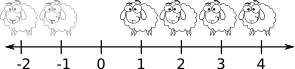
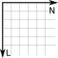
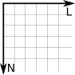
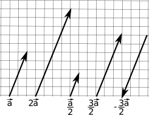
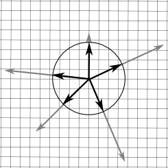

------------------------------
author: Anderson Tavares
title: Tutorial WebGL 7: Luz direcional e ambiente
description: Luz direcional e ambiente
tags: WebGL, OpenGL
thumbnail: assets/images/webgl-directional-ambient-light-thumb.png
biblio: library.bib
csl: ieee-with-url.csl
math: true
------------------------------

[<< T06: Teclado e Filtro de Textura](2014-03-04-webgl-texture.html)
[T07: Teclado e Filtro de Texturas >>](2014-03-06-webgl-keyboard-filter.html)

Bem vindo ao tutorial número 7 nessa série de tutoriais WebGL, baseado na [lição 7](http://learningwebgl.com/blog/?p=571) do LearningWebGL. Vamos trabalhar com um dos assuntos mais importantes da computação gráfica: iluminação. Na verdade falaremos e faremos o básico. Vou apresentar um conteúdo mais matemático. Espero que seja compreensível para quem ainda não tem estudado álgebra linear e outras disciplinas.

Veja o resultado:

<iframe class="sombreado" width="640" height="360" src="//www.youtube.com/embed/wq68Q6WJgyo?feature=player_embedded" frameborder="0" allowfullscreen></iframe>

<a href="http://vision.ime.usp.br/~acmt/hakyll/webgl/demo-luz-ambiente-direcional" target="_blank">Veja o resultado</a>. 
<a href="http://github.com/anderflash/webgl_tutorial" target="_blank">Baixe todos os demos</a>.

Um aviso (de novo): estas lições estão baseadas no conteúdo dado na disciplina de Introdução à Computação Gráfica do Instituto de Matemática e Estatística da USP. Mesmo assim, outras pessoas que não sejam alunos dessa disciplina podem aproveitar e compreender o conteúdo destes tutoriais. Faça os tutoriais anteriores para melhor compreensão do que está acontecendo. O código mostrado é apenas a diferença para o [tutorial 6](2014-03-05-webgl-keyboard-filter.html). Se houver falhas ou achar que falta alguma coisa para melhorar o tutorial, não hesite em me avisar.

Antes de trabalhar com iluminação, precisamos fortalecer um pouco nossa base matemática, pois as técnicas de iluminação que vamos utilizar necessitam delas.

# Fundamentos

Nestes fundamentos, mostraremos o básico de vetores, matrizes, sistemas de coordenadas. Tentarei colocar o máximo de ilustrações para obter uma visão geométrica de cada informação matemática. Além disso, tentarei passar o conteúdo numa visão _top-down_, passando primeiro pelos problemas do dia-a-dia, para depois formalizar estes problemas em conceitos matemáticos.

Um bom livro disponível na Internet na íntegra é o livro de Jacir J. Venturi de [Álgebra Vetorial e Geometria Analítica](http://www.geometriaanalitica.com.br/livros/av.pdf). Certas partes se tornam narrativas históricas, tornando a leitura prazerosa. Ele cobre diversos aspectos e propriedades dos vetores que nós usaremos nesses tutoriais, nas disciplinas da área de Processamento Gráfico e no dia-a-dia no desenvolvimento de projetos de visualização gráfica.

Geralmente os vetores são utilizados para representar deslocamentos ao invés de posições imediatas. Em alguns momentos precisamos trabalhar com deslocamentos:

- De uma cidade para outra você traça uma seta representando seu deslocamento;
- Em um segundo, o carro se desloca de um ponto a outro. Se olharmos de cima, podemos traçar uma seta da origem para o destino;
- Os fótons dos raios solares batem na superfície do espelho e refletem como se fossem bolas quiquando. O sentido e direção desses fótons são importantes para sabermos se eles vão atingir o seu olho (se você percebe o raio refletido) ou não;
- Se você der um soco num saco de boxe (soco num saco, parece uma cacofonia...), a parte inferior do saco vai para o sentido do murro aplicado, com uma aceleração e velocidade iniciais. A ponta no alto está presa no teto, e como a altura do saco é finita e por causa da força centrípeta, o saco tende a subir. Mas aí o sentido da velocidade se orienta para cima, contra a gravidade. A gravidade reduz a velocidade, fazendo com que o saco pare e depois ganhe velocidade no outro sentido. Devido à pressão do ar, a energia não é conservada, tornando o sistema estável. Tudo isso para dizer que velocidade, gravidade, força do soco e do vento podem ser modeladas como vetores;
- Em circuitos elétricos, existem componentes para controlar a passagem de elétrons como resistores e indutores. A resistência e reatância compõem a impedância, e é onde os campos elétricos e magnéticos são estudadas em conjunto, como campos eletromagnéticos. Porém esses campos contém polarizações diferentes (90 graus de diferença de fase). A polarização pode ser modelada como vetores;

Existem milhares de exemplos e aplicações que utilizam vetores e outros conceitos de álgebra linear. Como criar um conceito matemático que seja básico o suficiente para atender tamanha variedade de aplicações? Vamos entender o que é o vetor. Mas antes disso vamos entender o sistema de coordenadas cartesiano.

## Sistemas de Coordenadas Cartesiano

Eu vou usar uma didática do livro [3D Math Primer for Graphics and Game Development](http://www.amazon.com/Primer-Graphics-Development-Wordware-Library/dp/1556229119) que é bastante intuitivo.

### Uma dimensão

Números naturais, também chamado de números contáveis, foram inventados há bastante tempo, provavelmente para contar ovelhas (um bom livro que estou tentando ler sobre a história da matemática é o livro de Howard Eves, [Introdução à História da Matemática](http://www.livrariasaraiva.com.br/produto/392616)). O conceito de uma ovelha fica bastante claro. Duas e três também. Mas depois disso se torna tanta ovelha que era apenas referenciado como "muitas ovelhas". Quando crianças, nós temos um pensamento logarítmico (a diferença entre 1 e 2 é muito maior do que 101 e 102) (vide [isto](http://www.huffingtonpost.com/ben-thomas/whats-halfway-between-1-and-9-kids-and-scientists-say-3_b_1982920.html) e [isto](http://www.ncbi.nlm.nih.gov/pmc/articles/PMC2610411/)). Inclusive muitos adultos ainda se abstém desse pensamento, quando as habilidades de percepção de escala linear dos números não são desenvolvidos com a escola formal. Com o tempo, civilizações evoluíram a tal ponto de terem pessoas dedicadas a estudarem os números, ao invés de apenas matar e comer ovelhas. Com isso, o conceito de zero (sem ovelha) foi introduzido no sistema numérico, além de criarem vários sistemas gráficos que pudessem representar mais precisamente a quantidade _muitos_.

O hábito de criar uma fila de ovelhas para contar teve como consequência a linha numérica, ou seja, uma linha com números posicionados em intervalos regulares.

Em algum momento, houve a necessidade de definir o conceito de débito, ou seja, de ficar devendo ovelhas. Daí surgiram os números negativos.

E os pobres que não podem ter uma ovelha inteira, apenas uma parte dela? Com o tempo, foi-se necessário inserir o conceito de números racionais, facilmente posicionados na linha numérica. Para não ficar escrevendo tanto número como 31415/10000, inventou-se o número decimal, como 3,1415.

Depois perceberam que alguns números importantes não podiam ser representados por números racionais, como a razão entre o perímetro da circunferência e seu diâmetro. Estes são os números irracionais, que requerem um infinito número de casas decimais. Enquanto que os números racionais podem ser contáveis, fazendo um mapeamento bijetor para números naturais, os números irracionais não são contáveis. Com isso, duas das maiores áreas da matemática nasceram: a matemática discreta e a matemática contínua.

Pode ser que você pense: não dá para representar fielmente o mundo por parecer contínuo devido a quantidade absurda de átomos, quarks e outras partículas. Mas aí é onde entre a **Primeira Lei da Computação Gráfica**

> Se parecer Ok, então está Ok.

### Duas dimensões

E se eu tiver uma quantidade dependendo de outra? E se eu tiver de me localizar? Imaginemos uma cidade hipotética chamada Cartésia. Antes de Cartésia ser formada, só havia um terreno plano vazio. Os arquitetos e engenheiros precisaram um sistema para localizar espacialmente qualquer coisa. Inicialmente se preocuparam com as quadras. Definiram-se direções. Também definiram a origem do sistema (a prefeitura) e cada posição (x,y) equivalia à quantidade de quadras ao norte e ao leste as pessoas teriam de ir.

As linhas que passam pela origem se chamam "eixos". Não necessariamente os eixos precisam ser perpendiculares (mas não podem ser paralelas, veremos depois por quê). Há  algumas diferenças entre Cartésia e o conceito abstrato de sistema de coordenads 2D: 

- Embora a cidade seja limitada, o sistema de coordenadas 2D é ilimitado, se estendendo ao infinito;
- As ruas em Cartésia tem espessura, enquanto que as linhas no sistema abstrato não tem. 
- Em Cartésia, você só pode dirigir nas rodovias e ruas. Em um sistema de coordenadas, você não está limitado à grade desenhada, apenas ao domínio do números dos eixos.

Podemos denominar o eixo horizontal de eixo $X$ e o vertical de eixo $Y$. (5,3), significa 5 quadras no eixo X e 3 quadras no eixo Y.

**Mas e (-5, -3)?** Precisamos definir uma orientação para qual sentido nos eixos estão os valores positivos. No monitor, a orientação dos números positivos para o eixo X está para a direita, enquanto que para o eixo Y, o sentido está para baixo. Isso se mantém por razões históricas (é o sentido de onde os comandos do DOS, Unix e outros fluem).

Para Cartésia, houve um problema: os profissionais que projetaram Cartésia eram de Disléxia, uma cidade vizinha. Só que eles ficaram confusos sobre qual orientação Cartésia deveria seguir. Toda vez que recebia uma proposta de orientação, o norte aparecia em vários lugares: para cima, para baixo, para a esquerda ou para a direita. Mesmo o prefeito girando o norte para onde ele queria, o sentido do leste estava o contrário do que ele pensava a início. Ele viu que ao todo havia 8 propostas distintas de orientações:

Eles escolheram a primeira como a _orientação normal_ e perceberam que outras três poderiam ser rotacionadas para ficar idênticas à _orientação normal_. Mas as outras 4 propostas deram trabalho para eles. Apenas no final do dia, quando foram apagar a luz, um dos funcionários percebeu que se colocar uma das outras 4 propostas à contraluz, elas se transformariam à primeira. Ou seja, não importa a orientação no sistema de coordenadas 2D, você poderá transformá-la na _orientação normal_. Depois veremos que em 3D isso não acontece.

### 3 dimensões

Denominemos o terceiro eixo como eixo-z. Para localizar um ponto no espaço, precisamos de uma terceira coordenada dentro uma tupla $(x,y,z)$.

Nem sempre uma orientação pode ser igual a outra, mesmo que rotacione os eixos. Há duas classes de orientações: espaço de coordenadas da mão esquerda e da mão direita. Uma orientação não pode se transformar na outra, embora orientações dentro de uma classe podem se transformar.

Para a mão esquerda, há uma convenção: coloque o seu polegar no eixo X, os outros dedos no eixo Y (pode ser apenas o polegar), e o eixo Z automagicamente estará saindo da sua palma. Para os sistemas de coordenadas da mão direita, é o mesmo processo. Mas veja que se você usar a mão esquerda em um sistema de coordenadas de mão direita, o eixo Z estará saindo das costas da mão. Se seguirmos a ordem X-Y-Z, verás que essa ordem na sua mão direita é polegar-indicador-palma, dando uma orientação antihorária. Essa ordem na mão esquerda resulta numa orientação horária. Então no espaço de coordenadas da mão direita, ângulos positivos seguem a orientação antihorária. Veja como fica a orientação olhando contra o eixo X no sistema de coordenadas da mão esquerda:

O OpenGL e, por consequência, o WebGL trabalham com o sistema de coordenadas da mão direita. Essa determinação é importante, pois algumas coisas são diferentes entre os dois tipos de sistemas.

## Vetores

Um vetor é uma tupla $[x_1,x_2, ...,x_n]$, com $x_i \in R^n, 1 \le i \le n$. É uma entidade geométrica com magnitude, direção e sentido. Ela pertence a um conjunto denominado [espaço vetorial](http://pt.wikipedia.org/wiki/Espa%C3%A7o_vetorial). Nesse conjunto, se dois vetores tiverem a mesma magnitude, direção e sentido, então elas são iguais. Um vetor não tem posição definida, então não faz sentido transladar um vetor (ela pode estar em qualquer lugar). O valor de $n$ é a dimensão do vetor. Um vetor como 

$$\begin{bmatrix}
1 \\
2 \\
3
\end{bmatrix}$$

é um vetor coluna. Um vetor $[1,2,3]$ é um vetor linha. A transposta de um vetor coluna é um vetor linha. Para economizar espaço, poderemos tratar um vetor coluna como $[1,2,3]^T$. Outra notação é tratar um vetor $\vec{a}$ como $[a_1,a_2,a_3,a_4]$ ou $[a_x,a_y,a_z,a_w]$.

Um ponto também é uma tupla $(x_1,x_2, ...,x_n)$, com $x_i \in R^n, 1 \le i \le n$. Veja que estamos usando a notação $()$ para ponto e $[]$ para vetor, mas isso pode mudar nos livros-texto. Geralmente um ponto representa uma posição, ao invés de um deslocamento.

**Mas um vetor não é a mesma coisa que um ponto?** Em termos numéricos, sim, mas em termos semânticos, não. Veja algumas diferenças:

ponto                                vetor
------------------------------------ ----------------------------------------
representa uma posição               representa um deslocamento
não tem direção                      tem direção
não tem sentido                      tem sentido
não tem magnitude                    tem magnitude
tem posição                          não tem uma posição específica
-----------------------------------------------------------------------------

Quando você quiser especificar uma posição, por exemplo um lugar _A_ com latitude=-23 e longitude=-46, você especifica um ponto (-23, -46). Quando você quiser especificar um deslocamento, por exemplo entre A(-23, -46) e B(50, 20) você precisa caminhar 73 unidades no eixo X e 66 unidades no eixo Y, resultando em [73,66], que é diferente de um ponto C na posição (73,66).

Geometricamente podemos associar pontos e vetores:

Matematicamente podemos associar pontos e vetores dessa forma:

- $A - B = \vec{v}$
- $A + \vec{v} = B$
- $\vec{v} + \vec{w} = \vec{z}$

### Vetor zero

A identidade da operação de adição entre vetores é o vetor zero: $[0,0,\dots,0]^T$. Se você fixar a magnitude de um vetor, todos os vetores distintos formam um círculo de vetores. Porém o vetor zero não tem direção, ou seguindo a definição, tem todas as direções. Não pense no vetor zero como um ponto, pense como "sem deslocamento".

### Negar um vetor

$-\vec{a}= -[a_1,a_2,\dots,a_n]^T = [-a_1,-a_2,\dots,-a_n]^T$

Geometricamente você inverte o sentido do vetor:

### Magnitude

A magnitude, também conhecido como norma, comprimento ou intensidade, não está explícito no vetor. O vetor $[3,4]^T$ tem magnitude nem 3 nem 4, mas 5. Veja como calculá-lo:

$\|v\| = \sqrt{v_1^2 + v_2^2 + ... + v_{n-1}^2 + v_n^2}$

$\|v\| = \sqrt{\sum^{n}_{i=1}{v_i^2}}$

Geometricamente, usando pitágoras:

$v_x$ e $v_y$ podem ser valores negativos, todavia $\|v\|$ não é. Jà que $|x|^2 = x^2$ então as equações seguintes são equivalentes:

- $\|v\|^2 = |v_1|^2 + |v_2|^2$
- $\|v\|^2 = v_1^2 + v_2^2$

### Multiplicação por um escalar
$$
k 
\begin{bmatrix} v_1 \\ v_2 \\ \vdots \\ v_n \end{bmatrix}
=
\begin{bmatrix} v_1 \\ v_2 \\ \vdots \\ v_n \end{bmatrix}
k
=
\begin{bmatrix} kv_1 \\ kv_2 \\ \vdots \\ kv_n \end{bmatrix}
$$

Dividir por k é igual a multiplicar por $\frac{1}{k}$. Algumas observações:

- Geralmente multiplicação entre escalar e vetor não tem símbolo de multiplicação;
- multiplicação entre escalar e vetor ocorre antes de adição: $3\vec{a} + \vec{b}$ é o mesmo que $(3\vec{a})+\vec{b}$, mas diferente de $3(\vec{a}+\vec{b})$;
- Um escalar não pode ser dividido por um vetor, e um vetor não pode ser dividido por outro vetor;
- Negação de vetor pode ser visto como multiplicação pela escalar -1.

Geometricamente, a multiplicação de um vetor por uma escalar estica ou encolhe o vetor, mantendo seu sentido e direção, mas mudando sua magnitude proporcionalmente à escalar:

### Normalização

Multas vezes você só quer saber o sentido do vetor, sem se importar com a magnitude:

- Para onde o vento está orientado nesse ponto?
- Para onde esse fóton está indo?
- Essa cidade fica ao norte ou ao leste daqui?
- Na sinuca, em que direção o taco deve se orientar para acertar a bola?

Podemos representar estas situações com um vetor unitário (sua magnitude é igual a 1), também chamado de _versor_ ou _normal_. Podemos obter um versor de um vetor dividindo-o pela sua magnitude:

$\vec{v}_{norm} = \frac{\vec{v}}{\|v\|}$

Por causa do denominador, não podemos obter o versor do vetor zero.

Geometricamente:

### Adição e Subtração de vetores

Na adição, $\vec{a} + \vec{b} = \vec{b} + \vec{a}$:

$$
\begin{bmatrix} a_1 \\ a_2 \\ \vdots \\ a_n \end{bmatrix}
+
\begin{bmatrix} b_1 \\ b_2 \\ \vdots \\ b_n \end{bmatrix}
=
\begin{bmatrix} a_1 + b_1 \\ a_2 + b_2 \\ \vdots \\ a_n + b_n \end{bmatrix}
$$

Na subtração, $\vec{a} - \vec{b} = - \vec{b} - \vec{a}$:

$$
\begin{bmatrix} a_1 \\ a_2 \\ \vdots \\ a_n \end{bmatrix}
-
\begin{bmatrix} b_1 \\ b_2 \\ \vdots \\ b_n \end{bmatrix}
=
\begin{bmatrix} a_1 - b_1 \\ a_2 - b_2 \\ \vdots \\ a_n - b_n \end{bmatrix}
$$

Geometricamente:

Uma forma de ver estas operações:

- Adição: se eu caminhar por uma sequência de lugares, qual o deslocamento do primeiro lugar para o último?
- Subtração: se eu sair daqui para um dos dois outros lugares, qual é o deslocamento entre estes destinos? É longe um do outro?

Perceba que eu posso representar um vetor como uma sequência de deslocamentos (uma adição) de versores:

$$
\begin{bmatrix} a_1 \\ a_2 \\ \vdots \\ a_n \end{bmatrix}
=
a_1\begin{bmatrix} 1 \\ 0 \\ \vdots \\ 0 \end{bmatrix}
+
a_2\begin{bmatrix} 0 \\ 1 \\ \vdots \\ 0 \end{bmatrix}
+
\dots
+
a_n\begin{bmatrix} 0 \\ 0 \\ \vdots \\ 1 \end{bmatrix}
$$

### Distância entre pontos

Dados dois pontos A e B, você pode obter um vetor $v = A-B = [a_1 - b_1,a_2-b_2,\dots,a_n-b_n]^T$. A distância entre A e B é a magnitude $\|v\| = \sqrt{(a_1-b_1)^2+(a_2-b_2)^2+\dots+(a_n-b_n)^2}$

### Produto Escalar

Vimos como multiplicar um vetor por um produto escalar. Podemos multiplicar um vetor por um outro vetor. Com o tempo, perceberam que certas formas de multiplicação entre vetores tornaram-se úteis no dia-a-dia.

O produto escalar (ou produto interno) tem esse nome pois o resultado é uma escalar. Dado dois vetores $\vec{a}$ e $\vec{b}$, o produto escalar $\vec{a}\cdot\vec{b} = [a_1b_1, a_2b_2,\dots,a_nb_n]$. Simplesmente é a multiplicação elemento a elemento. Qual a utilidade disso. Fica mais fácil vendo geometricamente a consequência dessa operação:

O produto escalar retorna o quão similar é um vetor do outro. Se eles forem perpendiculares, o valor do produto escalar é 0. Outra fórmula para o produto escalar é:

$\vec{a}\cdot\vec{b} = \|\vec{a}\|\|\vec{b}\|cos(\theta)$

Produto escalar entre versores é mais simples (dado versores $\vec{a}$ e $\vec{b}$:

$\vec{a}\cdot\vec{b} = cos(\theta)$

### Projetando um vetor no outro

### Produto Vetorial

## Matrizes

## Sistemas de Coordenadas

## 

# Luzes

As maiores modificações entre a última lição e essa, é o controle pelo teclado. É mais fácil entender esse controle explicando o que está sendo controlado:

- À medida que o usuário segura a tecla da direita, além do cubo girar para a direita, sua velocidade aumenta. Se ele pressionar a esquerda, o cubo vai desacelerando até começar a girar para a esquerda e acelerar.
- As teclas Cima/Baixo fazem o mesmo efeito girando sobre o eixo X (girando para cima e para baixo).
- Queremos também ir mais perto ou se distanciar do cubo.
- Também queremos mudar o filtro da textura entre linear, vizinhança ou mipmaps (explicaremos ao longo do tutorial).

Vamos começar a satisfazer esses pedidos mostrando as variáveis a serem controladas.

**Tarefa:** Remova o `zRot` e adicione `xVelo`, `yVelo`, `z` e `filtro`.

~~~~ {#mycode .javascript .numberLines startFrom="1"}
var xRot = 0;
var xVelo = 0;

var yRot = 0;
var yVelo = 0;

var z = -5.0;

var filtro = 0;
~~~~~~~~~~~~~~~~~~~~~~~~~~~~~~~~~~~~~

`z` será a coordenada `z` do cubo (a câmera continua imóvel). Vamos controlá-la usando PageDown/PageUp.

Ao invés de aplicar os filtros toda vez que for desenhar, vamos criar as imagens filtradas, enviá-las na GPU e simplesmente referenciá-las, economizando recursos. Serão 3 filtros sobre uma imagem, resultando em 3 texturas. Vamos guardá-las num vetor.

**Tarefa:** Mude a função `tratarTextura` e `iniciarTextura`

~~~~ {#mycode .javascript .numberLines startFrom="1"}
/*---Remova "var uspTextura;"---*/
/*---Insira esta linha---*/
var caixaTexturas = Array();

function iniciarTextura()
{
  var imagemCaixa = new Image();
  for(var i = 0; i < 3; i++)
  {
    var textura = gl.createTexture();
    textura.image = imagemCaixa;
    caixaTexturas.push(textura);
  }
  imagemCaixa.onload = function()
  {
    tratarTextura(caixaTexturas);
  }
  imagemCaixa.src = "caixa.gif";
  shaderProgram.samplerUniform = gl.getUniformLocation(shaderProgram, "uSampler");
}
function tratarTextura(texturas)
{
  gl.pixelStorei(gl.UNPACK_FLIP_Y_WEBGL, true);
  gl.bindTexture(gl.TEXTURE_2D, texturas[0]);
  gl.texImage2D(gl.TEXTURE_2D, 0, gl.RGBA, gl.RGBA, gl.UNSIGNED_BYTE, texturas[0].image);
  gl.texParameteri(gl.TEXTURE_2D, gl.TEXTURE_MAG_FILTER, gl.NEAREST);
  gl.texParameteri(gl.TEXTURE_2D, gl.TEXTURE_MIN_FILTER, gl.NEAREST);

  gl.bindTexture(gl.TEXTURE_2D, texturas[1]);
  gl.texImage2D(gl.TEXTURE_2D, 0, gl.RGBA, gl.RGBA, gl.UNSIGNED_BYTE, texturas[1].image);
  gl.texParameteri(gl.TEXTURE_2D, gl.TEXTURE_MAG_FILTER, gl.LINEAR);
  gl.texParameteri(gl.TEXTURE_2D, gl.TEXTURE_MIN_FILTER, gl.LINEAR);

  gl.bindTexture(gl.TEXTURE_2D, texturas[2]);
  gl.texImage2D(gl.TEXTURE_2D, 0, gl.RGBA, gl.RGBA, gl.UNSIGNED_BYTE, texturas[2].image);
  gl.texParameteri(gl.TEXTURE_2D, gl.TEXTURE_MAG_FILTER, gl.LINEAR);
  gl.texParameteri(gl.TEXTURE_2D, gl.TEXTURE_MIN_FILTER, gl.LINEAR_MIPMAP_NEAREST);
  gl.generateMipmap(gl.TEXTURE_2D);

  gl.bindTexture(gl.TEXTURE_2D, null);
}
~~~~~~~~~~~~~~~~~~~~~~~~~~~~~~~~~~~~~

Veja que carregamos apenas uma imagem, todavia criamos 3 texturas com essa imagem, e passamos o vetor para a função `tratarTextura`. Essa função inverte o eixo Y (linhas dos gifs são guardados do último para o primeiro), seleciona a textura com o `bindTexture`, manda para a GPU com o `texImage2D`, define o filtro de ampliação e minimização com o `texParameteri`. Até aqui nada de shaders ainda.

# Os filtros

É hora de falar mais um pouco sobre estes filtros. Como as coordenadas de textura são independentes da resolução da imagem, nem sempre o texel corresponde ao pixel. Isso ocorre especialmente em casos em que a imagem é esticada e reduzida. O processo de filtragem escolhe como os pixels serão coloridos baseados nos texels da imagem. No shader de fragmentos você pode criar seu filtro personalizado, todavia o WebGL provê alguns filtros básicos por padrão.

- `NEAREST` escolhe o texel mais próximo do pixel. Se um pixel estiver no meio entre dois vértices, sua cor corresponderá ao texel do meio entre dois texel correspondentes aos vértices. Ele não fará nenhum cálculo com os vizinhos;
- `LINEAR` calcula a média entre os 4 texels vizinhos;
- `LINEAR_MIPMAP_NEAREST` captura o mipmap mais próximo.

Abaixo está um exemplo de filtragem `NEAREST` e `LINEAR`.

<table>
<tbody>
<tr class="odd" style="border:none;">
<td align="center" style="width:320px"></td>
<td align="center" style="width:320px"></td>
</tr>
<tr class="even" style="border:none;">
<td align="center" width="110px">NEAREST</td>
<td align="center" width="110px">LINEAR</td>
</tr>
</tbody>
</table>

Mipmaps são cópias menores da imagem que servem para ajustar a textura de acordo com o tamanho do objeto na tela. Estas cópias são de tamanho $\frac{1}{2}$, $\frac{1}{4}$, $\frac{1}{8}$ até 1 pixel (por isso que o WebGL prefere trabalhar com imagens com tamanho potência de 2 (outro jargão: POT - _Power of Two_). Cada mipmap é referenciado pelo seu nível (a textura original tem o nível 0, o mipmap $\frac{1}{2}$ tem o nível 1, e assim sucessivamente...). Por isso que na função `texImage2D`, estamos usando o nível 0 (a textura original) como primeiro nível de textura.

**Mas sou eu que tenho de gerar esses mipmaps?** Nâo necessariamente, o WebGL já provê isso para nós, pela função `generateMipmap` (veja lá no código acima). Lembre-se que é o `bindTexture` que diz qual textura vai sofrer esse processo.

A opção `LINEAR_MIPMAP_NEAREST` escolhe o mipmap mais próximo do tamanho do objeto e usa a interpolação linear. As diferenças entre as opções são mais perceptíveis quando você movimenta o objeto, ou quando se desloca entre mais próximo e mais longe do objeto. Você pode achar que pela opção `LINEAR_MIPMAP_NEAREST` ser mais complexa, ela é mais interessante; nem sempre, pois a opção `NEAREST` é bastante usada para simular jogos de 8 bits, com aspecto pixelado.

Não estamos usando `LINEAR_MIPMAP_NEAREST` para `TEXTURE_MAG_FILTER` pois os mipmaps são para o caso de redução (`TEXTURE_MIN_FILTER`).

# O Entorno

Se a coordenada de textura estão dentro da faixa [0.0,1.0], o que acontece se você inserir a coordenada de textura (5.0, 3.0) para um vértice? A resposta é: você escolhe o resultado. Após a coordenada com valor 1.0, você pode decidir se quer repetir a imagem, truncar os valores fora da faixa para [0.0, 1.0], ou espelhar a imagem. Veja os efeitos:

<table>
<tbody>
<tr class="odd" style="border:none;">
<td align="center" style="width:170px"></td>
<td align="center" style="width:170px"></td>
<td align="center" style="width:170px"></td>
<td align="center" style="width:170px"></td>
</tr>
<tr class="even" style="border:none;">
<td align="center" width="110px">REPEAT</td>
<td align="center" width="110px">MIRRORED_REPEAT</td>
<td align="center" width="110px">CLAMP_TO_EDGE</td>
<td align="center" width="110px">CLAMP_TO_BORDER (Só no OpenGL)</td>
</tr>
</tbody>
</table>

O WebGL não contém o modo `CLAMP_TO_BORDER`. 

Então se você usar o `REPEAT` e os 4 vértices de um quadrado tiverem coordenadas (0.0, 0.0), (5.0, 0.0), (5.0, 3.0) e (0.0, 3.0), então você verá a textura repetida 5 vezes pelo eixo U e 3 vezes pelo eixo V. Você pode, por exemplo, especificar `REPEAT` apenas para um dos eixos e `CLAMP_TO_EDGE` para o outro eixo. 

Vamos continuar com nosso código. Já que estamos usando a variável `z` para deslocar o cubo para longe ou para perto, vamos usá-lo.

**Tarefa:** Mude a translação do cubo na função `desenharCena`

~~~~ {#mycode .javascript .numberLines startFrom="1"}
mat4.translate(mMatrix, [0.0, 0.0, z]);
~~~~~~~~~~~~~~~~~~~~~~~~~~~~~~~~~~~~~

Vamos também inserir as nossas rotações que serão controladas pelo teclado

**Tarefa:** Mude a rotação do cubo na função `desenharCena` (remova o `zRot`)

~~~~ {#mycode .javascript .numberLines startFrom="1"}
mat4.rotate(mMatrix, degToRad(xRot), [1, 0, 0]);
mat4.rotate(mMatrix, degToRad(yRot), [0, 1, 0]);
~~~~~~~~~~~~~~~~~~~~~~~~~~~~~~~~~~~~~

Vamos agora dizer qual textura o cubo vai "vestir"

**Tarefa:** Edite o comando `bindTexture` na função `desenharCena`

~~~~ {#mycode .javascript .numberLines startFrom="1"}
gl.bindTexture(gl.TEXTURE_2D, caixaTexturas[filtro]);
~~~~~~~~~~~~~~~~~~~~~~~~~~~~~~~~~~~~~

**Tarefa:** Adicione as velocidades na função `animar` (remova o `zRot`)

~~~~ {#mycode .javascript .numberLines startFrom="1"}
xRot  += ((xVelo*diferenca)/1000.0) % 360.0;
yRot  += ((yVelo*diferenca)/1000.0) % 360.0;
~~~~~~~~~~~~~~~~~~~~~~~~~~~~~~~~~~~~~

Falta agora o efetivo controle do teclado. Precisamos capturar os eventos de teclado na página. O objeto no JavaScript que representa a página é o `document`. Vamos capturar as teclas pressionadas (`onkeydown`) e soltas (`onkeyup`). Há um problema comum quando somos iniciantes ao aprender a manipular o teclado no WebGL (ou OpenGL, ou SDL, darkBasic, PyGame...). É que quando você pressiona a tecla `A`, o sistema operacional espera um tempo na primeira tecla para depois repetir a tecla: `AAAAAAA` de forma temporal fica `A - 1 segundo depois - AAAAAA`. Se você utilizar diretamente o evento de teclado para movimentar um objeto, o objeto vai movimentar 1 frame, esperar 1 segundo de frames (a duração depende da configuração do SO) e depois se movimenta como esperado. Essa parada provavelmente não é o que você quer.

O que precisamos fazer é inserir uma matriz no meio entre os eventos e o movimento dos objetos. Os eventos do teclado atualizam a matriz e toda vez que for desenhar, as funções de movimento utilizam a matriz. Então esse efeito indesejado desaparece. Essa matriz só terá duas colunas: o código da tecla e se ela está pressionada. Em Python, você pode utilizar o dicionário para essa associação. Em JavaScript, você pode usar a matriz associativa, que é equivalente a um objeto mutável. Usuários do JSON (JavaScript Object Notation) trabalham constantemente com esse tipo de objeto.

**Tarefa:** Adicione as funções que tratam eventos de teclado na função `iniciaWebGL`

~~~~ {#mycode .javascript .numberLines startFrom="1"}
function iniciaWebGL()
{
  var canvas = $('#licao01-canvas')[0];
  iniciarGL(canvas); // Definir como um canvas 3D
  iniciarShaders();  // Obter e processar os Shaders
  iniciarBuffers();  // Enviar o triângulo e quadrado na GPU
  iniciarAmbiente(); // Definir background e cor do objeto
  iniciarTextura();
  
  /*---Adicione estas 2 linhas---*/
  document.onkeydown = eventoTeclaPress;
  document.onkeyup = eventoTeclaSolta;
  
  tick();
}
~~~~~~~~~~~~~~~~~~~~~~~~~~~~~~~~~~~~~

O objetivo destas novas funções são simplesmente atualizar a matriz. Para trocar o filtro, precisamos apenas de um dos eventos.

**Tarefa:** Adicione um objeto para monitorar o estado das teclas e as funções de evento do teclado.

~~~~ {#mycode .javascript .numberLines startFrom="1"}
var teclasPressionadas = {};

function eventoTeclaPress(evento) {
  teclasPressionadas[evento.keyCode] = true;

  if (String.fromCharCode(evento.keyCode) == "F")
    filtro = (filtro+1) % 3;
}

function eventoTeclaSolta(evento) {
  teclasPressionadas[evento.keyCode] = false;
}
~~~~~~~~~~~~~~~~~~~~~~~~~~~~~~~~~~~~~

Se você pressionar a tecla por bastante tempo, a função `eventoTeclaPress` só é executada uma vez. Então o filtro não será alterado constantemente. Só quando o usuário soltar a tecla F e pressionar novamente.

Agora vamos fazer com que essa matriz atualize o movimento.

**Tarefa:** Adicione a chamada para `tratarTeclado` em `tick`

~~~~ {#mycode .javascript .numberLines startFrom="1"}
function tick()
{
  requestAnimFrame(tick);
  /*---Adicione esta linha---*/
  tratarTeclado();
  desenharCena();
  animar();
}
~~~~~~~~~~~~~~~~~~~~~~~~~~~~~~~~~~~~~~~~~~~~~~~~~

Você poderia colocar tudo dentro de `animar`, mas vamos quebrar as funções em partes para melhor compreender e organizar o código.

**Tarefa:** Crie a função `tratarTeclado`

~~~~ {#mycode .javascript .numberLines startFrom="1"}
function tratarTeclado() {
  if (teclasPressionadas[33]) {
    // Page Up
    z -= 0.05;
  }
  if (teclasPressionadas[34]) {
    // Page Down
    z += 0.05;
  }
  if (teclasPressionadas[37]) {
    // Esquerda
    yVelo -= 1;
  }
  if (teclasPressionadas[39]) {
    // Direita
    yVelo += 1;
  }
  if (teclasPressionadas[38]) {
    // Cima
    xVelo -= 1;
  }
  if (teclasPressionadas[40]) {
    // Baixo
    xVelo += 1;
  }
}
~~~~~~~~~~~~~~~~~~~~~~~~~~~~~~~~~~~~~~~~~~~~~~~~~

Esta função simplesmente checa se antes de desenhar, a tecla está pressionada. Se estiver, atualizamos as variáveis. Se você mantiver a tecla `Page Down` pressionada, a variável `z` em cada frame vai ser incrementada, e o objeto vai ficando mais perto de você. Quando você solta a tecla, o valor da tecla na matriz é atualizada para `false`. A vantagem dessa estratégia de matriz é que duas ou mais teclas podem ser usadas ao mesmo tempo (por exemplo, a tecla `Esquerda` e `Page Down` para girar e deslocar o cubo).

É isso, tente interagir com o cubo. Abraços.

**Exercícios**:

[<< T04: Agora em 3D](2014-03-02-webgl-real-3d.html)
[T06: Teclado e Filtro de Texturas >>](2014-03-05-webgl-keyboard-filter.html)

