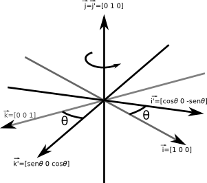

------------------------------
author: Anderson Tavares
title: Revisão Álgebra Linear (básico e visual)
description: Pequena revisão, utilizando ilustrações, de álgebra linear para computação gráfica
tags: Álgebra Linear, Computação Gráfica
thumbnail: assets/images/webgl-directional-ambient-light-thumb.png
biblio: library.bib
csl: ieee-with-url.csl
math: true
------------------------------

Bem vindo à revisão de álgebra linear. Aqui irei mostrar o básico de álgebra linear, tentando . Esse tutorial foi feito visando os fundamentos para os tutoriais de WebGL, mas podem ser usados em qualquer outra aplicação.

# Fundamentos

Nestes fundamentos, mostraremos o básico de vetores, matrizes, sistemas de coordenadas. Tentarei colocar o máximo de ilustrações para obter uma visão geométrica de cada informação matemática. Além disso, tentarei passar o conteúdo numa visão _top-down_, passando primeiro pelos problemas do dia-a-dia, para depois formalizar estes problemas em conceitos matemáticos.

Um bom livro disponível na Internet na íntegra é o livro de Jacir J. Venturi de [Álgebra Vetorial e Geometria Analítica](http://www.geometriaanalitica.com.br/livros/av.pdf). Certas partes se tornam narrativas históricas, tornando a leitura prazerosa. Ele cobre diversos aspectos e propriedades dos vetores que nós usaremos nesses tutoriais, nas disciplinas da área de Processamento Gráfico e no dia-a-dia no desenvolvimento de projetos de visualização gráfica.

Geralmente os vetores são utilizados para representar deslocamentos ao invés de posições imediatas. Em alguns momentos precisamos trabalhar com deslocamentos:

- De uma cidade para outra, traça uma seta representando seu deslocamento;
- Em um segundo, o carro se desloca de um ponto a outro. Se olharmos de cima, podemos traçar uma seta da origem para o destino;
- Os fótons dos raios solares batem na superfície do espelho e refletem como se fossem bolas quiquando. O sentido e direção desses fótons são importantes para sabermos se eles vão atingir o seu olho (se percebes o raio refletido) ou não;
- Se aplicares um soco num saco de boxe (soco num saco, parece uma cacofonia...), a parte inferior do saco vai para o sentido do murro aplicado, com uma aceleração e velocidade iniciais. A ponta no alto está presa no teto, e como a altura do saco é finita e por causa da força centrípeta, o saco tende a subir. Mas aí o sentido da velocidade se orienta para cima, contra a gravidade. A gravidade reduz a velocidade, fazendo com que o saco pare e depois ganhe velocidade no outro sentido. Devido à pressão do ar, a energia não é conservada, tornando o sistema estável. Tudo isso para dizer que velocidade, gravidade, força do soco e do vento podem ser modeladas como vetores;
- Em circuitos elétricos, existem componentes para controlar a passagem de elétrons como resistores e indutores. A resistência e reatância compõem a impedância, e é onde os campos elétricos e magnéticos são estudadas em conjunto, como campos eletromagnéticos. Porém esses campos contém polarizações diferentes (90 graus de diferença de fase). A polarização pode ser modelada como vetores;

Existem milhares de exemplos e aplicações que utilizam vetores e outros conceitos de álgebra linear. Como criar um conceito matemático que seja básico o suficiente para atender tamanha variedade de aplicações? Vamos entender o que é o vetor. Mas antes disso vamos entender o sistema de coordenadas cartesiano.

## Sistemas de Coordenadas Cartesiano

Eu vou usar uma didática do livro [3D Math Primer for Graphics and Game Development](http://www.amazon.com/Primer-Graphics-Development-Wordware-Library/dp/1556229119) que é bastante intuitivo.

### Uma dimensão

Números naturais, também chamado de números contáveis, foram inventados há bastante tempo, provavelmente para contar ovelhas (um bom livro que estou tentando ler sobre a história da matemática é o livro de Howard Eves, [Introdução à História da Matemática](http://www.livrariasaraiva.com.br/produto/392616)). O conceito de uma ovelha fica bastante claro. Duas e três também. Mas depois disso se torna tanta ovelha que era apenas referenciado como "muitas ovelhas". Quando crianças, nós temos um pensamento logarítmico (a diferença entre 1 e 2 é muito maior do que 101 e 102) (vide [isto](http://www.huffingtonpost.com/ben-thomas/whats-halfway-between-1-and-9-kids-and-scientists-say-3_b_1982920.html) e [isto](http://www.ncbi.nlm.nih.gov/pmc/articles/PMC2610411/)). Inclusive muitos adultos ainda se abstém desse pensamento, quando as habilidades de percepção de escala linear dos números não são desenvolvidos com a escola formal. Com o tempo, civilizações evoluíram a tal ponto de terem pessoas dedicadas a estudarem os números, ao invés de apenas matar e comer ovelhas. Com isso, o conceito de zero (sem ovelha) foi introduzido no sistema numérico, além de criarem vários sistemas gráficos que pudessem representar mais precisamente a quantidade _muitos_.

O hábito de criar uma fila de ovelhas para contar teve como consequência a linha numérica, ou seja, uma linha com números posicionados em intervalos regulares.

Em algum momento, houve a necessidade de definir o conceito de débito, ou seja, de ficar devendo ovelhas. Daí surgiram os números negativos.

E os pobres que não podem ter uma ovelha inteira, apenas uma parte dela? Com o tempo, foi-se necessário inserir o conceito de números racionais, facilmente posicionados na linha numérica. Para não ficar escrevendo tanto número como 31415/10000, inventou-se o número decimal, como 3,1415.

Depois perceberam que alguns números importantes não podiam ser representados por números racionais, como a razão entre o perímetro da circunferência e seu diâmetro. Estes são os números irracionais, que requerem um infinito número de casas decimais. Enquanto que os números racionais podem ser contáveis, fazendo um mapeamento bijetor para números naturais, os números irracionais não são contáveis. Com isso, duas das maiores áreas da matemática nasceram: a matemática discreta e a matemática contínua.

Pode ser que penses: não dá para representar fielmente o mundo por parecer contínuo devido a quantidade absurda de átomos, quarks e outras partículas. Mas aí é onde entre a **Primeira Lei da Computação Gráfica**

> Se parecer Ok, então está Ok.

### Duas dimensões

E se eu tiver uma quantidade dependendo de outra? E se eu tiver de me localizar? Imaginemos uma cidade hipotética chamada Cartésia. Antes de Cartésia ser formada, só havia um terreno plano vazio. Os arquitetos e engenheiros precisaram um sistema para localizar espacialmente qualquer coisa. Inicialmente se preocuparam com as quadras. Definiram-se direções. Também definiram a origem do sistema (a prefeitura) e cada posição (x,y) equivalia à quantidade de quadras ao norte e ao leste as pessoas teriam de ir.

As linhas que passam pela origem se chamam "eixos". Não necessariamente os eixos precisam ser perpendiculares (mas não podem ser paralelas, veremos depois por quê). Há  algumas diferenças entre Cartésia e o conceito abstrato de sistema de coordenads 2D: 

- Embora a cidade seja limitada, o sistema de coordenadas 2D é ilimitado, se estendendo ao infinito;
- As ruas em Cartésia tem espessura, enquanto que as linhas no sistema abstrato não tem. 
- Em Cartésia, só podes dirigir nas rodovias e ruas. Em um sistema de coordenadas, não estás limitado à grade desenhada, apenas ao domínio do números dos eixos.

Podemos denominar o eixo horizontal de eixo $X$ e o vertical de eixo $Y$. (5,3), significa 5 quadras no eixo X e 3 quadras no eixo Y.

**Mas e (-5, -3)?** Precisamos definir uma orientação para qual sentido nos eixos estão os valores positivos. No monitor, a orientação dos números positivos para o eixo X está para a direita, enquanto que para o eixo Y, o sentido está para baixo. Isso se mantém por razões históricas (é o sentido de onde os comandos do DOS, Unix e outros fluem).

Para Cartésia, houve um problema: os profissionais que projetaram Cartésia eram de Disléxia, uma cidade vizinha. Só que eles ficaram confusos sobre qual orientação Cartésia deveria seguir. Toda vez que recebia uma proposta de orientação, o norte aparecia em vários lugares: para cima, para baixo, para a esquerda ou para a direita. Mesmo o prefeito girando o norte para onde ele queria, o sentido do leste estava o contrário do que ele pensava a início. Ele viu que ao todo havia 8 propostas distintas de orientações:

Eles escolheram a primeira como a _orientação normal_ e perceberam que outras três poderiam ser rotacionadas para ficar idênticas à _orientação normal_. Mas as outras 4 propostas deram trabalho para eles. Apenas no final do dia, quando foram apagar a luz, um dos funcionários percebeu que se colocar uma das outras 4 propostas à contraluz, elas se transformariam à primeira. Ou seja, não importa a orientação no sistema de coordenadas 2D, poderás transformá-la na _orientação normal_. Depois veremos que em 3D isso não acontece.

### 3 dimensões

Denominemos o terceiro eixo como eixo-z. Para localizar um ponto no espaço, precisamos de uma terceira coordenada dentro uma tupla $(x,y,z)$.

Nem sempre uma orientação pode ser igual a outra, mesmo que rotacione os eixos. Há duas classes de orientações: espaço de coordenadas da mão esquerda e da mão direita. Uma orientação não pode se transformar na outra, embora orientações dentro de uma classe podem se transformar.

Para a mão esquerda, há uma convenção: coloque o seu polegar no eixo X, os outros dedos no eixo Y (pode ser apenas o polegar), e o eixo Z automagicamente estará saindo da sua palma. Para os sistemas de coordenadas da mão direita, é o mesmo processo. Mas veja que se usares a mão esquerda em um sistema de coordenadas de mão direita, o eixo Z estará saindo das costas da mão. Se seguirmos a ordem X-Y-Z, verás que essa ordem na sua mão direita é polegar-indicador-palma, dando uma orientação antihorária. Essa ordem na mão esquerda resulta numa orientação horária. Então no espaço de coordenadas da mão direita, ângulos positivos seguem a orientação antihorária. Veja como fica a orientação olhando contra o eixo X no sistema de coordenadas da mão esquerda:

O OpenGL e, por consequência, o WebGL trabalham com o sistema de coordenadas da mão direita. Essa determinação é importante, pois algumas coisas são diferentes entre os dois tipos de sistemas.

## Vetores

Um vetor é uma tupla $[x_1,x_2, ...,x_n]$, com $x_i \in R^n, 1 \le i \le n$. É uma entidade geométrica com magnitude, direção e sentido. Ela pertence a um conjunto denominado [espaço vetorial](http://pt.wikipedia.org/wiki/Espa%C3%A7o_vetorial). Nesse conjunto, se dois vetores tiverem a mesma magnitude, direção e sentido, então elas são iguais. Um vetor não tem posição definida, então não faz sentido transladar um vetor (ela pode estar em qualquer lugar). O valor de $n$ é a dimensão do vetor. Um vetor como 

$$\begin{bmatrix}
1 \\
2 \\
3
\end{bmatrix}$$

é um vetor coluna. Um vetor $[1,2,3]$ é um vetor linha. A transposta de um vetor coluna é um vetor linha. Para economizar espaço, poderemos tratar um vetor coluna como $[1,2,3]^T$. Outra notação é tratar um vetor $\vec{a}$ como $[a_1,a_2,a_3,a_4]$ ou $[a_x,a_y,a_z,a_w]$.

Um ponto também é uma tupla $(x_1,x_2, ...,x_n)$, com $x_i \in R^n, 1 \le i \le n$. Veja que estamos usando a notação $()$ para ponto e $[]$ para vetor, mas isso pode mudar nos livros-texto. Geralmente um ponto representa uma posição, ao invés de um deslocamento.

**Mas um vetor não é a mesma coisa que um ponto?** Em termos numéricos, sim, mas em termos semânticos, não. Veja algumas diferenças:

ponto                                vetor
------------------------------------ ----------------------------------------
representa uma posição               representa um deslocamento
não tem direção                      tem direção
não tem sentido                      tem sentido
não tem magnitude                    tem magnitude
tem posição                          não tem uma posição específica
-----------------------------------------------------------------------------

Quando quiseres especificar uma posição, por exemplo um lugar _A_ com latitude=-23 e longitude=-46, especificas um ponto (-23, -46). Quando quiseres especificar um deslocamento, por exemplo entre A(-23, -46) e B(50, 20) precisas caminhar 73 unidades no eixo X e 66 unidades no eixo Y, resultando em [73,66], que é diferente de um ponto C na posição (73,66).

Geometricamente podemos associar pontos e vetores:

Matematicamente podemos associar pontos e vetores dessa forma:

- $A - B = \vec{v}$
- $A + \vec{v} = B$
- $\vec{v} + \vec{w} = \vec{z}$

### Vetor zero

A identidade da operação de adição entre vetores é o vetor zero: $[0,0,\dots,0]^T$. Se fixares a magnitude de um vetor, todos os vetores distintos formam um círculo de vetores. Porém o vetor zero não tem direção, ou seguindo a definição, tem todas as direções. Não pense no vetor zero como um ponto, pense como "sem deslocamento".

### Negar um vetor

$-\vec{a}= -[a_1,a_2,\dots,a_n]^T = [-a_1,-a_2,\dots,-a_n]^T$

Geometricamente invertes o sentido do vetor:

### Magnitude

A magnitude, também conhecido como norma, comprimento ou intensidade, não está explícito no vetor. O vetor $[3,4]^T$ tem magnitude nem 3 nem 4, mas 5. Veja como calculá-lo:

$\|v\| = \sqrt{v_1^2 + v_2^2 + ... + v_{n-1}^2 + v_n^2}$

$\|v\| = \sqrt{\sum^{n}_{i=1}{v_i^2}}$

Geometricamente, usando pitágoras:

$v_x$ e $v_y$ podem ser valores negativos, todavia $\|v\|$ não é. Jà que $|x|^2 = x^2$ então as equações seguintes são equivalentes:

- $\|v\|^2 = |v_1|^2 + |v_2|^2$
- $\|v\|^2 = v_1^2 + v_2^2$

### Multiplicação por um escalar
$$
k 
\begin{bmatrix} v_1 \\ v_2 \\ \vdots \\ v_n \end{bmatrix}
=
\begin{bmatrix} v_1 \\ v_2 \\ \vdots \\ v_n \end{bmatrix}
k
=
\begin{bmatrix} kv_1 \\ kv_2 \\ \vdots \\ kv_n \end{bmatrix}
$$

Dividir por k é igual a multiplicar por $\frac{1}{k}$. Algumas observações:

- Geralmente multiplicação entre escalar e vetor não tem símbolo de multiplicação;
- multiplicação entre escalar e vetor ocorre antes de adição: $3\vec{a} + \vec{b}$ é o mesmo que $(3\vec{a})+\vec{b}$, mas diferente de $3(\vec{a}+\vec{b})$;
- Um escalar não pode ser dividido por um vetor, e um vetor não pode ser dividido por outro vetor;
- Negação de vetor pode ser visto como multiplicação pela escalar -1.

Geometricamente, a multiplicação de um vetor por uma escalar estica ou encolhe o vetor, mantendo seu sentido e direção, mas mudando sua magnitude proporcionalmente à escalar:

### Normalização

Multas vezes só queres saber o sentido do vetor, sem se importar com a magnitude:

- Para onde o vento está orientado nesse ponto?
- Para onde esse fóton está indo?
- Essa cidade fica ao norte ou ao leste daqui?
- Na sinuca, em que direção o taco deve se orientar para acertar a bola?

Podemos representar estas situações com um vetor unitário (sua magnitude é igual a 1), também chamado de _versor_ ou _normal_. Podemos obter um versor de um vetor dividindo-o pela sua magnitude:

$\vec{v}_{norm} = \frac{\vec{v}}{\|v\|}$

Por causa do denominador, não podemos obter o versor do vetor zero.

Geometricamente:

### Adição e Subtração de vetores

Na adição, $\vec{a} + \vec{b} = \vec{b} + \vec{a}$:

$$
\begin{bmatrix} a_1 \\ a_2 \\ \vdots \\ a_n \end{bmatrix}
+
\begin{bmatrix} b_1 \\ b_2 \\ \vdots \\ b_n \end{bmatrix}
=
\begin{bmatrix} a_1 + b_1 \\ a_2 + b_2 \\ \vdots \\ a_n + b_n \end{bmatrix}
$$

Na subtração, $\vec{a} - \vec{b} = - \vec{b} - \vec{a}$:

$$
\begin{bmatrix} a_1 \\ a_2 \\ \vdots \\ a_n \end{bmatrix}
-
\begin{bmatrix} b_1 \\ b_2 \\ \vdots \\ b_n \end{bmatrix}
=
\begin{bmatrix} a_1 - b_1 \\ a_2 - b_2 \\ \vdots \\ a_n - b_n \end{bmatrix}
$$

Geometricamente:

Uma forma de ver estas operações:

- Adição: se eu caminhar por uma sequência de lugares, qual o deslocamento do primeiro lugar para o último?
- Subtração: se eu sair daqui para um dos dois outros lugares, qual é o deslocamento entre estes destinos? É longe um do outro?

Perceba que eu posso representar um vetor como uma sequência de deslocamentos (uma adição) de versores:

$$
\begin{bmatrix} a_1 \\ a_2 \\ \vdots \\ a_n \end{bmatrix}
=
a_1\begin{bmatrix} 1 \\ 0 \\ \vdots \\ 0 \end{bmatrix}
+
a_2\begin{bmatrix} 0 \\ 1 \\ \vdots \\ 0 \end{bmatrix}
+
\dots
+
a_n\begin{bmatrix} 0 \\ 0 \\ \vdots \\ 1 \end{bmatrix}
$$

### Distância entre pontos

Dados dois pontos A e B, podes obter um vetor $v = A-B = [a_1 - b_1,a_2-b_2,\dots,a_n-b_n]^T$. A distância entre A e B é a magnitude $\|v\| = \sqrt{(a_1-b_1)^2+(a_2-b_2)^2+\dots+(a_n-b_n)^2}$

### Produto Escalar

Vimos como multiplicar um vetor por um produto escalar. Podemos multiplicar um vetor por um outro vetor. Com o tempo, perceberam que certas formas de multiplicação entre vetores tornaram-se úteis no dia-a-dia.

O produto escalar (ou produto interno) tem esse nome pois o resultado é uma escalar. Dado dois vetores $\vec{a}$ e $\vec{b}$, o produto escalar $\vec{a}\cdot\vec{b} = [a_1b_1, a_2b_2,\dots,a_nb_n]$. Simplesmente é a multiplicação elemento a elemento. Qual a utilidade disso. Fica mais fácil vendo geometricamente a consequência dessa operação:

O produto escalar retorna o quão similar é um vetor do outro. Se eles forem perpendiculares, o valor do produto escalar é 0. Outra fórmula para o produto escalar é:

$\vec{a}\cdot\vec{b} = \|\vec{a}\|\|\vec{b}\|cos(\theta)$

Produto escalar entre versores é mais simples (dado versores $\vec{a}$ e $\vec{b}$:

$\vec{a}\cdot\vec{b} = cos(\theta)$

### Projetando um vetor no outro

Digamos que tenhas modelado um coqueiro inclinado e o sol esteja exatamente acima, e queiras projetar sua sombra. Representando estas elementos como vetores:

Precisamos decompor $\vec{v}$ em dois vetores: $\vec{v}_\parallel$ (paralelo a $\vec{w}$) e $\vec{v}_\perp$ (perpendicular a $\vec{w}$), de forma que $\vec{v}_\parallel + \vec{v}_\perp = \vec{v}$. Usando os conceitos trigonométricos aprendidos na escola primária e secundária, sabemos que

$$\|\vec{v}_\parallel\| = \|\vec{v}\|cos(\theta)$$.

Mas neste tutorial aprendemos que

$$\vec{v}\cdot\vec{w} = \|\vec{v}\|\|\vec{w}\|cos(\theta)$$

$$\|\vec{v}\|cos(\theta) = \frac{\vec{v}\cdot\vec{w}}{\|\vec{w}\|}$$

Assim podemos fazer a relação entre $\vec{v}$ e $\|\vec{v}_\parallel\|$ sem precisar do ângulo:

$$\|\vec{v}_\parallel\| = \frac{\vec{v}\cdot\vec{w}}{\|\vec{w}\|}$$ 

Ou seja, já temos a magnitude de $\vec{v}_\parallel$. E se eu quiser de fato o $\vec{v}_\parallel$? Podemos criar um versor de $\vec{w}$ e multiplicá-lo pela magnitude de $\vec{v}_\parallel$:

$$\vec{v}_\parallel = \frac{\vec{w}}{\|\vec{w}\|}\|\vec{v}_\parallel\|$$

$$\vec{v}_\parallel = \vec{w}\frac{\vec{v}\cdot\vec{w}}{\|\vec{w}\|^2}$$

Se w já for um versor, a divisão é desnecessária. Para obter $\vec{v}_\perp$ basta subtrair $\vec{v}_\parallel$ de $\vec{v}$. Essa projeção e decomposição de vetores serão bastante usadas não só para sombras, mas para computar tambeḿ a iluminação dos objetos de acordo com o sentido dos raios solares.

Antes de terminar esta seção, uma observação: podemos representar o produto escalar como uma multiplicação entre vetores. Dado os vetores coluna $\vec{v}$ e $\vec{w}$, então o produto escalar é:

$$\vec{v}\cdot\vec{w} = \vec{v}^T\vec{w}$$

Isso é importante quando formos trabalhar com multiplicação de matrizes.

### Produto Vetorial

Existe uma outra operação que se mostrou bastante útil no mundo 3D. Esta operação resolve o seguinte problema: "Como posso achar um vetor que seja perpendicular a dois outros vetores?". O produto vetorial tem como resultado um vetor (daí o nome). A expressão para o produto vetorial é:

$$
\begin{bmatrix} x_1 \\ y_1 \\ z_1 \end{bmatrix}
\times
\begin{bmatrix} x_2 \\ y_2 \\ z_2 \end{bmatrix}
=
\begin{bmatrix} y_1z_2 - y_2z_1 \\ x_1z_2 - z_1x_2 \\ x_1y_2-y_1x_2 \end{bmatrix}
$$

Parece confuso e aleatório? Vou dar uma dica para visualizar o padrão nessa multiplicação: para achar o primeiro valor do vetor resultante, remova a primeira linha dos dois vetores, junte os outros 4 números e calcule o determinante. Para o segundo ou terceiro valores, remova a segunda ou terceira linha e repita o processo. Daí podes lembrar: _Isso se parece com determinante usando expansão em cofatores_. Mas é isso mesmo, há uma forma de calcular esse produto vetorial usando apenas uma determinante. Se eu representar o vetor $[x,y,z]^T$ como $x\vec{i}+y\vec{j}+z\vec{k}$, onde $\vec{i} = [1,0,0]^T$, $\vec{j} = [0,1,0]^T$ e $\vec{k} = [0,0,1]^T$, então o produto vetorial pode ser representado como:

$$
\vec{v}\times\vec{w} = 
\begin{bmatrix}
  \vec{i} & \vec{j} & \vec{k} \\
  v_1     & v_2     & v_3     \\
  w_1     & w_2     & w_3    
\end{bmatrix}
$$

O cálculo é o mesmo. Mas ainda há um problema:

- Que eu saiba, com dois vetores distintos, há outros dois vetores que são perpendiculares a eles. Qual deles é o resultado do produto vetorial?

Não conseguiu enxergar esses dois vetores? Vou mostrar:

Lembras que a orientação na regra da mão direita é antihorária? E lembras da ordem polegar$\rightarrow$outros dedos$\rightarrow$palma da mão? Faça exatamente isso no produto vetorial:

- $\vec{v}\times\vec{w}$: Polegar no v e os outros dedos no w. O vetor resultante do produto vetorial está saindo da palma da mão.

Mas quem é o outro vetor? Faça a mesma regra:

- $\vec{w}\times\vec{v}$: Polegar no w e os outros dedos no v. O vetor resultante do produto vetorial está saindo da palma da mão.

Veja que um é o negativo do outro, ou seja:

$\vec{v}\times\vec{w}$ = - $\vec{w}\times\vec{v}$.

Essa é uma propriedade interessante. Outra propriedade interessante é com respeito à sua magnitude, pois ela é igual à área do paralelogramo formado pelos vetores $\vec{v}$ e $\vec{w}$:

$$
\begin{split}
Area_{paralelogramo} & = bh \\
                     & = \|\vec{v}\|h \\
                     & = \|\vec{v}\|\|\vec{w}\|sen(\theta) \\
                     & = \|\vec{v}\times\vec{w}\|
\end{split}
$$

## Matrizes

### Introdução

Uma matriz é um vetor multidimensional, retangular com valores dispostos em linhas e colunas. Uma matriz $l\times c$ tem $l$ linhas e $c$ colunas. Podemos usar a notação $M = [m_{ij}]$, onde $1 \le i \le r$ e $1 \le j \le c$, e $m_{ij}$ representa o elemento na linha $i$ e coluna $j$. Uma matriz quadrada tem $r = c$ (cuja dimensão chamarei de $n \times n$). A diagonal de matriz quadrada é um vetor [m_{ii}], onde $1 \le i \le n$. Se apenas $m_{ii}$ são não-nulos, então temos uma matriz diagonal. A matriz identidade é uma matriz diagonal onde $m_{ii} = 1$ e os outros elementos são iguais a zero.

Você pode considerar os vetores como matrizes. O vetor linha é uma matriz $1 \times n$, enquanto que o vetor coluna é uma matriz $n \times 1$.

A transposta de uma matriz  $M_{r \times c} = [m_{ij}]$ é uma matriz $M^T_{c \times r}=[m_{ji}]$, ambas com $1 \le i \le r$ e $1 \le j \le c$. Uma matriz é simétrica quando $M = M^T$. A transposta de um vetor coluna é um vetor linha, e vice-versa. A transposta da transposta de uma matriz é igual à matriz.

### Multiplicação de uma matriz por uma escalar

A multiplicação é semelhante à multiplicação entre vetores e escalares:

$$kM = 
k\begin{bmatrix} m_{11} & m_{12} & m_{13} \\ m_{21} & m_{22} & m_{23} \\ m_{31} & m_{32} & m_{33}\end{bmatrix} = \begin{bmatrix}km_{11} & km_{12} & km_{13} \\ km_{21} & km_{22} & km_{23} \\ km_{31} & km_{32} & km_{33}\end{bmatrix}

### Multiplicação entre Matrizes

Poderíamos multiplicar as duas matrizes elemento a elemento, como por exemplo:

$$AB = [a_{ij}][b_{ij}] = [a_{ij}b_{ij}]$$

Inclusive nas ferramentas computacionais, existe essa operação de multiplicação elemento-a-elemento entre matrizes. Todavia, com o tempo, percebeu-se que uma outra forma de multiplicação se mostrava muito mais útil para o desenvolvimento da álgebra linear e suas aplicações. Mantendo a abordagem top-down, vou mostrar o conceito primeiramente mostrando um problema, um exemplo.

Imagine que estejas resolvendo um sistema de equações lineares:

$$
\begin{array}\\a_{11}x_1 + a_{12}x_2 + a_{13}x_3 + a_{14}x_4 = b_1 \\
a_{21}x_1 + a_{22}x_2 + a_{23}x_3 + a_{24}x_4 = b_2 \\
a_{31}x_1 + a_{32}x_2 + a_{33}x_3 + a_{34}x_4 = b_3 \\
a_{41}x_1 + a_{42}x_2 + a_{43}x_3 + a_{44}x_4 = b_4
\end{array}
$$

Podemos representar essas quatro equações como matrizes. Perceba que a primeira equação é um produto interno entre o vetor $[a_{11}, a_{12}, a_{13}, a_{14}]^T$ e o vetor $[x_1,x_2,x_3,x_4]^T$.

$$
\begin{array}\\[a_{11}, a_{12}, a_{13}, a_{14}][x_1,x_2,x_3,x_4]^T = b_1 \\
[a_{21}, a_{22}, a_{23}, a_{24}][x_1,x_2,x_3,x_4]^T = b_2 \\
[a_{31}, a_{32}, a_{33}, a_{34}][x_1,x_2,x_3,x_4]^T = b_3 \\
[a_{41}, a_{42}, a_{43}, a_{44}][x_1,x_2,x_3,x_4]^T = b_4
\end{array}
$$

Podemos reunir as 4 equações:

$$
\begin{bmatrix}  a_{11} & a_{12} & a_{13} & a_{14} \\
  a_{21} & a_{22} & a_{23} & a_{24} \\
  a_{31} & a_{32} & a_{33} & a_{34} \\
  a_{41} & a_{42} & a_{43} & a_{44}
\end{bmatrix}
\begin{bmatrix}x_1 \\  x_2 \\  x_3 \\  x_4 \end{bmatrix} 
=
\begin{bmatrix}b_1 \\  b_2 \\  b_3 \\  b_4 \end{bmatrix}
$$

Podemos abreviar as matrizes:

$$A\vec{x} = \vec{b}$$

Esse exemplo mostra uma multiplicação entre matriz e vetor. Percebeu que há uma relação entre as linhas da primeira matriz e as colunas da segunda matriz (que nesse caso só havia uma coluna, o vetor coluna)? O número de elementos dentro de cada linha do primeiro vetor e dentro de cada coluna do segundo vetor deve ser o mesmo. Generalizando, podes multiplicar vetores de diferentes tamanhos, porém seguindo essa regra.

$$A_{l \times n}B_{n \times c} = C_{l \times c}$$

Cada elemento de C pode ser computado da seguinte forma:

$$c_{ij} = \sum^{n}_{k=1}{a_{ik}b_{kj}}$$

Algumas observações com relação à multiplicação entre matrizes:

- Multiplicar uma matriz $M$ por uma matriz quadrada $Q$ (em qualquer um dos lados) mantém o tamanho de $M$ (a multiplicação precisa ser válida);
- Se $I$ é a matriz identidade

    $MI = IM = M$;
  
- Multiplicação de matrizes não é comutativa:

    $AB \neq BA$;
  
- Multiplicação de matrizes é associativa:

    $(AB)C = A(BC)$;
  
- Associação também se rege com matrizes, escalares e vetores

    $(kA)B = k(AB) = A(kB)$ e $(\vec{v}A)B = \vec{v}(AB)$
  
- A transposta de uma multiplicação é a multiplicação de transpostas, invertendo a ordem das matrizes
  
    $(AB)^T = B^TA^T$. 
  
    Isso faz sentido quando levas em conta o tamanho das matrizes, de forma a manter a multiplicação válida:
  
    $(A_{l \times n}B_{n \times c})^T = B^T_{c \times n}A^T_{n \times l}$
  
- Transposição da multiplicação pode ser estendido para mais de duas matrizes:
    $(M_1M_2 \cdots M_n)^T = M_n^T\cdots M_2^TM_1^T$

### Multiplicar um vetor e uma matriz

Lado esquerdo, lado direito, vetor coluna, vetor linha. Há 4 formas de multiplicar uma matriz e um vetor. Veja o que acontece mostrando exemplos com matrizes $3\times 3$ e vetores:

$$
\begin{align}
\begin{bmatrix}x & y & z\end{bmatrix}\begin{bmatrix}m_{11} & m_{12} & m_{13}\\m_{21} & m_{22} & m_{23}\\m_{31} & m_{32} & m_{33}\end{bmatrix} &= \begin{bmatrix}xm_{11} + ym_{21} + zm_{31} & xm_{12} + ym_{22} + zm_{32} & xm_{13} + ym_{23} + zm_{33}\end{bmatrix}\\
\begin{bmatrix}m_{11} & m_{12} & m_{13}\\m_{21} & m_{22} & m_{23}\\m_{31} & m_{32} & m_{33}\end{bmatrix}\begin{bmatrix}x \\ y \\ z\end{bmatrix} &= \begin{bmatrix}xm_{11} + ym_{12} + zm_{13} \\ xm_{21} + ym_{22} + zm_{23} \\ xm_{31} + ym_{32} + zm_{33}\end{bmatrix}\\
\begin{bmatrix}m_{11} & m_{12} & m_{13}\\m_{21} & m_{22} & m_{23}\\m_{31} & m_{32} & m_{33}\end{bmatrix}\begin{bmatrix}x & y & z\end{bmatrix} &= indefinido\\
\begin{bmatrix}x \\ y \\ z\end{bmatrix}\begin{bmatrix}m_{11} & m_{12} & m_{13}\\m_{21} & m_{22} & m_{23}\\m_{31} & m_{32} & m_{33}\end{bmatrix} &= indefinido
\end{align}
$$

Um vetor linha só pode ser multiplicado por uma matriz pelo lado direito, enquanto que um vetor coluna só pode ser multiplicado por uma matriz pelo seu lado esquerdo. O resultado é um vetor linha ou coluna respectivamente, mantendo a dimensão do vetor original. Outras observações:

- Cada elemento do vetor resultante é um produto escalar do vetor original com uma linha (para vetores coluna) ou coluna (para vetores linha) da matriz;
- Você pode imaginar os elementos $m_{ij}$ como um peso do $i$-ésimo elemento do vetor original influenciando o $j$-ésimo elemento da saída (isso no caso da multiplicação com vetor linha). Com o vetor coluna, troque os papéis de $i$ e $j$. Ex (vetor coluna): $m_{21}$ controla o quanto do valor de x contribui para o 2º elemento da saída.
- Multiplicação é distributiva sobre adição de vetores:

    $(\vec{v}+\vec{w})M = \vec{v}M + \vec{w}M$

Agora perceba os valores da saída numa multiplicação com vetores linha:

$$\begin{bmatrix}xm_{11} + ym_{21} + zm_{31} & xm_{12} + ym_{22} + zm_{32} & xm_{13} + ym_{23} + zm_{33}\end{bmatrix}$$

Veja os valores da saída numa multiplicação com vetores coluna:

$$\begin{bmatrix}xm_{11} + ym_{12} + zm_{13} \\ xm_{21} + ym_{22} + zm_{23} \\ xm_{31} + ym_{32} + zm_{33}\end{bmatrix}$$

Independente do resultado ser um vetor coluna ou linha, os valores dos elementos não são os mesmos! Por isso a importância da distinção de um vetor coluna e um vetor linha. Como os livros de álgebra linear, _bíblias_ de computação gráfica e o OpenGL utilizam vetores coluna, vamos seguir essa convenção. O DirectX utiliza vetores linha, e o raciocínio adquirido ao aprender os conceitos utilizando vetores coluna podem ser aplicados a vetores linha.

### Interpretação Geométrica

Com tantas informações sobre matrizes, fiquei devendo ilustrações para entender as matrizes de uma forma visual, ao invés de apenas um grade de de números.

Como dito anteriormente nessa revisão, podemos representar um vetor como uma sequência de vetores ponderados:

$$
\begin{split}
\begin{bmatrix} v_1 \\ v_2 \\ v_3 \end{bmatrix} & = 
1\begin{bmatrix} v_1 \\ 0   \\ 0   \end{bmatrix} +
1\begin{bmatrix} 0   \\ v_2 \\ 0   \end{bmatrix} +
1\begin{bmatrix} 0   \\ 0   \\ v_3 \end{bmatrix} \\
& = 
v_1\begin{bmatrix} 1 \\ 0  \\ 0   \end{bmatrix} +
v_2\begin{bmatrix} 0 \\ 1  \\ 0   \end{bmatrix} +
v_3\begin{bmatrix} 0 \\ 0  \\ 1   \end{bmatrix} \\
& = 
v_1\vec{i} + v_2\vec{j} + v_3\vec{k} \\
& = \begin{bmatrix}\vec{i}&\vec{j}&\vec{k}\end{bmatrix}\begin{bmatrix}v_1\\v_2\\v_3\end{bmatrix} \\
& =
\begin{bmatrix}1&0&0\\0&1&0\\0&0&1\\\end{bmatrix}\begin{bmatrix}v_1\\v_2\\v_3\end{bmatrix}
\end{split}
$$

Nós expressamos o vetor $\vec{v}$ como uma combinação linear dos vetores $\vec{i}$, $\vec{j}$ e $\vec{k}$. Denominemos estes vetores como _vetores base_. Com estas bases, podemos formar qualquer vetor no espaço $n$-dimensional ($n$ é o número de vetores base), todavia veja que não há combinação linear de $\vec{i}$ e $\vec{j}$ que resulte em $\vec{k}$ (nem de $\vec{j}$ e $\vec{k}$ para $\vec{i}$ e de $\vec{k}$ e $\vec{i}$ para $\vec{j}$). Quando isso acontece, então eles são _linearmente independentes_ (LI). Existem diversas bases que podem formar o mesmo espaço vetorial, todavia elas precisam ser LI (nós denominamos os vetores base \vec{i}, \vec{j} e \vec{k} como _base canônica_). Se tiveres no seu conjunto de vetores base um vetor que seja combinação linear dos outros vetores, então sua base não é LI. É necessário remover esse vetor e fazer um novo teste, até conseguir um número de vetores base. Em 3D, a consequência de uma base LI de dimensão 3 é que seus três vetores não pertencem a um plano.

Então vamos representar geometricamente os vetores $\vec{v}$, $\vec{i}$, $\vec{j}$ e $\vec{k}$ (Em 2D é mais fácil de visualizar):

Se trocarmos a matriz identidade por uma outra matriz, por exemplo:

$$
\begin{bmatrix}
2 & 0 & 0 \\
0 & 3 & 0 \\
0 & 0 & 5 
\end{bmatrix}
\begin{bmatrix}
v_1 \\
v_2 \\
v_3 
\end{bmatrix}
=
\begin{bmatrix}
2v_1 \\
3v_2 \\
5v_3 \\
\end{bmatrix}
$$

Ou seja, o primeiro componente foi duplicado, o segundo foi triplicado e o terceiro foi quintuplicado. Então a matriz provoca uma transformação em um vetor. Generalizando, usando a mesma ideia do exemplo do sistema de equações, o resultado de uma transformação de uma matriz em um vetor é uma combinação linear dos elementos da matriz com os elementos do vetor.

**Mas como eu sei que transformação uma dada matriz provoca?** Você pode saber isso transformando os nossos vetores base canônicos.

$$
\begin{bmatrix}
m_{11} & m_{12} & m_{13} \\
m_{21} & m_{22} & m_{23} \\
m_{31} & m_{32} & m_{33} 
\end{bmatrix}
\begin{bmatrix}
1 \\ 0 \\ 0
\end{bmatrix}
=
\begin{bmatrix}
m_{11} \\ m_{21} \\ m_{31}
\end{bmatrix}
$$

$$
\begin{bmatrix}
m_{11} & m_{12} & m_{13} \\
m_{21} & m_{22} & m_{23} \\
m_{31} & m_{32} & m_{33} 
\end{bmatrix}
\begin{bmatrix}
0 \\ 1 \\ 0
\end{bmatrix}
=
\begin{bmatrix}
m_{12} \\ m_{22} \\ m_{32}
\end{bmatrix}
$$

$$
\begin{bmatrix}
m_{11} & m_{12} & m_{13} \\
m_{21} & m_{22} & m_{23} \\
m_{31} & m_{32} & m_{33} 
\end{bmatrix}
\begin{bmatrix}
0 \\ 0 \\ 1
\end{bmatrix}
=
\begin{bmatrix}
m_{13} \\ m_{23} \\ m_{33}
\end{bmatrix}
$$

Então as colunas representam os vetores resultantes das transformações das bases canônicas. Por exemplo, em 2D, se a matriz for 

$$
M = \begin{bmatrix}
 2 & -1\\
 1 &  2\\
\end{bmatrix}
$$

Significa que o vetor $\vec{i}$ se transforma em $[2,1]^T$ e o vetor $\vec{j}$ se transforma em $[-1,2]^T$. Vamos mostrar isso geometricamente:

Então a transformação é uma espécie de escala e uma rotação. Significa que todos os vértices naquele espaço vão ser transformados dessa forma se multiplicados por esta matriz.

Algumas transformações podem ficar um tanto distorcidas. As transformações representadas por uma matriz são _transformações lineares_. Alguns tipos de transformações lineares são:

- Rotação
- Escala
- Projeção Ortográfica
- Reflexão
- Cisalhamento

Vamos abordar cada uma delas em detalhes. 

## Transformações

### Rotação em 2D

Em 2D, a rotação se dá sobre um ponto (a origem). Sendo $\theta$ o ângulo de rotação, os vetores $\vec{i}$ e $\vec{j}$ em $[cos(\theta) sen(\theta)]^T$ e $[-sen(\theta) cos(\theta)]^T$.

$$R(\theta)=\begin{bmatrix}
  \vec{p'} & \vec{q'}
\end{bmatrix}
 =
\begin{bmatrix}
cos\theta & -sen\theta \\
sen\theta & cos\theta
\end{bmatrix}$$

### Rotação em 3D

Rotações em 3D não ocorrem sobre um ponto, mas sobre um eixo. Enquanto não abordarmos translação, estas rotações serão sobre eixos que passam pela origem. Precisamos saber que rotações são de ângulos positivas e negativos. Essa orientação pode ser obtida pela regra do sistema de coordenadas adotada. Mantenha o polegar na direção positiva do eixo e seus outros dedos farão a curva no sentido da orientação positiva da rotação. Por exemplo, na regra da mão direita:

Perceba que o sentido da rotação positiva é antihorário. Na regra da mão esquerda, o sentido é horário. Com isso em mente, vamos ver inicialmente como são as matrizes que rotacionam sobre os eixos básicos. Lembrando que as colunas da matriz são os vetores resultantes depois da transformação dos vetores básicos canônicos.

Na rotação sobre o eixo $x$:

$$R_x(\theta)=
\begin{bmatrix}
  \vec{i'} &
  \vec{j'} &
  \vec{k'}
\end{bmatrix}=
\begin{bmatrix}
  1 & 0 	  & 0 \\
  0 & cos(\theta) & -sen(\theta) \\
  0 & sen(\theta) &  cos(\theta)
\end{bmatrix}$$

Rotação sobre o eixo $y$

$$R_y(\theta)=
\begin{bmatrix}
  \vec{i'} &
  \vec{j'} &
  \vec{k'}
\end{bmatrix}=\begin{bmatrix}
  cos(\theta) & 0 & sen(\theta) \\
  0           & 1 & 0            \\
 -sen(\theta) & 0 & cos(\theta)
\end{bmatrix}$$

Rotação sobre o eixo $z$

$$R_z(\theta)=
\begin{bmatrix}
  \vec{i'} &
  \vec{j'} &
  \vec{k'}
\end{bmatrix}=\begin{bmatrix}
  cos(\theta) & -sen(\theta) & 0 \\
  sen(\theta) &  cos(\theta) & 0 \\
  0           & 0 	     & 1
\end{bmatrix}$$

### Rotação sobre um eixo arbitrário

Esse é mais complicado. É necessário utilizar o arsenal que aprendemos sobre decomposição de vetores e as outras rotações.

Essa imagem tem muitos vetores, mas olhe apenas para o vetor $\vec{n}$ e $\vec{v}$ na esquerda. Queremos rotacionar por um ângulo $\theta$ o vetor $\vec{v}$ em volta do vetor $\vec{n}$. Digamos que $\vec{n}$ seja um versor para facilitar o cálculo. Perceba que se decompormos $\vec{v}$ em $\vec{v}_\parallel$ (paralelo a $\vec{n}$) e $\vec{v}_\perp$, apenas o vetor $\vec{v}_\perp$ é rotacionado, resultando em $\vec{v}_\perp'$. Então só precisamos calcular $\vec{v}_\perp'$. Vamos ver por partes:

- $\vec{v}_\parallel$ é simplesmente a projeção de $\vec{v}$ sobre o vetor $\vec{n}$. Isto pode ser calculado como $(\vec{v} \cdot \vec{n})\vec{n}$ (como $\vec{n}$ é unitário, a divisão é desnecessária);
- $\vec{v}_\perp$ pode ser calculado como $\vec{v}-\vec{v}_\parallel$.
- $\vec{w}$ é um vetor auxiliar que sempre será perpendicular a $\vec{v}_\perp$ e $\vec{v}_\parallel$ (e a $\vec{n}$). _Ué, mas um vetor que é perpendicular a dois outros vetores distintos é a definição de produto vetorial_. É isso mesmo, $\vec{w}$ pode ser calculado como $\vec{n}\times\vec{v}_\perp$;

Perceba que $\vec{v}_\perp'$ é uma combinação linear entre $\vec{w}$ e $\vec{v}_\perp$, de forma circular:

$$\vec{v}_\perp' = cos(\theta)\vec{v}_\perp + sen(\theta)\vec{w}$$

Vamos representar $\vec{v}_\perp'$ com nossos vetores originais $\vec{v}$ e $\vec{n}$:

$$\begin{align}
\vec{v}_\parallel & = (\vec{v}\cdot \vec{n})\vec{n} \\
\vec{v}_\perp     & = v - \vec{v}_\parallel \\
                  & = v - (\vec{v}\cdot \vec{n})\vec{n} \\
\vec{w}           & = \vec{n} \times \vec{v}_\perp \\
                  & = \vec{n} \times (\vec{v} - \vec{v}_\parallel) \\
                  & = \vec{n} \times \vec{v} - \vec{n} \times \vec{v}_\parallel\\
                  & = \vec{n} \times \vec{v} - \vec{0}\\
                  & = \vec{n} \times \vec{v}\\
\vec{v}_\perp'    & = cos(\theta)\vec{v}_\perp + sen(\theta)\vec{w} \\
                  & = cos(\theta)(\vec{v} - (\vec{v}\cdot \vec{n})\vec{n}) + sen(\theta)(\vec{n}\times\vec{v})
\end{align}
$$

E agora vamos compor nosso vetor resultante $\vec{v}'$:

$$\begin{align}
\vec{v}'          & = \vec{v}_\perp' + \vec{v}_\parallel \\
                  & = cos(\theta)(\vec{v} - (\vec{v} \cdot \vec{n})\vec{n}) + sen(\theta)(\vec{n}\times\vec{v}) + (\vec{v}\cdot\vec{n})\vec{n}
\end{align}
$$

Com isso temos a rotação de um vetor $\vec{v}'$ representado por $\vec{v}$, $\theta$ e $\vec{n}$. Lembra como se constroi uma matriz de transformação? Vamos usar nossos vetores canônicos:

$$\begin{align}
\vec{i}  & = \begin{bmatrix}1\\0\\0\end{bmatrix} \\
\vec{i}' & = cos(\theta)(\vec{i} - (\vec{i} \cdot \vec{n})\vec{n}) + sen(\theta)(\vec{n}\times\vec{i}) + (\vec{i}\cdot\vec{i})\vec{n} \\
         & = cos(\theta)\left(
	      \begin{bmatrix}1\\0\\0\end{bmatrix}-\left(
		\begin{bmatrix}1\\0\\0\end{bmatrix} \cdot
		\begin{bmatrix}n_x\\n_y\\n_z\end{bmatrix}
	      \right)
	      \begin{bmatrix}n_x\\n_y\\n_z\end{bmatrix}
	     \right)
	     +sen(\theta)\left(
	      \begin{bmatrix}n_x\\n_y\\n_z\end{bmatrix}\times
	      \begin{bmatrix}1\\0\\0\end{bmatrix}
	     \right)
	     +\left(
	      \begin{bmatrix}1\\0\\0\end{bmatrix}\cdot
	      \begin{bmatrix}n_x\\n_y\\n_z\end{bmatrix}
	     \right)
	     \begin{bmatrix}n_x\\n_y\\n_z\end{bmatrix} \\
	 & = cos(\theta)\left(
	       \begin{bmatrix}1\\0\\0\end{bmatrix}-
	       n_x\begin{bmatrix}n_x\\n_y\\n_z\end{bmatrix}
	     \right) +
	     sen(\theta)\begin{bmatrix}0\\n_z\\-n_y\end{bmatrix}+
	     n_x\begin{bmatrix}n_x\\n_y\\n_z\end{bmatrix} \\
	 & = cos(\theta)\begin{bmatrix}1-n_x^2\\-n_xn_y\\-n_xn_z\end{bmatrix}+
	     sin(\theta)\begin{bmatrix}0\\n_z\\-n_y\end{bmatrix} + 
	     \begin{bmatrix}n_x^2\\n_xn_y\\n_xn_z\end{bmatrix} \\
	 & = \begin{bmatrix}cos(\theta)-n_x^2cos(\theta)\\-n_xn_ycos(\theta)\\-n_xn_zcos(\theta)\end{bmatrix} + 
	     \begin{bmatrix}0\\n_zsen(\theta)\\-n_ysen(\theta)\end{bmatrix} + 
	     \begin{bmatrix}n_x^2\\n_xn_y\\n_xn_z\end{bmatrix} \\
	 & = \begin{bmatrix}
	     cos(\theta) - \cos(\theta)n_x^2 + n_x^2\\
	     -n_xn_ycos(\theta) + n_zsen(\theta) + n_xn_y\\
	     -n_xn_zcos(\theta) - n_ysen(\theta) + n_xn_z
	     \end{bmatrix} \\
	 & = \begin{bmatrix}
	     n_x^2(1-cos(\theta)) + cos(\theta)\\
	     n_xn_y(1-cos(\theta)) + n_zsen(\theta)\\
	     n_xn_z(1-cos(\theta)) - n_ysen(\theta)
	     \end{bmatrix}
\end{align}
$$

Ufa, achamos a primeira coluna da matriz. Faltam outras duas. O processo é o mesmo:

$$\begin{align}
\vec{j}  & = \begin{bmatrix}0 & 1 & 0\end{bmatrix}^T \\
vec{j}' & = \begin{bmatrix}
n_xn_y(1-cos\theta) - n_zsen\theta)\\
n_y^2(1 - cos\theta) + cos\theta \\
n_yn_z(1 - cos\theta) + n_xsen\theta
\end{bmatrix}\\
\vec{k}  & = \begin{bmatrix}0 & 0 & 1\end{bmatrix}^T \\
vec{k}' & = \begin{bmatrix}
n_xn_z(1-cos\theta) + n_ysen\theta)\\
n_yn_z(1 - cos\theta) - n_xsen\theta \\
n_z^2(1 - cos\theta) + cos\theta
\end{bmatrix}
\end{align}$$

A matriz de rotação para um eixo arbitrário $\vec{n}$ é:

$$R(\vec{n},\theta) = 
\begin{bmatrix}
n_x^2(1-cos\theta) + cos\theta     & n_xn_y(1-cos\theta) - n_zsen\theta) & n_xn_z(1-cos\theta) + n_ysen\theta) \\
n_xn_y(1-cos\theta) + n_zsen\theta & n_y^2(1 - cos\theta) + cos\theta & n_yn_z(1 - cos\theta) - n_xsen\theta \\
n_xn_z(1-cos\theta) - n_ysen\theta & n_yn_z(1 - cos\theta) + n_xsen\theta & n_z^2(1 - cos\theta) + cos\theta \\
\end{bmatrix}
$$

### Escala

Podemos escalar um objeto para ele ficar proporcionalmente maior ou menor dependendo de um fator $k$. Se nós aplicarmos a mesma escala em todas as direções, então estamos aplicando uma escala uniforme. Escalas uniformes preservam ângulos e proporções. Comprimentos são escalados por um fator $k$, áreas por um fator $k^2$ e volumes por um fator $k^3$.

Se $|k|<1$, então o objeto é reduzido. Se $|k|>1$, o objeto é ampliado. Se $k=0$, então estamos aplicando uma _projeção ortográfica_. Se $k<0$, então estamos fazendo uma reflexão. Reflexão e projeção ortográfica serão vistos mais adiante. Assuma nessa seção que $k > 0$.

Então $\vec{i}=[1,0,0]^T$ se transforma em $\vec{i}'=[k_1,0,0]^T$. $\vec{k}$ e $\vec{j}$ se transformam em $[0,k_2,0]^T$ e $[0,0,k_3]^T$. Generalizando, a matriz de transformação para dimensão $n$ é:

$$S(k_1, k_2, \dots,k_n) = \begin{bmatrix}
  k_1    & 0      & \cdots & 0      \\ 
  0      & k_2    & \cdots & 0      \\ 
  \vdots & \vdots & \ddots & \vdots \\
  0      & 0      & \cdots & k_n        
\end{bmatrix}$$

### Escala em uma direção arbitrária

Podemos aplicar uma escala em qualquer eixo. Vamos representar este eixo por um vetor $\vec{n}$ e o vetor a ser escalado por $\vec{v}$. 

Da mesma forma que a rotação, se decompores $\vec{v}$ em $$ e $$, perceberás que apenas o componente $$ sofre a transformação. Vamos aos cálculos:

$$
\begin{align}
  \vec{v} &= \vec{v}_\parallel + \vec{v}_\perp\\
  \vec{v}_\parallel &= (\vec{v}\cdot\vec{n})\vec{n}\\
  \vec{v}_\perp' &= \vec{v}_\perp\\
          &= \vec{v} - \vec{v}_\parallel\\
          &= \vec{v} - (\vec{v}\cdot\vec{n})\vec{n}\\
  \vec{v}_\parallel' &= k\vec{v}_\parallel\\
          &= k(\vec{v}\cdot\vec{n})\vec{n}\\
  \vec{v}'&= \vec{v}_\perp' + \vec{v}_\parallel'\\
          &= \vec{v}-(\vec{v}\cdot\vec{n})\vec{n} + k(\vec{v}\cdot\vec{n})\vec{n}\\
          &= \vec{v}+(k-1)(\vec{v}\cdot\vec{n})\vec{n}\\
\end{align}
$$

Agora vamos calcular as transformações de cada vetor canônico (em 2D):

$$
\begin{align}
  \vec{i} & = \begin{bmatrix}1&0\end{bmatrix}^T\\
  \vec{i}'& = \vec{i}+(k-1)(\vec{i}\cdot\vec{n})\vec{n}\\
          & = \begin{bmatrix}1\\0\end{bmatrix}+(k-1)(\begin{bmatrix}1\\0\end{bmatrix}\cdot\begin{bmatrix}n_x\\n_y\end{bmatrix})\begin{bmatrix}n_x\\n_y\end{bmatrix}\\
          & = \begin{bmatrix}1\\0\end{bmatrix}+(k-1)n_x\begin{bmatrix}n_x\\n_y\end{bmatrix}\\
          & = \begin{bmatrix}1\\0\end{bmatrix}+\begin{bmatrix}(k-1)n_x^2\\(k-1)n_xn_y\end{bmatrix}\\
          & = \begin{bmatrix}1+(k-1)n_x^2\\(k-1)n_xn_y\end{bmatrix}\\
  \vec{j} & = \begin{bmatrix}0&1\end{bmatrix}^T\\
  \vec{j}'& = \begin{bmatrix}(k-1)n_xn_y\\1+(k-1)n_y^2\end{bmatrix}\\
\end{align}
$$

Então a matriz de escala por um eixo arbitrário é:

$$
S(\vec{n},k)=\begin{bmatrix}\vec{i}'\\\vec{j}'\end{bmatrix} = 
\begin{bmatrix}1+(k-1)n_x^2 & (k-1)n_xn_y\\(k-1)n_xn_y & 1+(k-1)n_y^2\end{bmatrix}
$$

E agora em 3D:

$$
\begin{align}
  \vec{i} & = \begin{bmatrix}1&0\end{bmatrix}^T\\
  \vec{i}'& = \vec{i}+(k-1)(\vec{i}\cdot\vec{n})\vec{n}\\
          & = \begin{bmatrix}1\\0\end{bmatrix}+(k-1)(\begin{bmatrix}1\\0\end{bmatrix}\cdot\begin{bmatrix}n_x\\n_y\end{bmatrix})\begin{bmatrix}n_x\\n_y\end{bmatrix}\\
          & = \begin{bmatrix}1\\0\end{bmatrix}+(k-1)n_x\begin{bmatrix}n_x\\n_y\end{bmatrix}\\
          & = \begin{bmatrix}1\\0\end{bmatrix}+\begin{bmatrix}(k-1)n_x^2\\(k-1)n_xn_y\end{bmatrix}\\
          & = \begin{bmatrix}1+(k-1)n_x^2\\(k-1)n_xn_y\end{bmatrix}\\
  \vec{j} & = \begin{bmatrix}0&1\end{bmatrix}^T\\
  \vec{j}'& = \begin{bmatrix}(k-1)n_xn_y\\1+(k-1)n_y^2\end{bmatrix}\\
  \vec{k} & = \begin{bmatrix}0&1\end{bmatrix}^T\\
  \vec{k}'& = \begin{bmatrix}(k-1)n_xn_y\\1+(k-1)n_y^2\end{bmatrix}\\
\end{align}
$$

A matriz de escala por um eixo arbitrário em 3D é:

$$
S(\vec{n},k)=\begin{bmatrix}\vec{i}'\\\vec{j}'\end{bmatrix} = 
\begin{bmatrix}1+(k-1)n_x^2 & (k-1)n_xn_y\\(k-1)n_xn_y & 1+(k-1)n_y^2\end{bmatrix}
$$

### Projeção Ortográfica

Projeção é uma operação de redução de dimensão. O ambiente tridimensional, após uma projeção, se torna um ambiente bidimensional. A forma mais simples é simplesmente descartar uma das coordenadas. Nesse caso todos os pontos estarão dentro de um plano alinhado aos outros eixos. Além disso, podemos realizar uma escala numa direção arbitrária com fator igual a zero. Esta é denominada _projeção ortográfica_, ou projeção paralela, já que os pontos originais e seus correspondentes pontos após a transformação formam linhas paralelas.

Inicialmente vamos usar os vetores básicos canônicos como direções de projeção. Simplesmente transformamos o vetor básico em um vetor nulo:

$$P_x = S(\begin{bmatrix}0&1\end{bmatrix},0) = \begin{bmatrix}1&0\\0&0\end{bmatrix}

$$P_y = S(\begin{bmatrix}1&0\end{bmatrix},0) = \begin{bmatrix}0&0\\0&1\end{bmatrix}

$$P_{xy} = S(\begin{bmatrix}0&0&1\end{bmatrix},0) = \begin{bmatrix}1&0&0\\0&1&0\\0&0&0\end{bmatrix}

$$P_{xz} = S(\begin{bmatrix}0&1&0\end{bmatrix},0) = \begin{bmatrix}1&0&0\\0&0&0\\0&0&1\end{bmatrix}

$$P_{yz} = S(\begin{bmatrix}1&0&0\end{bmatrix},0) = \begin{bmatrix}0&0&0\\0&1&0\\0&0&1\end{bmatrix}

Projeção ortográfica sobre uma direção arbitrária consiste em escalar essa direção por um fator nulo:

$$\begin{align}
P(\vec{n}) &= S(\vec{n},0) \\
           &= \begin{bmatrix}1+(0-1)n_x^2 & (0-1)n_xn_y\\(0-1)n_xn_y&1+(0-1)n_y^2\end{bmatrix} \\
           &= \begin{bmatrix}1-n_x^2&-n_xn_y\\-n_xn_y&1-n_y^2\end{bmatrix}
\end{align}
$$

Em 3D:

$$\begin{align}
P(\vec{n}) &= S(\vec{n},0) \\
           &= \begin{bmatrix}1+(0-1)n_x^2 & (0-1)n_xn_y&(0-1)n_xn_z\\(0-1)n_xn_y&1+(0-1)n_y^2&(0-1)n_yn_z\\(0-1)n_xn_z&(0-1)n_yn_z&1+(0-1)n_z^2\end{bmatrix} \\
           &= \begin{bmatrix}1-n_x^2&-n_xn_y&-n_xn_z\\-n_xn_y&1-n_y^2&-n_yn_z\\-n_xn_z&-n_yn_z&1-n_z^2\end{bmatrix}
\end{align}
$$

### Reflexão

Em 2D a reflexão ocorre sobre um eixo. Você pode fazer uma reflexão sobre um eixo canônico realizando uma escala com fator -1. Para um eixo arbitrário representado por \vec{n}:

$$
\begin{align}
R(\vec{n}) & = S(\vec{n}, -1) \\
           & = \begin{bmatrix}1+(-1-1)n_x^2&(-1-1)n_xn_y\\(-1-1)n_xn_y&1+(-1-1)n_y^2\end{bmatrix}
           & = \begin{bmatrix}1-2n_x^2&-2n_xn_y\\-2n_xn_y 1-2n_y^2\end{bmatrix}
\end{align}
$$

Em 3D, nós realizamos reflexão sobre um plano ao invés de um eixo. A seguinte matriz reflete sobre um plano que passa pela origem e é perpendicular ao vetor \vec{n}:

$$
\begin{align}
R(\vec{n}) & = S(\vec{n}, -1) \\
           & = \begin{bmatrix}1+(-1-1)n_x^2&(-1-1)n_xn_y&(-1-1)n_xn_z\\(-1-1)n_xn_y&1+(-1-1)n_y^2&(-1-1)n_yn_z\\(-1-1)n_xn_z&(-1-1)n_yn_z&1+(-1-1)n_z^2\end{bmatrix}
           & = \begin{bmatrix}1-2n_x^2&-2n_xn_y&-2n_xn_z\\-2n_xn_y 1-2n_y^2&-2n_yn_z\\-2n_xn_z&-2n_yn_z&1-2n_z^2\end{bmatrix}
\end{align}
$$

Duas reflexões (não necessariamente sobre o mesmo eixo ou plano) resultam numa rotação.

### Cisalhamento

Cisalhamento é uma transformação que distorce o objeto, transformando retângulos e quadrados em paralelogramos. 

Como se pode ver, os ângulos não são preservados, mas a área e o volume sim. A ideia é fazer uma coordenada influenciar a outra. Por exemplo, podemos pegar o múltiplo de \vec{i} e inserir em \vec{j}, de forma que \vec{j}' = \vec{j} + c\vec{i}, como na figura.

A matriz que realiza este cisalhamento é:

$$H_x(c)=\begin{bmatrix}1&c\\0&1\end{bmatrix}$$

A notação $H_x$ denota a coordenada $x$ sendo cisalhada pela coordenada $y$. O parâmetro $c$ controla a quantidade e direção do cisalhamento. Para cisalhar no eixo $y$, $H_y$ é dado abaixo:

$$H_y(c)=\begin{bmatrix}1&0\\c&1\end{bmatrix}$$

Em 3D, podemos adicionar múltiplos de um eixo em dois outros eixos. A notação H_{xy} significa que as coordenadas $x$ e $y$ estão sendo cisalhadas pela coordenada $z$. Estas matrizes são dadas abaixo:

$$
\begin{align}
H_{xy}(c,d) &= \begin{bmatrix}1&0&c\\0&1&d\\0&0&1\end{bmatrix}\\
H_{xz}(c,d) &= \begin{bmatrix}1&c&0\\0&1&0\\0&d&1\end{bmatrix}\\
H_{yz}(c,d) &= \begin{bmatrix}1&0&0\\c&1&0\\d&0&1\end{bmatrix}
\end{align}
$$

A combinação de cisalhamento e escala pode ser uma transformação semelhante a alguma combinação de rotação e escala. Cisalhamento também gera um efeito interessante para a transformação perspectiva. Fora dessa aplicação, cisalhamento não é bastante usado.

### Composição de Transformações

Digamos que tenhas criado seus modelos tridimensionais. Onde posicioná-los? Como escalá-los? Como rotacioná-los? Além disso, todo o ambiente precisa ser projetado para uma imagem 2D que aparecerá na tela. Ainda não abordamos posicionamento (translação) e nem projeção perspectiva.
Será que rotação e escala é o efeito que quero naquele momento ou é escala e rotação?

Digamos que cries os pontos ($A$, $B$, $C$ e $D$), baseando-se no sistema de coordenadas do objeto. Seus correspondentes vértices ($\vec{a}$, $\vec{b}$, $\vec{c}$ e $\vec{d}$) também estão ilustrados. Talvez na figura não consigas ver, mas denominei os vértices resultantes da transformação das coordenadas de objeto para as coordenadas do mundo como $\vec{a}'$, $\vec{b}'$, $\vec{c}'$ e $\vec{d}'$. Na segunda transformação, os vértices resultantes são $\vec{a}''$, $\vec{b}''$, $\vec{c}''$ e $\vec{d}''$. Veja também que o sistema de coordenadas pode ser qualquer um (veja o sist. de coord. do mundo na figura), desde que siga a regra estabelecida (na nossa convenção, a regra da mão direita). Generalizando para um vértice $\vec{v}$:

$$\begin{align}
\vec{v}'  & = M_{objeto\rightarrow mundo}\vec{v} \\
\vec{v}'' & = M_{mundo->camera}\vec{v}' \\
          & = M_{mundo->camera}(M_{objeto\rightarrow mundo}\vec{v}) \\
\vec{v}'''& = M_{camera->tela}\vec{v}'' \\
          & = M_{camera->tela}(M_{mundo->camera}(M_{objeto\rightarrow mundo}\vec{v}))
\end{align}$$

Como uma matriz é associativa, podemos reunir as matrizes:

$$\begin{align}
\vec{v}'''& = (M_{camera->tela}M_{mundo->camera}M_{objeto\rightarrow mundo})\vec{v} 
\end{align}$$

Para encurtar, podemos denominar $M_{camera->tela}$ de $P$ (para lembrar _projeção_), $M_{mundo->camera}$ de $V$ (para lembrar _visualização_) e $M_{objeto->mundo}$ de $M$ mesmo (para lembrar _modelo_). Esta estruturação se dá o nome de MVP (do inglês _Model-View-Projection_), bastante usada nas aplicações de computação gráfica.

Sabemos que as colunas das matrizes de transformação são os vetores bases transformados:

$$A = \begin{bmatrix}\vec{a_1}&\vec{a_2}&\vec{a_3}\end{bmatrix}$$

Então as colunas da segunda transformação são os vetores das colunas de A transformados:

$$\begin{align}
BA & = B\begin{bmatrix}\vec{a_1}&\vec{a_2}&\vec{a_3}\end{bmatrix}\\
   & = \begin{bmatrix}B\vec{a_1}&B\vec{a_2}&B\vec{a_3}\end{bmatrix}
\end{align}$$

## Classes de Transformações

Com tantas matrizes de transformações distintas, será que podemos achar padrões? Será que podemos achar um subconjunto de transformações que preservam ângulos? E que nome se dá a esse subconjunto? Essa classificação é importante para saberes que tipo de transformação não amplia o volume dos objetos (escala não é um deles).

Já que uma transformação está realizando um mapeamento de um vértice para outro, podemos denominar a transformação de _mapeamento_ ou _função_. Um mapeamento $F$ que mapeia $a$ para $b$ se define como $F(a) = b$. Um conjunto de transformações e um conjunto de pontos em um determinado domínio é chamado de _geometria_. Cada geometria preserva certas propriedades, e existem algumas geometrias que são subconjuntos de outras, herdando propriedades e adicionando outras.

### Geometria Euclidiana

A geometria euclidiana contém transformações que preservam:

- ângulos;
- paralelismo;
- áreas (2D, 3D e outros $N$D, com $N\ge 2$);
- volumes (no caso de 3D e outros $N$D, com $N\ge 2$);
- razões de distâncias entre pontos (ex: AB/AC se mantém após a transformação);
- colinearidade: se vários pontos estão contidos numa linha, os pontos resultantes ainda formarão parte de uma linha;
- distância;
- incidência: se uma linha incidir sobre um ponto, a linha transformada incidirá sobre o ponto transformado.
- razão cruzada: se calculares as distâncias entre um ponto e outros dois pontos (ex: AC e AD), fazer a razão ($\frac{AC}{AD}$), e fizer o mesmo com um outro ponto (\frac{BC}{BD}), e fizer a razão entre estas razões (\frac{\frac{AC}{AD}}{\frac{BC}{BD}}), esse valor se manterá após a transformação.
- forma;

As transformações dessa geometria são:

- translação;
- rotação;
- reflexão.

### Geometria de Similaridade

Dois objetos são similares se eles tiverem a mesma forma (seja refletido, ampliado ou reduzido). Transformações que mantém o formato dos objetos estão contidos nesta

- ângulos;
- paralelismo;
- razões de distâncias entre pontos;
- colinearidade;
- incidência;
- razão cruzada;
- forma;

As transformações dessa geometria são:

- translação;
- rotação;
- reflexão;
- escala Uniforme.

Veja que a geometria euclidiana é um subconjunto da geometria de similaridade.

### Geometria Afim

A geometria afim preserva menos propriedades do que a geometria de similaridade (pois a segunda é um subconjunto da primeira, a geometria afim é menos restritiva e mais abrangente). As propriedades que a geometria afim preserva são:

- paralelismo;
- razões de distâncias entre pontos;
- colinearidade;

As transformações dessa geometria são:

- translação;
- rotação;
- reflexão;
- escala Uniforme;
- escala Não-Uniforme;
- cisalhamento.

### Geometria Projetiva

Já viste uma foto de uma praia em um pôr-de-sol? E uma foto que contenha um trilho de trem, onde o trilho vai reduzindo de tamanho conforme vai ficando mais distante da câmera até se transformar em um ponto no horizonte? E se considerarmos (de forma hipotética) que o horizonte está localizado a uma distância infinita de nós? É estranho constatarmos que fotografamos o infinito. Até porque não existem esses pontos ao infinito na geometria euclidiana até a afim, porém na geometria projetiva, esses pontos são como qualquer outro, e são projetados no plano da imagem como qualquer outro ponto no espaço, formando um horizonte.

As propriedades que a geometria projetiva preserva são:

- razões de distâncias entre pontos;
- colinearidade;

**E onde está o paralelismo?** Mesmo o trilho de trem sendo paralelo no espaço, na foto elas aparecerão se encontrando no horizonte (na hipotética linha do infinito). De fato, todas as linhas paralelas, transformadas projetivamente, na verdade se encontram no horizonte. Isso transforma a frase da geometria euclidiana - "Duas linhas se encontram em um ponto exceto quando são paralelas" - na frase - "Duas linhas se encontram em um ponto", removendo a indesejada exceção. Por causa disso, ela não preserva o paralelismo.

As transformações dessa geometria são:

- Todas as transformações da geometria afim;
- Projeção perspectiva
- Composição de projeções

Geometria projetiva é um tópico em que são dedicados vários livros completos. Essa revisão apenas mostra uma leve introdução. Mesmo assim, é um assunto fascinante, pois é uma base para Computação Gráfica e para Visão Computacional, especialmente para aplicações de reconstrução de ambientes tridimensionais a partir de simples fotografias. Vide o livro [Multiple View Geometry](http://www.amazon.com/Multiple-View-Geometry-Computer-Vision/dp/0521540518/ref=sr_1_1?ie=UTF8&qid=1394402186&sr=8-1&keywords=multi+view+geometry) e [Projective Geometry](http://www.amazon.com/Projective-Geometry-H-S-M-Coxeter/dp/0387406239/ref=sr_1_1?ie=UTF8&qid=1394402213&sr=8-1&keywords=projective+geometry).

Existem outras geometrias que não são baseadas na Geometria Euclidiana. São chamadas de [Geometrias Não-Euclidianas](http://www.amazon.com/Euclidean-Non-Euclidean-Geometries-Development-History/dp/0716799480/ref=sr_1_3?ie=UTF8&qid=1394402375&sr=8-3&keywords=non+euclidean+geometry). Todavia, nessa revisão, não serão abordadas.

Após mostrar as geometrias, vamos ver algumas características interessantes sobre transformações lineares.

### Transformação Linear

Um mapeamento F(a) é linear se 

$$F(a+b) = F(a) + F(b)$$

e

$$F(ka) = kF(a)$$.

Ou seja, se pensarmos na função linear como uma máquina que processa uma entrada e gera uma saída, se enviarmos duas entradas em momentos distintos, e somarmos as saídas, é o mesmo que somar as entradas, jogar o resultado na entrada da máquina e obter seu resultado. A segunda característica pode ser pensada assim: Se duplicarmos a entrada, duplicaremos a saída, e assim sucessivamente com outros fatores.

Se $F$ for apenas uma multiplicação por uma matriz, então a transformação é linear, pois:

$$\begin{align}
F(\vec{a}+\vec{b}) &= M(\vec{a}+\vec{b}) \\
       &= M\vec{a}+M\vec{b}  \\
       &= F(\vec{a}) + F(\vec{b})
\end{align}
$$

e

$$\begin{align}
F(k\vec{a}) &= M(k\vec{a}) \\
       &= kM\vec{a}  \\
       &= kF(\vec{a})
\end{align}
$$

Se uma transformação mapear o vetor nulo para outro vetor ($\vec{a}$ por exemplo), significa que a origem do sistema de coordenadas foi deslocado (ocorreu uma translação). Mas translação não é uma transformação linear (Se $F(\vec{0}) = \vec{a}$, com $\vec{a}\neq\vec{0}$, então $F(k\vec{0}) = F(\vec{0}) = \vec{a}$ e por isso $F(k\vec{0})\neq kF(\vec{0})$.) Todas as transformações que apresentamos (pois podem ser representadas por uma multiplicação de matriz) são transformações lineares.

Na verdade, existe uma forma de tornar a translação uma transformação linear.

### Transformação Afim

A transformação afim engloba as transformações lineares e a translação, no seguinte formato:

$$F(\vec{a}) = M\vec{a} + \vec{t}$$

Se $\vec{t}=\vec{0}$, então temos uma transformação linear. Se $\vec{t}\neq\vec{0}$:

$$\begin{align}
F(\vec{a} + \vec{b}) &= M(\vec{a} + \vec{b}) + \vec{t} \\
                     &= (M\vec{a} + \vec{t}) + (M\vec{b} + \vec{t}) - \vec{t} \\
                     &= F(\vec{a}) + F(\vec{b}) - \vec{t} \\
                     &\neq F(\vec{a}) + F(\vec{b})
\end{align}

$$

### Transformação 

### Transformação Afim

### Transformação Inversível

