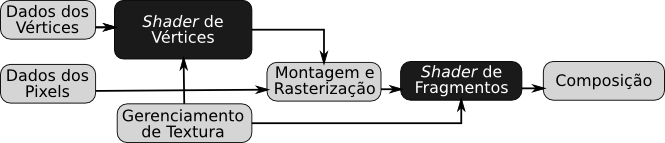

Bem vindos ao tutorial 2 da nossa séries de tutoriais OpenGL. Este tutorial está baseado no [tutorial 02](http://www.opengl-tutorial.org/beginners-tutorials/tutorial-2-the-first-triangle/) do _Opengl-Tutorial_.

Um aviso: estas lições estão baseadas no conteúdo dado na disciplina de Introdução à Computação Gráfica do Instituto de Matemática e Estatística da USP. Mesmo assim, outras pessoas que não sejam alunos dessa disciplina podem aproveitar e compreender o conteúdo destes tutoriais. Se você não fez os tutoriais anteriores, recomendo fazê-lo antes de avançar para este tutorial. Se te sentes seguro em compreender o que se passa aqui, podes continuar. Se houver falhas ou achares que falta alguma coisa para melhorar o tutorial, não hesita em avisar-me.

# Álgebra Linear

Este tutorial tem uma abordagem _top-down_, ou seja, desde o primeiro tutorial tu pões a mão na massa, tão logo para veres o resultado e te motivares. Porém com o tempo, sentirás que alguma base matemática é necessária. Boa parte desse fundamento está na chamada _Álgebra Linear_. Há um [grande post](2014-03-07-linear-algebra.html) dedicado ao estudo de conceitos, porém não num foco puramente matemático, mas num foco intuitivo, facilitando o estudo. Praticamente todos os conceitos abordados contém ilustrações e figuras para ter uma noção visual dos vetores, matrizes e transformações. Não é necessário ver agora este post, pois o objetivo principal é desenvolver a sensibilidade pela necessidade desses conceitos, ao invés de jogar tudo como uma abordagem _bottom-up_.

# OpenGL

Antes de criarmos nosso triângulo, deixa-me explanar algumas coisas sobre o OpenGL. O OpenGL é uma interface de programação (API) para criar imagens a partir de dados numéricos representando primitivas geométricas. Uma vantagem do OpenGL é que o processo de geração de imagem (renderização) é independente do sistema operacional, do sistema gráfico de janelas e é feito pela placa gráfica.

O desenvolvedor cria suas primitivas que compõem o ambiente, envia os dados para a GPU através das funções do OpenGL, e este retorna uma imagem das primitivas convertidas em pixels. No meio do caminho há subprocessos que podemos controlar para definir que cor cada pixel contém, assim podendo aplicar nossos efeitos para tornar o imagem do ambiente o mais realista possível. Todo esse caminho passando por subprocessos é denominado de _pipeline_, pois enquanto um subprocesso está trabalhando com algumas informações, subprocessos anteriores já estarão adiantando e processando novos dados.

O OpenGL 1.0 foi publicado em 1 de Julho de 1994. Seu pipeline é de função fixa, pois a implementação dos subprocessos foram fixadas, permitindo ao usuário apenas utilizá-las. Os processos são:

O pipeline evoluiu, porém continuou fixo para o usuário entre as versões 1.1 a 2.0 (Setembro de 2004).

Na versão 2.0, mesmo mantendo a versão fixa do pipeline, OpenGL oficialmente permitiu ao usuário programar algumas etapas, especialmente o processamento de vértices (_vertex shading_) e de fragmentos (_fragment shading_).

OpenGL 3.0 introduziu o _modelo depreciado_. Como o objetivo principal do OpenGL é enviar dados dos vértices para gerar uma imagem, as funções de tratamento dos vértices (como as transformações), modelos de iluminação e outras coisas foram marcadas como depreciadas (para serem removidas gradualmente). Com isso, a API se torna mais enxuta e rápida. O pipeline continuou o mesmo até o OpenGL 3.1 (Março de 2009). Além disso também foram criados tipos de contexto: _full_ (incluindo as funções depreciadas) ou _forward compatible_ (apenas incluindo funções que estariam na próxima versão do OpenGL).

OpenGL 3.1 removeu o pipeline fixo, obrigando o usuário a utilizar _shaders_ para processar os vértices e fragmentos.

Além disso, quase todos os dados necessários para gerar a imagem são guardadas na GPU, enviadas pela CPU para objetos chamados de _buffers_.

OpenGL 3.2 (Agosto de 2009), adicionou um estágio adicional: _shader_ de geometria. Enquanto que o _shader_ de vértice processa cada vértice e o _shader_ de fragmento processa cada fragmento, o _shader_ de geometria processa cada primitiva, estando entre os dois _shaders_ anteriores.

Além disso dentro de cada contexto foram criados perfis: _core_ e _compatible_.

Tipos de Contexto   Perfil        Descrição
------------------- ------------- ----------------------------
Full                core          Todos os recursos da versão atual
Full                compatible    Todos os recursos de todas as versões
Forward Compatible  core          Todos os recursos não-depreciados
Forward Compatible  compatible    Não suportado

OpenGL 4.1 (Julho de 2010) incluindo estágios adicionais: controle de tesselação e _shaders_ de avaliação de tesselação.

A [última versão](https://www.opengl.org/documentation/current_version/) (até agora) é a versão 4.4.

Além do OpenGL, há também o OpenGL _for Embedded Systems_ (OpenGL ES), desenvolvido para dispositivos móveis e é baseado no OpenGL 3.1, com shaders baseados em GLSL 1.2

E também o WebGL, OpenGL para a Web, baseado no OpenGL ES, desennvolvido em JavaScript, atualmente executado na maioria dos navegadores. Há um [tutorial em WebGL](http://vision.ime.usp.br/~acmt/hakyll/research/mac0420-2014-1/2013-11-26-index.html#webgl) na minha página.

# Pipeline Simplificado

Aqui está um diagrama simplificado do que ocorrerá no pipeline para nossos tutoriais, relacionando os processos do pipeline com os elementos que eles processam.

O que precisamos escrever para esses tutoriais iniciais são o código do aplicativo, o _script_ do _shader_ de vértices e o _script_ do _shader_ de fragmentos. Os outros shaders por enquanto não iremos trabalhar.

No código da aplicação haverá a criação da janela, a escolha do contexto e perfil OpenGL com sua versão e outros parâmetros, o carregamento e compilação dos _shaders_, a criação e compilação do programa de _shaders_ (direi depois o que é isso), o envio dos dados dos vértices, transformações e imagens de textura para a GPU, e o laço para realizar o desenho frame a frame, até o momento em que a aplicação acaba. Cada frame é guardado no framebuffer, local da memória onde se guarda os pixels a serem exibidos na tela. Na verdade há dois buffers, um para desenhar e outro para exibir na tela. Se fosse apenas um buffer, o usuário veria o processo de limpeza do buffer e desenho, causando um efeito indesejado de animação piscando (_flicker_).

Na execução do aplicativo, no momento em que se pede para desenhar o ambiente virtual, veja o que acontece (de acordo com a figura acima):

- Antes de começar o processamento dentro do pipeline até gerar a imagem no framebuffer, o aplicativo precisa enviar os dados dos vértices (posição, cor, coordenada de textura), além das texturas e as matrizes de transformações (da projeção, visualização e modelo, vide [revisão de álgebra linear](http://vision.ime.usp.br/~acmt/hakyll/posts/2014-03-07-linear-algebra.html#composi%C3%A7%C3%A3o-de-transforma%C3%A7%C3%B5es));
- O shader de vértices será executado em vários núcleos da GPU, e cada execução paralela estará associado a um vértice. O objetivo do shader de vértices é transformar os vértices nas coordenadas do objeto (separado para cada objeto), nas coordenadas da tela (um retângulo de [0,0] a [largura,altura] e comum a todos os vértices);
- O processo de montagem interliga vértices que pertencem a um mesmo polígono. Essa ligação resultará em pixels intermediários, digitalizando os polígonos (primitivas). Esses pixels são chamados de fragmentos. Cada fragmento não só conterá sua coordenada de tela (x,y), mas também sua profundidade, pois se um fragmento estiver atrás do outro, este não estará visível na tela, sendo descartado pelo processo de Z-buffer (A menos que você utilize a transparência, no processo de composição, ou _blending_);
- O shader de fragmentos será executados várias vezes ao mesmo tempo para cada fragmento dentro de vários núcleos da GPU. O objetivo do shader de fragmentos é colorir o fragmento. É aqui que boa parte do processo de iluminação, dentre outros efeitos, é aplicado;
- Todos os fragmentos, até os ocultos, são enviados para o processo de composição, onde se escolhe os fragmentos que serão pixels na tela, ou então faz uma combinação de cores de fragmentos que têm a mesma coordenada, realizando um processo de _alpha blending_;
- No fim os pixels são enviados para o FrameBuffer, geralmente enviado para a janela. Mas você pode usar a imagem para ser uma textura de outro objeto em um outro ambiente (mas precisa repetir o processo para renderizar esse novo ambiente);

Veja que o shader de vértices e o shader de fragmentos não utilizam diretamente dados da memória da CPU, mas os dados da memória da GPU que você enviou. Esses dados são guardados em buffers, que precisam ser criados a partir de chamadas de funções no código do aplicativo. As referências para todos os buffers, somadas com mais algumas outras informações de estado dos shaders e dos programas de shaders são guardadas em um objeto chamado de Vertex Array Object (VAO). Então antes de carregar os shaders, criar os buffers e enviar os dados, é necessário criar um VAO. Cada buffer de dados dos vértices é um Vertex Buffer Object (VBO). Primeiro se cria um VAO para depois criar vários VBOs e compilar os shaders.

## O _Vertex Array Object_ (VAO)

Depois de mostrar o pipeline e explicar um pouco onde as coisas se encaixam, vamos criar nosso VAO. Depois de criar nossa janela, nosso contexto e inicializar o GLEW, e antes do laço, coloque esse código:

~~~~ {#mycode .cpp .numberLines startFrom="1"}
GLuint VertexArrayID;
glGenVertexArrays(1, &VertexArrayID);
glBindVertexArray(VertexArrayID);
~~~~~~~~~~~~~~~~~~~~~~~~~~~~~~~~~~~~~~~~~~~~~~~~~

Ah, devo avisar: ao criar VAO, VBO, _shaders_, programas de _shader_ e outros objetos dentro da GPU, o OpenGL não retorna a você explicitamente a memória desses objetos na GPU, ou o ponteiro para elas. Na verdade ela cria um rótulo em formato de número inteiro (GLuint) e retorna apenas esse número. Apenas com esse número você tem acesso ao envio e recebimento de dados para o objeto relacionado. A função glBindVertexArray diz que todas as próximas operações que forem modificar ou usar algum VAO, deverá utilizar o VAO especificado no parâmetro. O OpenGL é uma máquina de estados, e dessa forma tu não precisas dizer a todo momento qual é o VAO que deve ser utilizado, apenas uma vez.

Outra coisa é que funções que modificam variáveis externas necessitam receber o endereço da variável, senão a modificação não terá nenhum efeito. Por isso a função `glGenVertexArrays` recebe o endereço da variável `VertexArrayID`, após o número de VAOs (se o número de VAOs for maior que 1, então é necessário criar um vetor de GLuint e passar o endereço do primeiro elemento do vetor).

## Dados do triângulo

Vamos agora criar nosso triângulo, a começar pelas posições dos vértices.

~~~~ {#mycode .cpp .numberLines startFrom="1"}
// Um vetor de 9 elementos, representando 
// 3 vetores de 3 dimensões
static const GLfloat trianguloBufferData[]=
{
  -1.0f, -1.0f, 0.0f,
   1.0f, -1.0f, 0.0f,
   0.0f,  1.0f, 0.0f
};
~~~~~~~~~~~~~~~~~~~~~~~~~~~~~~~~~~~~~~~~~~~~~~~~~

## Desenhando nosso triângulo

O próximo passo é enviar esses dados para a GPU por meio do OpenGL. Vamos criar nosso buffer que guardará esses dados de posição dos vértices:

~~~~ {#mycode .cpp .numberLines startFrom="1"}
// Referência para nosso buffer de vértices
GLuint vertexPositionBufferID;

// Gerar 1 buffer na GPU
glGenBuffer(1, &vertexPositionBufferID);

// Os próximos comandos de manipulação 
// de buffer usarão o vertexPositionBufferID
glBindBuffer(GL_ARRAY_BUFFER, vertexPositionBufferID);

// Enviar os vértices para esse buffer
glBufferData(GL_ARRAY_BUFFER,
             sizeof(trianguloBufferData),
             trianguloBufferData,
             GL_STATIC_DRAW);
             
// Habilitando o atributo posição dos vértices
glEnableVertexAttribArray(0);
~~~~~~~~~~~~~~~~~~~~~~~~~~~~~~~~~~~~~~~~~~~~~~~~~

Lembre-se, isso tudo antes do laço, só precisamos criar os dados de um triângulo, não criá-lo em todo frame. A função `glBufferData` enviar todo o vetor como um bloco de bytes (ele ainda não sabe que são vetores de posições 3D de vértices), então só precisa saber o tamanho do vetor em bytes (pelo `sizeof`) e mandar o endereço dos dados. O parâmetro GL_STATIC_DRAW significa que o buffer é somente-escrita. Não queremos receber os dados do buffer, apenas enviá-los para a GPU. A única coisa que queremos da GPU é a imagem pronta.

Por enquanto estamos trabalhando apenas com a posição do vértice. Posição é um atributo de cada vértice. Cada atributo precisa ser habilitado se for usado. Por exemplo, o script do shader de vértices pode conter atributo posição, cor, coordenadas de texturas, normais, mas naquele momento eu poderia querer usar apenas a posição, então para agilizar o processo, eu habilito apenas o atributo da posição.

Dentro do laço principal, vamos agora dizer para o OpenGL desenhar nosso triângulo. Primeiro vamos dizer ao OpenGL em qual buffer se guarda os dados do atributo posição (lembre-se que até esse momento o OpenGL não sabe nada sobre o conteúdo dos buffers).

~~~ {#mycode .cpp .numberLines startFrom="1"}
glClear(GL_COLOR_BUFFER_BIT | GL_DEPTH_BUFFER_BIT);
glBindBuffer(GL_ARRAY_BUFFER, vertexPositionBufferID);
glVertexAttribPointer(
  0, // Associando o buffer ao primeiro atributo: posição
  3, // Tamanho de cada posição (3 números)
  GL_FLOAT, // Tamanho de cada número
  GL_FALSE, // normalizar os dados? não, obrigado
  0,        // stride (depois falo isso)
  (void*)0  // offset (junto com stride, depois falo)
);

// Desenhar nosso triângulo!
// A partir do primeiro vértice, desenhe 3 vértices.
glDrawArrays(GL_TRIANGLES, 0, 3);
~~~~~~~~~~~~~~~~~~~~~~~~~~~~~~~~~~~~~~~~~~~~~~~~~

## Shaders

Precisamos agora carregar nossos shaders e utilizá-los. Na verdade podemos ter vários shaders de vértice e vários shaders de fragmento. Para cada efeito que queremos aplicar, precisamos escolher um shader de vértice, um shader de fragmento e criar um programa de shader que une os dois shaders. Então se nosso aplicativo necessitar de vários efeitos, então serão necessários vários programas. Por enquanto vamos apenas criar um programa de shader. Tudo isso deverá ficar compilado e guardado na GPU.

~~~ {#mycode .cpp .numberLines startFrom="1"}
GLuint carregarShaders(const char * vShaderArquivo,const char * fShaderArquivo){
 
    // Criar os shaders
    GLuint VertexShaderID = glCreateShader(GL_VERTEX_SHADER);
    GLuint FragmentShaderID = glCreateShader(GL_FRAGMENT_SHADER);
    
    // Criar os programas
    
 
    // Ler o código do shader de vértice no arquivo
    std::string VertexShaderCode;
    std::ifstream VertexShaderStream(vertex_file_path, std::ios::in);
    if(VertexShaderStream.is_open())
    {
        std::string Line = "";
        while(getline(VertexShaderStream, Line))
            VertexShaderCode += "\n" + Line;
        VertexShaderStream.close();
    }
 
    // Read the Fragment Shader code from the file
    std::string FragmentShaderCode;
    std::ifstream FragmentShaderStream(fragment_file_path, std::ios::in);
    if(FragmentShaderStream.is_open()){
        std::string Line = "";
        while(getline(FragmentShaderStream, Line))
            FragmentShaderCode += "\n" + Line;
        FragmentShaderStream.close();
    }
 
    GLint Result = GL_FALSE;
    int InfoLogLength;
 
    // Compile Vertex Shader
    printf("Compiling shader : %s\n", vertex_file_path);
    char const * VertexSourcePointer = VertexShaderCode.c_str();
    glShaderSource(VertexShaderID, 1, &VertexSourcePointer , NULL);
    glCompileShader(VertexShaderID);
 
    // Check Vertex Shader
    glGetShaderiv(VertexShaderID, GL_COMPILE_STATUS, &Result);
    glGetShaderiv(VertexShaderID, GL_INFO_LOG_LENGTH, &InfoLogLength);
    std::vector<char> VertexShaderErrorMessage(InfoLogLength);
    glGetShaderInfoLog(VertexShaderID, InfoLogLength, NULL, &VertexShaderErrorMessage[0]);
    fprintf(stdout, "%s\n", &VertexShaderErrorMessage[0]);
 
    // Compile Fragment Shader
    printf("Compiling shader : %s\n", fragment_file_path);
    char const * FragmentSourcePointer = FragmentShaderCode.c_str();
    glShaderSource(FragmentShaderID, 1, &FragmentSourcePointer , NULL);
    glCompileShader(FragmentShaderID);
 
    // Check Fragment Shader
    glGetShaderiv(FragmentShaderID, GL_COMPILE_STATUS, &Result);
    glGetShaderiv(FragmentShaderID, GL_INFO_LOG_LENGTH, &InfoLogLength);
    std::vector<char> FragmentShaderErrorMessage(InfoLogLength);
    glGetShaderInfoLog(FragmentShaderID, InfoLogLength, NULL, &FragmentShaderErrorMessage[0]);
    fprintf(stdout, "%s\n", &FragmentShaderErrorMessage[0]);
 
    // Link the program
    fprintf(stdout, "Linking program\n");
    GLuint ProgramID = glCreateProgram();
    glAttachShader(ProgramID, VertexShaderID);
    glAttachShader(ProgramID, FragmentShaderID);
    glLinkProgram(ProgramID);
 
    // Check the program
    glGetProgramiv(ProgramID, GL_LINK_STATUS, &Result);
    glGetProgramiv(ProgramID, GL_INFO_LOG_LENGTH, &InfoLogLength);
    std::vector<char> ProgramErrorMessage( max(InfoLogLength, int(1)) );
    glGetProgramInfoLog(ProgramID, InfoLogLength, NULL, &ProgramErrorMessage[0]);
    fprintf(stdout, "%s\n", &ProgramErrorMessage[0]);
 
    glDeleteShader(VertexShaderID);
    glDeleteShader(FragmentShaderID);
 
    return ProgramID;
}

Veja o resultado:

Veja uma coisa interessante: nosso triângulo tem posições cujas coordenadas variam entre -1 a 1. O OpenGL, se não aplicares nenhuma matriz de projeção, trabalha de forma padrão com um sistema de coordenadas X, Y e Z variando de [-1 a 1]. Por isso que o triângulo ocupou toda a tela. A matriz de projeção tem como objetivo projetar todos os vértices do mundo virtual para esse sistema de coordenadas. Em outro tutorial veremos melhor como trabalhar com a projeção e com os sistemas de coordenadas.

## Cores

Agora vamos trabalhar com as cores. Por enquanto não vamos trabalhar com efeitos de iluminação, vamos dar uma cor estática para cada vértices. Estas cores também são guardadas em um buffer e será um atributo do vértice, exatamente como a posição. Não há segredo.

Vamos agora trabalhar.
