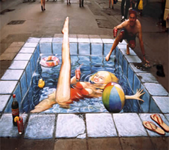
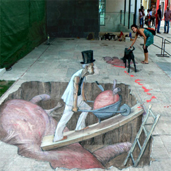
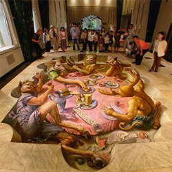
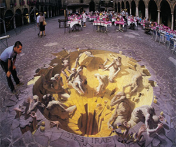

# Introdução

# Objetivo

O objetivo do trabalho é explorar técnicas projeção anamórfica em superfícies planas usando sistemas computacionais. Participação do trabalho de mestrado de Fábio Rosa.

# Cronograma

<iframe src="https://www.google.com/calendar/embed?src=ksk6tqbdnq69c3vpcnjc5hd4p8%40group.calendar.google.com&ctz=America/Sao_Paulo" style="border: 0" width="800" height="600" frameborder="0" scrolling="no"></iframe>

# Atividades

[Revisão Bibliográfica Sistemática](2013-11-30-rbs.html)
