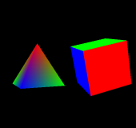
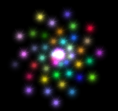
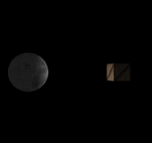

# Introdução

O objetivo deste curso é introduzir noções básicas e algoritmos de computação gráfica. Alunos desenvolverão experiência prática através de exercícios práticos utilizando a linguagem C (C++) , a biblioteca gráfica [OpenGL](http://www.opengl.org) e [WebGL](http://www.khronos.org/webgl).

## Horário

quartas (14-16h) e sextas (16-18h)

## Local:

Sala B-01.

## Compilador: 

Neste curso utilizaremos o compilador gcc/g++ e o ambiente Linux ou Mac OS X. 

## Pré-requisitos:

Conhecimento da linguagem C, noções gerais de álgebra linear e cálculo básico.

# Cronograma

<iframe src="https://www.google.com/calendar/embed?src=kvfu9hu2lsorqu43s81n63kdlk%40group.calendar.google.com&ctz=America/Sao_Paulo" style="border: 0" width="800" height="600" frameborder="0" scrolling="no"></iframe>

# Tutoriais

## WebGL

Este tutorial está baseado no tutorial da [learningwebgl.com](http://learningwebgl.com/blog/?p=11), que está baseado no tutorial de OpenGL da [NeHe](http://nehe.gamedev.net/). Além da tradução ao português, estes tutoriais estão adaptados ao curso de Introdução à Computação Gráfica.

Tutoriais                                                                
----------                                                            --------
                   [Introdução](../../posts/2014-02-25-webgl-introducao.html)            _Mostra a você como fazer o download, instalar e configurar um navegador que pode mostrar o conteúdo WebGL._
            [Criando um triângulo](../../posts/2014-02-26-webgl-criando-triangulo.html)  _Tutorial enorme sobre o canvas, shaders, vertices, transformação e renderização_
          [Adicionando Cores](../../posts/2014-02-28-webgl-colorindo-triangulo.html)     
       [Adicionando Movimento](../../posts/2014-03-01-webgl-movimentando-triangulo.html) 
                      [Agora em 3D](../../posts/2014-03-02-webgl-real-3d.html)           
                      [Inserindo Texturas](../../posts/2014-03-04-webgl-texture.html)    
              [Teclado e Filtro de Texturas](../../posts/2014-03-05-webgl-keyboard-filter.html) 
    [Luzes direcionais e ambientes](../../posts/2014-03-06-webgl-directional-ambient-light.html) 
           [Buffer de Profundidade e Transparência](../../posts/2013-12-05-webgl-depth-transparency.html) 
               [Melhorando o código](../../posts/2013-12-06-webgl-improving-code.html)   
         [Carregando o mundo e câmera básica](../../posts/2013-12-07-webgl-loading-world-camera.html) 
                      [Esferas](../../posts/2013-12-08-webgl-spheres.html)               
               [Luz Pontual](../../posts/2013-12-09-webgl-point-lighting.html)           
        [Iluminação per-fragment e múltiplos programas](../../posts/2013-12-10-webgl-per-fragment-multiple.html) 
          [Iluminação Especular e JSON](../../posts/2013-12-11-webgl-specular-highlights.html) 
                [Mapa de Luz Especular](../../posts/2013-12-12-webgl-specular-maps.html) 
            [Render-to-texture](../../posts/2013-12-13-webgl-render-to-texture.html)     

## OpenGL

Este tutorial está baseado no tutorial da [Opengl-Tutorial](http://www.opengl-tutorial.org).

Tutoriais                                                                
----------                                                            --------
                  [Introdução](../../posts/2014-02-27-opengl-introducao.html)            _Configurando o sistema para trabalhar com os tutoriais_
          [Criando um triângulo](../../posts/2014-02-26-webgl-criando-triangulo.html)  _Tutorial enorme sobre o canvas, shaders, vertices, transformação e renderização_
                    [Adicionando Cores](../../posts/2013-11-29-webgl-colorindo-triangulo.html)     
               [Adicionando Movimento](../../posts/2013-11-30-webgl-movimentando-triangulo.html) 
            [Agora em 3D](../../posts/2013-12-01-webgl-real-3d.html)           
               [Inserindo Texturas](../../posts/2013-12-02-webgl-texture.html)    
                      [Teclado e Filtro de Texturas](../../posts/2013-12-03-webgl-keyboard-filter.html) 
           [Luzes direcionais e ambientes](../../posts/2013-12-04-webgl-directional-ambient-light.html) 
                         [Buffer de Profundidade e Transparência](../../posts/2013-12-05-webgl-depth-transparency.html) 
               [Melhorando o código](../../posts/2013-12-06-webgl-improving-code.html)   
                     [Carregando o mundo e câmera básica](../../posts/2013-12-07-webgl-loading-world-camera.html) 
                   [Esferas](../../posts/2013-12-08-webgl-spheres.html)               
              [Luz Pontual](../../posts/2013-12-09-webgl-point-lighting.html)           
           [Iluminação per-fragment e múltiplos programas](../../posts/2013-12-10-webgl-per-fragment-multiple.html) 
                   [Iluminação Especular e JSON](../../posts/2013-12-11-webgl-specular-highlights.html) 
              [Mapa de Luz Especular](../../posts/2013-12-12-webgl-specular-maps.html) 
                    [Render-to-texture](../../posts/2013-12-13-webgl-render-to-texture.html)     
                  [Billboards](../../posts/2013-12-13-webgl-render-to-texture.html)     

# Bibliografia
