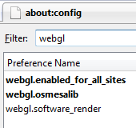

# Introdução

O objetivo deste curso é introduzir noções básicas e algoritmos de computação gráfica. 
Alunos desenvolverão experiência prática através de exercícios práticos utilizando a 
linguagem C ([C++](http://www.cplusplus.com/‎)) e a biblioteca gráfica [OpenGL](http://www.opengl.org) e [GLUT(The OpenGL Utility Toolkit)](http://www.opengl.org/resources/libraries/glut/‎).

## Horário

terças (16-17:40h) e quintas (14-15:40h)

## Local:

Sala B-01.

## Compilador: 

Neste curso utilizaremos o compilador gcc/g++ e o ambiente Linux. 

## Pré-requisitos:

Conhecimento da linguagem C, noções gerais de álgebra linear e cálculo básico.

# Tutoriais

## WebGL
Tutoriais                                                                
----------                                                            --------
                   [Introdução]()            _Mostra a você como fazer o download, instalar e configurar um navegador que pode mostrar o conteúdo WebGL._
            [Criando um triângulo]()  Alo
          [Adicionando Cores]()     Legal
       [Adicionando Movimento]()

# Bibliografia